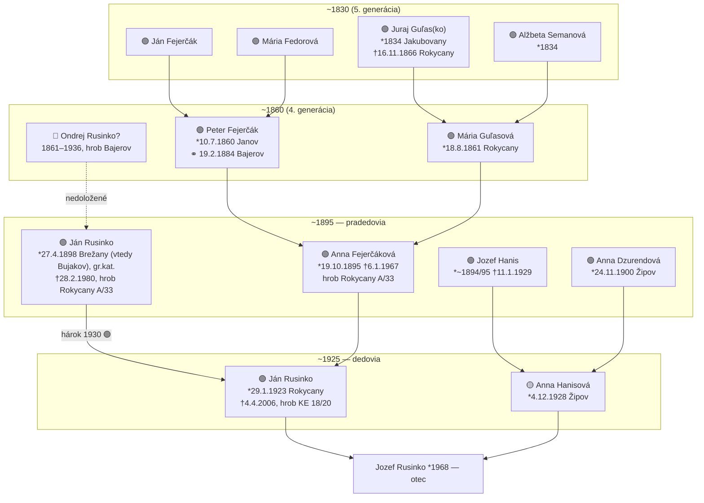
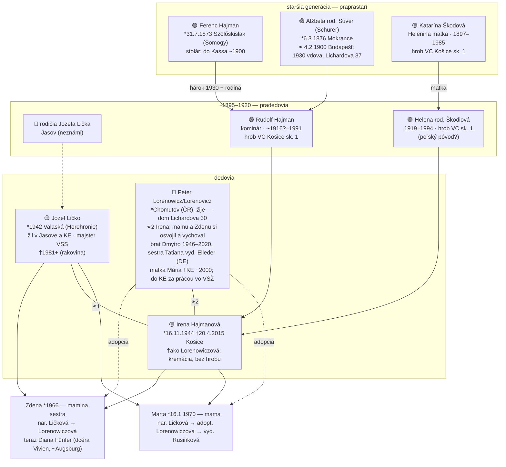
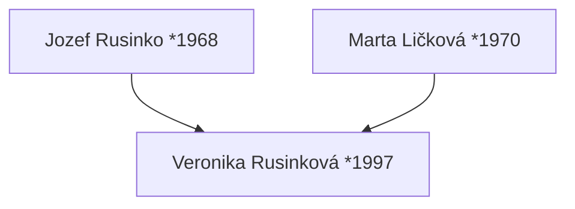
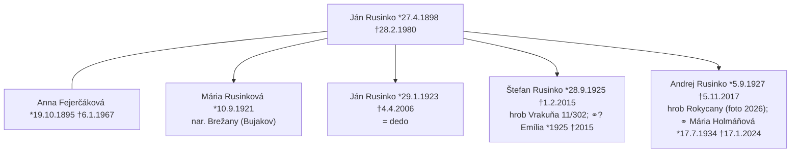
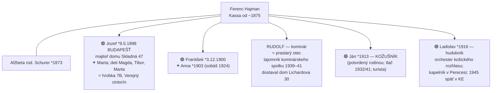
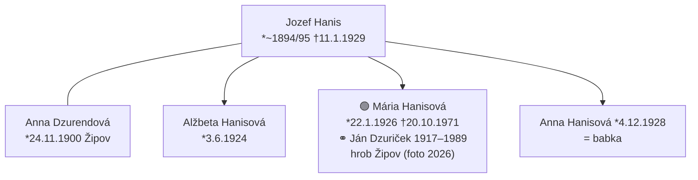

# Rodokmeň

🌐 **Živý strom na FamilySearch:** [rodokmeň Veroniky (PMQS-SVF)](https://www.familysearch.org/en/tree/pedigree/portrait/PMQS-SVF) — priebežne dopĺňaný o nové objavy (zobrazenie vyžaduje bezplatné FS konto)

Legenda: 🟢 doložené záznamom · 🟡 v strome FS, bez dokladu · 🔴 hypotéza

## 🧭 Kto je kto — legenda vzťahov (priama línia od Veroniky)

> Formát: **Vydaté meno rod. rodné** — vzťah (strana) · dátumy. Počet „pra" = počet generácií nad starými rodičmi (stará mama = 0 pra; prababka/pradedo = 1 pra; praprababka = 2 pra; 3×, 4×…). Táto legenda opravuje staršie pomýlené počty (napr. János Hajman bol chybne „5×", správne **3×**).

**Ja (0):** Veronika Rusinková *1997

**Rodičia (1):**
- Jozef Rusinko *1968 — **otec**
- Marta Rusinková rod. Ličková *1970 — **mama** (nar. Ličková → adopt. Lorenowiczová)

**Starí rodičia (2):**
- Ján Rusinko 1923–2006 (dožil sa ~83 r.) — **starý otec (otcova strana)**
- Anna Rusinková rod. Hanisová 1928–2000 (dožila sa ~72 r.) — **stará mama (otcova strana)**
- Jozef Ličko *1942 Valaská (okr. Brezno) †1981+ — **starý otec (mamina strana)**
- Peter Lorenowicz *Chomutov, žije — **starý otec (mamina strana)**: Irenin druhý manžel; po smrti Jozefa Lička si mamu a Zdenu osvojil a vychoval; žije v rodinnom dome na Lichardovej 30
- Irena rod. Hajmanová 1944–2015 (dožila sa ~71 r.) — **stará mama (mamina strana)**

**Prastarí rodičia (3) — „1× pra":**
- Ján Rusinko 1898–1980 (dožil sa ~82 r.) & Anna rod. Fejerčáková 1895–1967 (dožila sa ~72 r.) — *prastarí, otcova strana (Rusinko)*
- Jozef Hanis ~1894–1929 & Anna rod. Dzurendová *1900 — *prastarí, otcova strana (Hanis)*
- Rudolf Hajman ~1916?–1991 & Helena rod. Škodiová 1919–1994 (dožila sa ~75 r.) — *prastarí, mamina strana (Hajman)*
- rodičia Jozefa Lička — *neznámi — hľadať v matrike Valaská (rodný list Jozefa *1942), mamina strana (Ličko)*

**Praprastarí rodičia (4) — „2× pra":**
- Ondrej Rusinko? 1861–1936 (dožil sa ~75 r.) (hypotéza) — *prapradedo, otec/Rusinko*
- Peter Fejerčák 1860 & Mária rod. Guľasová 1861 — *praprastarí, otec/Fejerčák*
- Andrej Dzurenda *1870 & Alžbeta rod. Šoltés — *praprastarí, otec/Dzurenda*
- Ferenc Hajman 1873 & Alžbeta rod. Suver *1876 Mokrance — *praprastarí, mama/Hajman*
- Katarína Škodová 1897–1985 (dožila sa ~88 r.) — *praprababka, mama/Škoda (Helenina matka)*
- rodičia Jozefa Hanisa — *neznámi, otec/Hanis*

**3× prastarí (5) — „3× pra":**
- Juraj Guľas 1834–1866 (dožil sa ~32 r.) & Alžbeta rod. Semanová *1834 — *otec/Guľas*
- Ján Fejerčák & Mária rod. Fedorová (~1830) — *otec/Fejerčák*
- **János Hajman** (želiar) & **Anna rod. Huterová**, Szőlőskislak — *mama/Hajman* ⚠️ (predtým chybne „5×")
- **Erzsébet Suver** (slúžka, Mokrance) *~1845 — *mama/Suver* ⚠️ (predtým chybne „4×"; je to matka Alžbety Suverovej *1876 → 3×, nie 4×)

**Najhlbší doložený predok:** Joannes Rusinko, daňový súpis Klenov **1715** (otcova strana) — ~9–10 generácií nad Veronikou.

## Otcova strana (Rusinko · Fejerčák/Guľas · Hanis)

## Mamina strana (Ličko · Hajman/Škodiová · Lorenowicz)

## Spojenie

## Súrodenci deda Jána (podľa stromu FS, zapísal NagyLukas)

> Presné dátumy Jána, Anny, deda a Štefana doložené hrobmi (9.7.2026): Rokycany A/33 (pohrebiskasr.sk), Verejný cintorín KE sk. 18/20 (GIS), Vrakuňa 11/302 (Marianum). Sobáš Ján (1898) × Anna: **3.6.1919** — 🟢 doložený **sčítacím hárkom 1930** (Rokycany 20), ktorý zároveň dokladá deda ako ich syna a **gréckokatolícke** vierovyznanie rodiny. Anna mala **5 detí, 1 zomrelo** → okrem 4 v strome existovalo **5. dieťa (†pred 1930)**. Rodina žila v **Bujakove**, do Rokycian sa presťahovala 25.5.1922. Rozloženie: otcova strana vľavo, mamina vpravo.

## Súrodenci prastarého otca Rudolfa (Hajman, Košice)

> Doložené sčítacími hárkami 1930 (D. Licharda 37 + Skladná 47); Rudolfova príslušnosť k rodine potvrdená rodinným svedectvom o bratovi-kožušníkovi (13.7.2026) a rodinným domom na tej istej ulici. Zapísané do FS 14.7.2026.

## Súrodenci babky Anny (Hanis, Žipov)

> Otec **Jozef Hanis** a rodné meno matky **Dzurendová** doložené odpismi matrík farnosti Bajerov (Arcibiskupský archív KE, 19.7.2026); sestry podľa FS (NagyLukas); Mária doložená náhrobkom. Anna Dzurendová = dcéra Andreja Dzurendu & Alžbety rod. Šoltésovej (Žipov 18) — nová generácia.

## FamilySearch ID-čka

| Osoba | PID |
|---|---|
| Veronika Rusinková | PMQS-SVF |
| Jozef Rusinko (otec) | PMQS-D7K |
| Marta (mama) — Ličková/Lorenowiczová/Rusinková | PMQS-X8L |
| Zdena (teta) — Ličková/Lorenowiczová/Diana Fünfer | PMQ3-989 |
| Vivien Fünfer (Dianina dcéra, žije, ~Augsburg) | PX7J-697 |
| Ján Rusinko 1923 | PMQS-J35 |
| Anna Hanisová 1928 | GYM2-LCP |
| Jozef Ličko | PMQS-RZ4 |
| Irena Hajmanová | PMQ3-MPM |
| Ján Rusinko 1898 | PQ3W-GXN |
| Anna Fejerčáková 1895 | P3GG-4Y2 |
| Jozef Hanis *~1894/95 †11.1.1929 | GYM2-8M9 |
| Anna rod. Dzurendová *24.11.1900 (Hanisová matka) | GYM2-WVL |
| Andrej Dzurenda *11.11.1870 (2× pradedo, otec/Dzurenda) | PXZ3-8B1 |
| Alžbeta rod. Šoltés (2× prababka) | PXZQ-SPB |
| Rudolf Hajman | PMQ3-4D3 |
| Helena Škodiová | PMQ3-HFX |
| Ferenc Hajman (Rudolfov otec) | PX7K-3LY |
| Alžbeta rod. Schurer/**Suver** *6.3.1876 Mokrance (Rudolfova matka; stub LDNJ-M19 zlúčený 15.7.2026) | PX7K-M17 |
| **János Hajman (3× pradedo, želiar, Szőlőskislak)** | LHW1-JPX |
| **Anna Huterová (3× prababka)** | LHW1-JPF |
| Mária Hajmanová *1869 (Ferencova sestra, ⚭ 1906 Lachmanek) | LHW1-JPD |
| **Erzsébet Suver (3× prababka, slúžka, Mokrance)** | LDNJ-M1S |
| Jozef Hajman *1898 Budapešť (brat) | PX7K-FV1 |
| František Hajman *1900 (brat) | PX7V-S7V |
| Ján Hajman *1913, kožušník (brat) | PX7V-5RK |
| Ladislav Hajman *1916, hudobník (brat) | PX7K-S9Z |
| Marta rod. **Kočišová** 1902–1982 (dožila sa ~80 r.) (Jozefova manželka) | PXWS-XHJ |
| Magda Hajmanová-Ginelliová 1923–2006 (dožila sa ~83 r.) | PXW3-MQY |
| MUDr. Tibor Hajman *1926, chirurg | PXWS-257 |
| Marta Hajmanová ml. *1928 | PXWS-FY9 |
| **Ferdinand** Ginelli 1913–1989 (dožil sa ~76 r.) (Magdin manžel, huslista; v FS opravené z „Jozef" 15.7.2026) | PXWS-GXF |
| MUDr. Tibor Ginelli (žijúci, gynekológ) | PXWS-JNS |
| Peter Fejerčák 1860 | P3GG-4YC |
| Mária Guľasová 1861 | P3GL-XYR |
| Ján Fejerčák | L8DR-XMS |
| Mária Fedorová | LDBF-CRZ |
| Juraj Guľas 1834 | P3GG-3VM |
| Alžbeta Semanová 1834 | P3GL-B7M |
| Mária Rusinková 1921 | PQ34-D4G |
| Alžbeta Hanisová 1924 (babkina sestra) | GYM2-D3W |
| Mária Hanisová-Dzuričková 1926–1971 (dožila sa ~45 r.) (babkina sestra) | GYMS-9YH |
| Ján Dzuriček 1917–1989 (dožil sa ~72 r.) (jej manžel) | PXS2-M43 |
| Štefan Rusinko 1925 | PQ34-7LM |
| Andrej Rusinko 1927 | PQ3W-4S7 |
| Mária Holmáňová 1934 | PQ3W-XRM |
