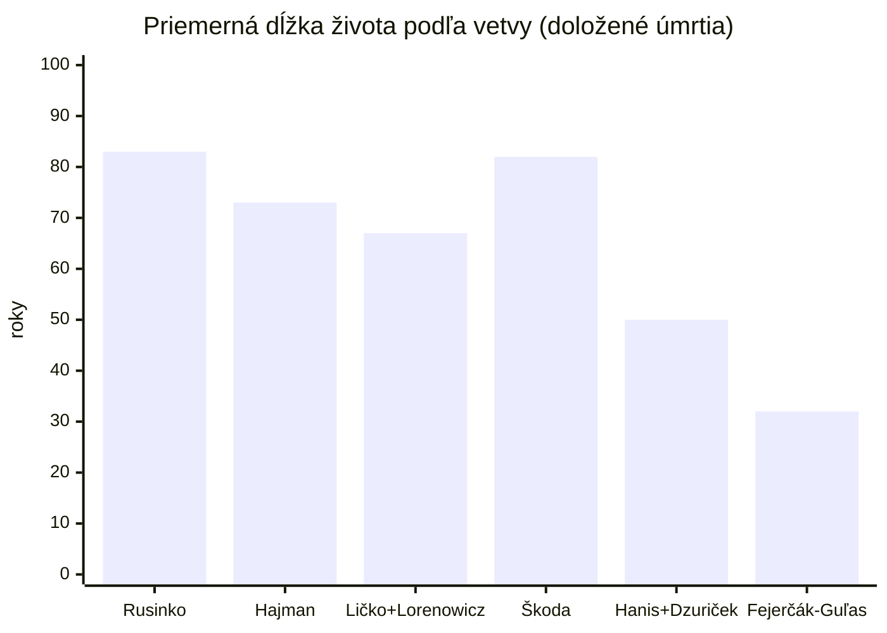

# Štatistiky rodiny

Súvisí: [Prehľad](index.md) · [Stav osôb](stav-osob.md) · [Zamestnania v rodine](zamestnania.md) · zostavené 22.7.2026 z doložených dátumov (~32 osôb s úplnými rokmi narodenia aj úmrtia). Hodnoty s ~ sú približné (rok bez presného dňa).

## Dĺžka života

**Priemer: ženy ~74 rokov, muži ~69 rokov** (16 + 16 doložených osôb).

| Skupina | Priemer | Najdlhšie | Najkratšie |
|---|---|---|---|
| narodení pred 1900 | ~66 r. | Katarína Škodová 88 | Juraj Guľas 32 |
| narodení 1900–1950 | ~75 r. | Štefan, Andrej, Emília, Mária H. — všetci **90** | Jozef Ličko ~40 |
| ženy | ~74 r. | Emília a Mária Holmáňová 90 | Mária Dzuričková 45 |
| muži | ~69 r. | Štefan a Andrej Rusinkovci 90 | Juraj Guľas 32 |

- ⭐ **Rusinkovská dlhovekosť**: vetva Rusinko má priemer ~83 rokov — štyria z nej sa dožili presne ~90 (Štefan, Andrej, Emília, Mária Holmáňová). Ak sa niečo dedí, tak toto.
- **Traja otcovia, ktorí zomreli mladí** — a zakaždým to prepísalo osud rodiny: Juraj Guľas (32, †1866 — vdova Alžbeta s deťmi), Jozef Hanis (34, †1929 — vdova Anna s dcérami), Jozef Ličko (~40, †~1981–83 — vdova Irena, dcéry adoptoval Peter Lorenowicz).
- Vetva Fejerčák–Guľas má zatiaľ len 1 doložené úmrtie — priemer sa zdvihne, keď odpovie fara Bajerov.

## Vdovské roky (kto koho prežil)

| Pár | Ovdovel/a | Rokov vdovstva |
|---|---|---|
| Irena (†2015) po Jozefovi Ličkovi (†~1982) | Irena | **~34** (znovu vydatá za Petra L.) |
| Marcela Ličková (†2011) po Miroslavovi (†1985) | Marcela | 26 |
| Mária Majáková (†2009) po MUDr. Tiborovi (†1988) | Mária | 21 |
| Magda Ginelliová (†2006) po Ferdinandovi (†1989) | Magda | 17 |
| Anna Dzurendová po Jozefovi Hanisovi (†1929) | Anna | 40+ (nikdy sa nevydala?) |
| Marta Kočišová (†1982) po Jozefovi Hajmanovi (†1977) | Marta | 5 |
| Helena (†1994) po Rudolfovi (†1991) | Helena | 3 |
| Ján Rusinko (†1980) po Anne (†1967) | **on** | 13 — vzácny prípad, keď prežil muž |
| dedo Ján (†2006) po babke Anne (†2000) | **on** | 6 — druhý taký prípad |

Vzorec sedí s demografiou: takmer vždy prežila žena — ale rusinkovskí muži sú výnimka (dlhovekosť).

## Vekové rozdiely manželov

Priemer: muž starší o ~5 rokov. Extrémy:

| Pár | Rozdiel |
|---|---|
| MUDr. Tibor Hajman (1926) ⚭ Mária Majáková (1942) | **16 rokov** |
| Ferdinand Ginelli (1913) ⚭ Magda Hajmanová (1923) | 10 |
| Ján Dzuriček (1917) ⚭ Mária Hanisová (1926) | 9 |
| Ján Hajman (1913) ⚭ Alžbeta (1922) | 9 |
| Ján Rusinko (1898) ⚭ Anna Fejerčáková (1895) | **−3 — žena staršia!** |
| Peter Fejerčák (1860) ⚭ Mária Guľasová (1861) | 1 |

## Generačný interval (vek rodiča pri narodení dieťaťa)

Materská línia Veroniky je pozoruhodne pravidelná — **22 až 27 rokov, päť generácií za storočie**:

| Rodič → dieťa | Interval |
|---|---|
| Katarína Škodová (1897) → Helena (1919) | 22 |
| Helena (1919) → Irena (1944) | 25 |
| Irena (1944) → Marta (1970) | 26 |
| Marta (1970) → Veronika (1997) | 27 |
| Ján Rusinko (1898) → dedo Ján (1923) | 25 |
| Ferenc Hajman (1873) → Rudolf (~1916) | **~43** — Rudolf bol z najmladších detí |
| Erzsébet Suver (~1845) → Alžbeta (1876) | ~31 |

## Krstné mená naprieč stromom

| Meno | Počet | Nositelia |
|---|---|---|
| **Ján/János** | 7+ | Rusinko 1898, dedo 1923, Hajman kožušník 1913, Dzuriček, János Hajman (3× pradedo), János Suver 1884, Ján Fejerčák |
| **Anna** | 7 | Fejerčáková 1895, babka 1928, Dzurendová 1900, Huterová (3× prababka), Schullerová 1903, Hovanecz, sestra Anna *po 1930 |
| **Jozef** | 5 | Hanis †1929, Ličko 1942, Hajman 1898, Ginelli 1880, Suver? |
| **Mária** | 5+ | Guľasová 1861, Dzuričková 1926, Holmáňová 1934, Majáková 1942, Ginelliová 1950, Hajmanová 1869 |
| **Alžbeta** | 4 | Suverová 1876, Šoltésová, Hanisová 1924, Hajmanová 1922 |
| Rudolf | 2 | otec → syn (Kanada) — priame dedenie mena |
| Tibor | 2 | strýko chirurg → synovec gynekológ — dedenie cez krstné meno |
| Helena | 2 | Škodiová 1919, Hajmanová (Rudolfova švagriná?) |

Dedenie mien je doložené 2×: **Rudolf → Rudolf ml.** a **Tibor Hajman → Tibor Ginelli**. Ženská línia Veroniky mená naopak nikdy neopakuje: Katarína → Helena → Irena → Marta → Veronika — päť generácií, päť rôznych mien.

## Nemanželské deti (línia Suver)

Doložené v matrikách: **3 nemanželské narodenia v dvoch generáciách tej istej ženskej línie** — Alžbeta Suverová (*1876, matka slúžka v Mokranciach), jej brat(?) János (*1884, tá istá matka) a Jozef Hajman (*1898 Budapešť, matka Alžbeta slúžka; legitimizovaný sobášom 1900). Vzorec „slúžka → nemanželské dieťa" sa opakoval matka → dcéra. V dobovom Uhorsku bolo nemanželských ~7–10 % narodení — u Suverovcov to nebola anomália jednotlivca, ale sociálna pasca chudoby.

## Krst koľko dní po narodení

| Osoba | Narodenie → krst | Interval |
|---|---|---|
| Ferenc Hajman | 31.7.1873 → 2.8.1873 | 2 dni |
| Alžbeta Suverová | 6.3.1876 → 7.3.1876 | **1 deň** |

V 19. storočí sa krstilo okamžite — novorodenecká úmrtnosť bola taká vysoká, že sa nečakalo. (Dátumy krstov ďalších generácií doplnia matriky Klenov/Bajerov/Valaská.)

## Čo zažili predkovia (vek pri veľkých udalostiach)

| Osoba (život) | 1914 WWI | 1920 Trianon | 1938 anexia KE | 1944–45 front | 1948 KSČ | 1968 invázia | 1989 Nežná |
|---|---|---|---|---|---|---|---|
| Ondrej Rusinko (1861–1936) | 53 | 59 | — | — | — | — | — |
| Ferenc Hajman (1873–?) | 41 | 47 | 65? | | | | |
| Ján Rusinko (1898–1980) | 16 | 22 | 40 | 46 | 50 | 70 | — |
| **Katarína Škodová (1897–1985)** | 17 | 23 | 41 | 47 | 51 | 71 | — |
| Rudolf Hajman (~1916–1991) | — | 4 | 22 | 28 | 32 | 52 | 73 |
| Helena Škodiová (1919–1994) | — | 1 | 19 | 25 | 29 | 49 | 70 |
| dedo Ján (1923–2006) | — | — | 15 | 21 | 25 | 45 | 66 |
| Irena (1944–2015) | — | — | — | 0 | 4 | 24 | 45 |
| Marta (*1970) | — | — | — | — | — | — | 19 |

**Katarína Škodová prežila celý „krátky vek extrémov" na jednom mieste**: narodila sa v Rakúsko-Uhorsku, žila v ČSR, Maďarskom kráľovstve (anexia), ČSR, ČSSR — päť štátov bez jediného sťahovania. Irena sa narodila v novembri 1944 — **priamo do frontového mesta** (Košice oslobodené v januári 1945).

## Index skomolenín priezvisk

Koľko pravopisných podôb sme doložili v prameňoch:

| Priezvisko | Varianty | Počet |
|---|---|---|
| **Suver** | Suver, Suvet (FS index), Šuver, Schurer, (Schuller — zámena) | **5** |
| **Hajman** | Hajman, Hajmán, Haiman, Halman, Homon | **5** |
| **Škoda** | Škoda, Škody, Škodi, Skodi, Szkoda (poľ.) | **5** |
| Fejerčák | Fejerčák, Fejercsák, Fejércsak, Fejérčák | 4 |
| Hutera | Hutera, Huterka, Hutyera, Hutira | 4 |
| Ličko | Ličko, Licskó, Lischko (Medzev), Litschko | 4 |
| Guľas | Guľas, Gulyasz, Gulyaszkó | 3 |
| Lorenowicz | Lorenowicz, Lorenovicz | 2 |
| Rusinko | Rusinko, Ruszinkó | 2 |

Praktický dôsledok: pri každom hľadaní v indexoch treba sito na všetky varianty — „Suvet" a „Halman" už raz takmer pochovali celé objavy.

## Konfesionálna mapa

| Vetva | Vyznanie | Farnosť |
|---|---|---|
| Rusinko | **gréckokatolícke** | Klenov (filiálky Brežany, Rokycany) |
| Fejerčák–Guľas | rímskokatolícke | Bajerov |
| Hanis + Dzurenda | rímskokatolícke | Bajerov (Žipov) |
| Hajman + Suver | rímskokatolícke (dolož. 1900) | Szőlősgyörök; Szepsi/Moldava; KE |
| Škoda | rímskokatolícke? | KE / Abov (overí Helenin zápis) |
| Ličko | rímskokatolícke? | Valaská/Brezno (overí rodný list) |
| Lorenowicz (pôvod) | gréckokatolícke | Zamiechów pri Przemyśli |

Manželstvo dedo Ján (GK) × babka Anna (RK) bolo konfesionálne zmiešané — bežné, ale určovalo, kde sa krstili deti. 🧬 DNA ~3 % Ashkenazi zostáva nepriradené — kandidáti: rodné meno Kataríny, rodičia Ferenca/Alžbety, Ličkovci.
