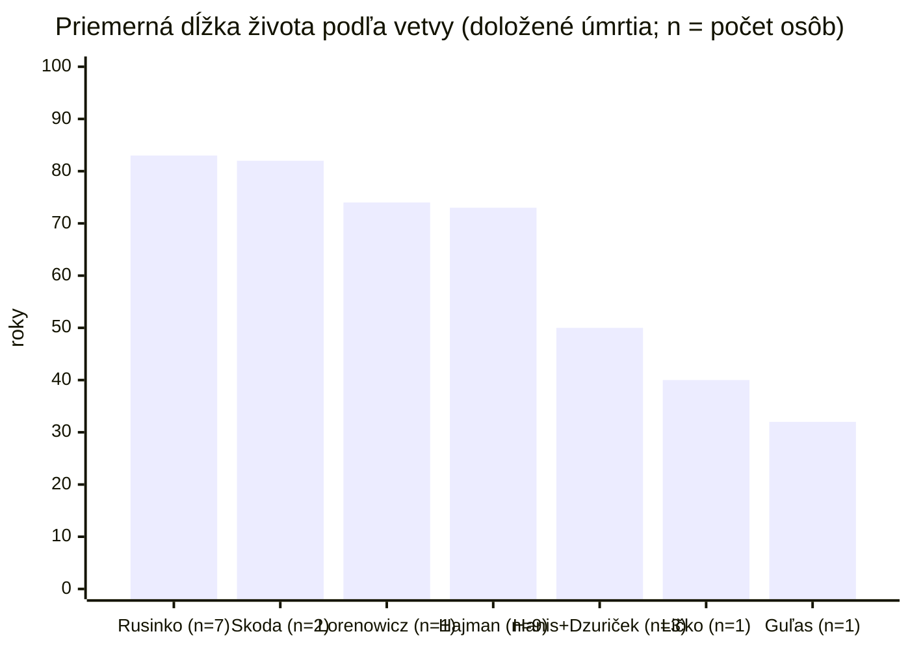

# Štatistiky rodiny

Súvisí: [Prehľad](prehlad.md) · [Stav osôb](stav-osob.md) · [Zamestnania v rodine](zamestnania.md) · zostavené 22.7.2026 z doložených dátumov (~32 osôb s úplnými rokmi narodenia aj úmrtia). Hodnoty s ~ sú približné (rok bez presného dňa).

## Dĺžka života

**Priemer: ženy ~74 rokov, muži ~69 rokov** (16 + 16 doložených osôb).

| Skupina | Priemer | Najdlhšie | Najkratšie |
|---|---|---|---|
| narodení pred 1900 | ~66 r. | Katarína Skodová 88 | Juraj Guľas 32 |
| narodení 1900–1950 | ~75 r. | Štefan, Andrej, Emília, Mária H. — všetci **90** | Jozef Ličko ~40 |
| ženy | ~74 r. | Emília a Mária Holmáňová 90 | Mária Dzuričková 45 |
| muži | ~69 r. | Štefan a Andrej Rusinkovci 90 | Juraj Guľas 32 |

```mermaid
xychart-beta
    title "Priemerná dĺžka života podľa vetvy (doložené úmrtia; n = počet osôb)"
    x-axis ["Rusinko (n=7)", "Skoda (n=2)", "Lorenowicz (n=1)", "Hajman (n=9)", "Hanis+Dzuriček (n=3)", "Ličko (n=1)", "Guľas (n=1)"]
    y-axis "roky" 0 --> 100
    bar [83, 82, 74, 73, 50, 40, 32]
```

Ličko a Lorenowicz sú v poznámkach jedna „vetva" (spája ich Irena), ale pokrvne sú to dve rodiny — v štatistike preto samostatne. Pri vetvách s n=1–2 je „priemer" len osud jednotlivca: Ličko = Jozef (~40), Lorenowicz = Dmytro (74), Guľas = Juraj (32). Etela Lischková (~83) nie je započítaná — jej príbuznosť zatiaľ nie je doložená.

- ⭐ **Rusinkovská dlhovekosť**: vetva Rusinko má priemer ~83 rokov — štyria z nej sa dožili presne ~90 (Štefan, Andrej, Emília, Mária Holmáňová). Ak sa niečo dedí, tak toto.
- **Traja otcovia, ktorí zomreli mladí** — a zakaždým to prepísalo osud rodiny: Juraj Guľas (32, †1866 — vdova Alžbeta s deťmi), Jozef Hanis (34, †1929 — vdova Anna s dcérami), Jozef Ličko (~40, †~1981–83 — vdova Irena, dcéry adoptoval Peter Lorenowicz).
- Vetva Fejerčák–Guľas má zatiaľ len 1 doložené úmrtie — priemer sa zdvihne, keď odpovie fara Bajerov.

## Vdovské roky (kto koho prežil)

| Pár | Ovdovel/a | Rokov vdovstva |
|---|---|---|
| Irena (†2015) po Jozefovi Ličkovi (†~1982) | Irena | **~34** (znovu vydatá za Petra L.) |
| Marcela Ličková (†2011) po Miroslavovi (†1985) | Marcela | 26 |
| Mária Majáková (†2009) po MUDr. Tiborovi (†1988) | Mária | 21 |
| Magda Ginelliová (†2006) po Ferdinandovi (†1989) | Magda | 17 |
| Anna Dzurendová po Jozefovi Hanisovi (†1929) | Anna | 40+ (nikdy sa nevydala?) |
| Marta Kočišová (†1982) po Jozefovi Hajmanovi (†1977) | Marta | 5 |
| Helena (†1994) po Rudolfovi (†1991) | Helena | 3 |
| Ján Rusinko (†1980) po Anne (†1967) | Ján | 13 — vzácny prípad, keď prežil muž |
| dedo Ján (†2006) po babke Anne (†2000) | dedo Ján | 6 — druhý taký prípad |

Vzorec sedí s demografiou: takmer vždy prežila žena — ale rusinkovskí muži sú výnimka (dlhovekosť).

## Vekové rozdiely manželov

Priemer: muž starší o ~5 rokov. Extrémy:

| Pár | Rozdiel |
|---|---|
| MUDr. Tibor Hajman (1926) ⚭ Mária Majáková (1942) | **16 rokov** |
| Ferdinand Ginelli (1913) ⚭ Magda Hajmanová (1923) | 10 |
| Ján Dzuriček (1917) ⚭ Mária Hanisová (1926) | 9 |
| Ján Hajman (1913) ⚭ Alžbeta (1922) | 9 |
| Ján Rusinko (1898) ⚭ Anna Fejerčáková (1895) | **−3 — žena staršia!** |
| Peter Fejerčák (1860) ⚭ Mária Guľasová (1861) | 1 |

## Generačný interval (vek rodiča pri narodení dieťaťa)

Materská línia Veroniky je pozoruhodne pravidelná — **22 až 27 rokov, päť generácií za storočie**:

| Rodič → dieťa | Interval |
|---|---|
| Katarína Skodová (1897) → Helena (1919) | 22 |
| Helena (1919) → Irena (1944) | 25 |
| Irena (1944) → Marta (1970) | 26 |
| Marta (1970) → Veronika (1997) | 27 |
| Ján Rusinko (1898) → dedo Ján (1923) | 25 |
| Ferenc Hajman (1873) → Rudolf (~1916) | **~43** — Rudolf bol z najmladších detí |
| Erzsébet Suver (~1845) → Alžbeta (1876) | ~31 |

## Krstné mená naprieč stromom

**Úplný zoznam: 36 rôznych krstných mien na 103 pomenovaných osobách** — pokrvní príbuzní, ich manželia a deti zo všetkých vetiev. Pri každej osobe je uvedený jej vzťah k rodine. Maďarské a latinské podoby toho istého mena sú zlúčené (Ján = János = Joannes, Ondrej = András = Andrej, František = Ferenc = Franciscus).

### Mená s viacerými nositeľmi

| Meno | Počet | Nositelia |
|---|---|---|
| **Anna** | 13 | prababka Anna Fejerčáková 1895 · babka Anna Hanisová 1928 · prababka Anna Dzurendová 1900 · 3× prababka Anna Huterová · Rudolfova sestra Anna Schullerová 1903 · Anna 1903, manželka Rudolfovho brata Františka · dedova sestra Anna Rusinková *po 1930 · Anna Fejerčáková \*1877, sestra pradeda Petra · Anna Hajmanová \*1876, pravdepodobná Ferencova sestra · Anna Hovanecz, matka Ferdinanda Ginelliho · Anna Jakubiková, manželka Petrovho brata Ondreja · Anna Hanzoková, manželka pravdepodobného Erzsébetinho brata Istvána Suvera · Anna Prognerová r. Ličková †1986, možná Jozefova teta |
| **Mária** | 13 | 2× prababka Mária Guľasová 1861 · 3× prababka Mária Fedorová · Ondrejova matka Mária Gumanová · dedova sestra Mária Rusinková 1921 · Mária „Holmáňová" 1934, manželka dedovho brata Andreja · babkina sestra Mária Dzuričková 1926 · Mária, manželka Jána Dzuričeka st. · Ferencova sestra Mária Hajmanová 1869 · Mária Majáková 1942, manželka MUDr. Tibora Hajmana · Mária Ginelliová 1950, Magdina dcéra · Mária Lorenoviczová, matka deda Petra · Mária Fejerčáková \*1858, sestra pradeda Petra · Mária Fejerčáková \*1894, Petrova neter |
| **Ján / János / Joannes** | 12 | pradedo Ján Rusinko 1898 · dedo Ján Rusinko 1923 · Ondrejov brat Ján Rusinko \*1859 · **Joannes Rusinko 1715, najhlbší doložený predok** · 3× pradedo Ján Fejerčák · Petrov brat Ján Fejerčák \*1866 · Petrov syn Ján Fejerčák \*1884 · Ján Dzuriček 1917, manžel babkinej sestry Márie · jeho otec Ján Dzuriček st. \*1874 · 3× pradedo János Hajman ~1836 · Rudolfov brat Ján Hajman 1913, kožušník · János Suver 1884, pravdepodobný brat prababky Alžbety |
| **Jozef / József** | 8 | otec Jozef Rusinko 1968 · pradedo Jozef Hanis †1929 · Rudolfov brat Jozef Hajman 1898 · dedo Jozef Ličko 1942 · József Ginelli 1880, otec Ferdinanda · József Hajman, pravdepodobný Ferencov brat · Jozef Suver, pravdepodobný otec 3× prababky Erzsébet · Jozef Fejerčák z Janova, vzdialená vetva |
| **Alžbeta / Erzsébet** | 8 | 2× prababka Alžbeta Suverová 1876 · 3× prababka Alžbeta Semanová 1834 · 2× prababka Alžbeta Šoltésová · babkina sestra Alžbeta Hanisová 1924 · Alžbeta \*1922, manželka Rudolfovho brata Jána · 3× prababka Erzsébet Suver st. ~1845 · Erzsébet Répásová, pravdepodobná 4× prababka · Alžbeta Fejerčáková-Brecová 1908, možná Annina sestra alebo neter |
| **Ondrej / Andrej / András** | 7 | 2× pradedo Ondrej Rusinko 1857 · dedov brat Andrej Rusinko 1927 · 2× pradedo Andrej Dzurenda 1870 · Petrov brat Ondrej Fejerčák \*1868 (†1870 ako dieťa) · Petrov brat Ondrej Fejerčák \*1872 · Petrov syn András Fejerčák \*1886 (†1887 ako dieťa) · András Lachmanek 1874, manžel Ferencovej sestry Márie |
| **František / Ferenc** | 5 | 2× pradedo Ferenc Hajman 1873 · Rudolfov brat František Hajman 1900 · 4× pradedo František Heiman · 4× pradedo František Hutera · Ferentz \*1867, starší brat, ktorý zomrel v detstve — jeho meno dostal Ferenc \*1873 |
| **Juraj / György** | 3 | 3× pradedo Juraj Guľas 1834 · Ondrejov brat Juraj Rusinko \*1862 · Juraj Fejerčák z Janova, vzdialená vetva |
| **Marta** | 3 | mama Marta 1970 · Marta Kočišová 1902, manželka Rudolfovho brata Jozefa · ich dcéra Marta Hajmanová 1928 |
| **Peter** | 2 | 2× pradedo Peter Fejerčák 1860 · dedo Peter Lorenowicz |
| **Rudolf** | 2 | pradedo Rudolf Hajman · jeho syn Rudolf ml. (Kanada) — priame dedenie mena |
| **Tibor** | 2 | MUDr. Tibor Hajman, chirurg · jeho synovec MUDr. Tibor Ginelli, gynekológ — dedenie cez krstné meno |
| **Veronika** | 2 | Veronika Rusinková 1997 · Veronika Mrúzová r. Rusinková ~1919, pravdepodobná príbuzná z Bzenova |

### Mená s jediným nositeľom (23)

| Meno | Kto to je |
|---|---|
| Michal | Michal Rusinko — Ondrejov otec, 3× pradedo |
| Štefan | Štefan Rusinko 1925 — dedov brat |
| Emília | Emília Rusinková 1925 — Štefanova manželka |
| Adam | Adam Fejerčák \*1892 — brat prababky Anny |
| Katarína | Katarína Skodová 1897 — Helenina matka, 2× prababka |
| Helena | Helena rod. Skodová 1919 — prababka |
| Irena | Irena Hajmanová 1944 — babka |
| Ladislav | Ladislav Hajman 1916 — Rudolfov brat, hudobník |
| Magda | Magda Hajmanová-Ginelliová 1923 — dcéra Rudolfovho brata Jozefa |
| Rozália | Rozália Hajmanová ~1861 — Ferencova sestra |
| Lajos | Lajos Hajman \*1864 — pravdepodobný Ferencov brat |
| Pál | Pál Hajman — pravdepodobný Ferencov brat |
| Ferdinand | Ferdinand Ginelli 1913 — Magdin manžel, huslista |
| Zita | Zita Kulčárová — pravdepodobná dcéra Rudolfovho brata Jána |
| Etela | Etela Lischková ~1918/19 — možná príbuzná deda Jozefa Lička |
| Štefánia | Štefánia Ličková — možná príbuzná deda Jozefa Lička |
| Viktor | Viktor Ličko — mamin nevlastný brat, Jozefov syn z iného manželstva |
| Dmytro | Dmytro Lorenovicz 1946 — brat deda Petra |
| Tatiana | Tatiana vyd. Elleder — sestra deda Petra |
| Vítězslav | Vítězslav Lorenowicz — možný ďalší Petrov súrodenec |
| Zdena / Diana | mamina sestra Zdena Ličková 1966, neskôr Diana Fünfer — jedna osoba, dve mená |
| Vivien | Vivien Fünfer — Dianina dcéra |

**Čo z toho vidno:** päť najčastejších mien (Anna, Mária, Ján, Jozef, Alžbeta) pokrýva **54 zo 103 osôb — viac než polovicu rodiny**. Do konca 19. storočia sa v podstate používalo len asi osem mien; pestrosť (Ferdinand, Ladislav, Tibor, Etela, Dmytro, Vivien) prichádza až s 20. storočím a s mestom. Dedenie mien je doložené 2×: **Rudolf → Rudolf ml.** a **Tibor Hajman → Tibor Ginelli**; k tomu jeden smutný prípad recyklácie — **Ferentz \*1867 zomrel v detstve a meno dostal Ferenc \*1873**. Ženská línia Veroniky mená naopak nikdy neopakuje: Katarína → Helena → Irena → Marta → Veronika — päť generácií, päť rôznych mien.

*Nezapočítané sú osoby, ktorých meno zatiaľ nepoznáme: piate dieťa Jána a Anny Rusinkovcov († pred 1930), dieťa Anny Huterovej z pôrodu roku 1879 a rodičia Jozefa Hanisa aj Jozefa Lička.*

## Nemanželské deti (línia Suver)

Doložené v matrikách: **3 nemanželské narodenia v dvoch generáciách tej istej ženskej línie** — Alžbeta Suverová (\*1876, matka slúžka v Mokranciach), jej brat(?) János (\*1884, tá istá matka) a Jozef Hajman (\*1898 Budapešť, matka Alžbeta slúžka; legitimizovaný sobášom 1900). Vzorec „slúžka → nemanželské dieťa" sa opakoval matka → dcéra. V dobovom Uhorsku bolo nemanželských ~7–10 % narodení — u Suverovcov to nebola anomália jednotlivca, ale sociálna pasca chudoby.

## Krst koľko dní po narodení

| Osoba | Narodenie → krst | Interval |
|---|---|---|
| Ferenc Hajman | 31.7.1873 → 2.8.1873 | 2 dni |
| Alžbeta Suverová | 6.3.1876 → 7.3.1876 | **1 deň** |

V 19. storočí sa krstilo okamžite — novorodenecká úmrtnosť bola taká vysoká, že sa nečakalo. (Dátumy krstov ďalších generácií doplnia matriky Klenov/Bajerov/Valaská.)

## Čo zažili predkovia (vek pri veľkých udalostiach)

| Osoba (život) | 1914 WWI | 1920 Trianon | 1938 anexia KE | 1944–45 front | 1948 KSČ | 1968 invázia | 1989 Nežná |
|---|---|---|---|---|---|---|---|
| Ondrej Rusinko (1861–1936) | 53 | 59 | — | — | — | — | — |
| Ferenc Hajman (1873–?) | 41 | 47 | 65? | | | | |
| Ján Rusinko (1898–1980) | 16 | 22 | 40 | 46 | 50 | 70 | — |
| **Katarína Skodová (1897–1985)** | 17 | 23 | 41 | 47 | 51 | 71 | — |
| Rudolf Hajman (~1916–1991) | — | 4 | 22 | 28 | 32 | 52 | 73 |
| Helena Skodová (1919–1994) | — | 1 | 19 | 25 | 29 | 49 | 70 |
| dedo Ján (1923–2006) | — | — | 15 | 21 | 25 | 45 | 66 |
| Irena (1944–2015) | — | — | — | 0 | 4 | 24 | 45 |
| Marta (\*1970) | — | — | — | — | — | — | 19 |

**Katarína Skodová prežila celý „krátky vek extrémov" na jednom mieste**: narodila sa v Rakúsko-Uhorsku, žila v ČSR, Maďarskom kráľovstve (anexia), ČSR, ČSSR — päť štátov bez jediného sťahovania. Irena sa narodila v novembri 1944 — **priamo do frontového mesta** (Košice oslobodené v januári 1945).

## Index skomolenín priezvisk

Koľko pravopisných podôb sme doložili v prameňoch:

| Priezvisko | Varianty | Počet |
|---|---|---|
| **Suver** | Suver, Suvet (FS index), Šuver, Schurer, (Schuller — zámena) | **5** |
| **Hajman** | Hajman, Hajmán, Haiman, Halman, Homon | **5** |
| **Skoda** | Škoda, Škody, Škodi, Skodi, Szkoda (poľ.) | **5** |
| Fejerčák | Fejerčák, Fejercsák, Fejércsak, Fejérčák | 4 |
| Hutera | Hutera, Huterka, Hutyera, Hutira | 4 |
| Ličko | Ličko, Licskó, Lischko (Medzev), Litschko | 4 |
| Guľas | Guľas, Gulyasz, Gulyaszkó | 3 |
| Lorenowicz | Lorenowicz, Lorenovicz | 2 |
| Rusinko | Rusinko, Ruszinkó | 2 |

Praktický dôsledok: pri každom hľadaní v indexoch treba počítať so všetkými variantmi — do matrík a súpisov sa dostali aj skomoleniny ako „Suvet" či „Halman".

## Konfesionálna mapa

| Vetva | Vyznanie | Farnosť |
|---|---|---|
| Rusinko | **gréckokatolícke** | Klenov (filiálky Brežany, Rokycany) |
| Fejerčák–Guľas | rímskokatolícke | Bajerov |
| Hanis–Dzurenda | rímskokatolícke | Bajerov (Žipov) |
| Hajman + Suver | rímskokatolícke (dolož. 1900) | Szőlősgyörök; Szepsi/Moldava; KE |
| Skoda | rímskokatolícke? | KE / Abov (overí Helenin zápis) |
| Ličko | rímskokatolícke? | Valaská/Brezno (overí rodný list) |
| Lorenowicz (pôvod) | gréckokatolícke | Zamiechów pri Przemyśli |

Manželstvo dedo Ján (GK) × babka Anna (RK) bolo konfesionálne zmiešané — bežné, ale určovalo, kde sa krstili deti. Približne tri percentá aškenázskeho pôvodu v DNA zostávajú nepriradené — najpravdepodobnejšie sa viažu na rodné meno Kataríny Skodovej alebo na poľských predkov Ferenca.

## Povolania — z čoho rodina žila

Doložené povolanie máme u **18 príbuzných** naprieč šiestimi vetvami a tromi storočiami (podrobný rozpis po vetvách je v [Zamestnania v rodine](zamestnania.md)).

| Okruh | Osôb | Kto |
|---|---|---|
| **Remeslá** | 4 | stolár Ferenc, kominár Rudolf, kožušník Ján, horehronskí uhliari a klinčiari Ličkovci |
| **Pôda a nádenníctvo** | 4 | gazda Joannes Rusinko (1715), nádenník Ján Rusinko, nádenníčka Anna Dzurendová, želiar János Hajman |
| **Priemysel a robota v závode** | 2 | majster VSS Jozef Ličko, robotník VSŽ (otec deda Petra) |
| **Služba** | 3 | Erzsébet Suver, jej dcéra Alžbeta, Alžbeta Hanisová — **všetko ženy** |
| **Vzdelané profesie** | 3 | chirurg Tibor Hajman, gynekológ Tibor Ginelli, kurátorka Mária Ginelliová |
| **Hudba** | 2 | huslista a profesor konzervatória Ferdinand Ginelli, rozhlasový hudobník Ladislav Hajman |

- ⭐ **Tri generácie od bezzemka k inteligencii** — najstrmší oblúk má vetva Hajman: želiar a slúžka (~1870) → stolársky pomocník, ktorý odišiel za prácou do Budapešti (1898) → košickí remeselníci s vlastným domom (1915) → **lekár, profesor konzervatória, kurátorka múzea** (1960-te). Štyri generácie, štyri sociálne poschodia.
- **Ženská práca = služba.** Všetky tri doložené ženské zamestnania pred rokom 1950 sú „slúžka" alebo „v službe". Prvá doložená žena s kvalifikovanou profesiou je až **Mária Ginelliová** (\*1950, kurátorka Východoslovenského múzea) — teda o generáciu neskôr než muži.
- **Remeslo išlo za železom.** Ličkovci pálili uhlie pre hrončiansko-podbrezovský komplex v 19. storočí; Jozef \*1942 skončil ako majster vo VSS Košice. Rovnaký motív priviedol do Košíc aj Lorenowiczovcov z Chomutova (VSŽ) — dve nezávislé vetvy, ten istý magnet.
- **Mesto verzus dedina.** Šarišské vetvy (Rusinko, Hanis) boli okolo 1930 bezzemkovia bez remesla; košická vetva mala v jednej generácii kominára, kožušníka, stolárov aj hudobníka. Rozdiel nie je v schopnostiach, ale v tom, kam sa rodina dostala.
- **Medzery.** Bez známeho povolania sú stále dedo Ján ⭐, babka Anna ⭐, Irena, Peter Lorenowicz, Helena a Katarína Skodové, Jozef Hanis, Jozef Hajman a celá staršia vetva Fejerčák–Guľas — čísla vyššie preto podceňujú roľnícku časť rodiny.
