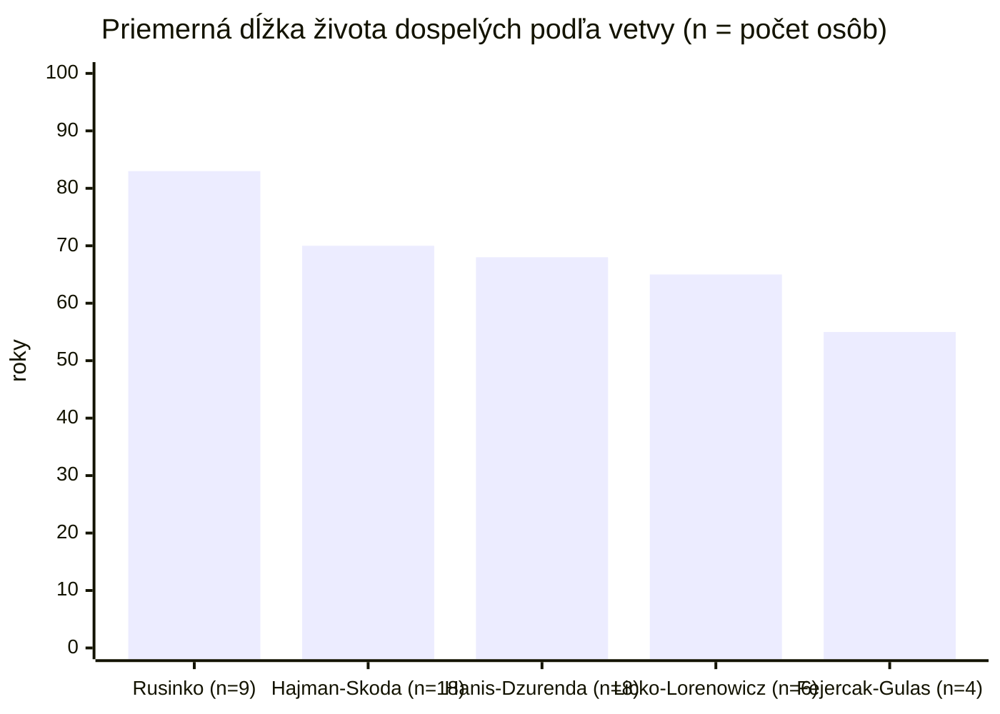

# Štatistiky rodiny

Súvisí: [Prehľad](prehlad.md) · [Stav osôb](stav-osob.md) · Zamestnania v rodine · prepočítané **12.9.2026** z databázy (170 osôb, z toho 107 je v registri na tomto webe). Hodnoty s ~ sú približné (rok bez presného dňa).

Kde sa v tabuľkách počítajú **mená, znamenia a povolania**, ráta sa **107 osôb z registra** — ľudia, ktorých príbuznosť zatiaľ nie je doložená, by čísla skresľovali. **Dĺžka života** sa počíta zo všetkých osôb databázy, ktoré majú doložený rok narodenia aj úmrtia.

## Dĺžka života

**Priemer dospelých: ženy 74 rokov, muži 67 rokov** (22 + 23 doložených osôb). **48 osôb má doložený rok narodenia aj úmrtia**, ďalším trom vieme oba roky aspoň približne — spolu 51 ľudí; šesť z nich zomrelo v detstve (traja ešte v roku narodenia) a do priemerov sa nerátajú — inak by ich stiahli tak, že by prestali hovoriť o dĺžke života a začali hovoriť o dojčenskej úmrtnosti.

| Skupina | Priemer | Najdlhšie | Najkratšie |
|---|---|---|---|
| všetci dospelí (n=45) | 70 r. | Verona Kašperová 91 | Juraj Guľas 32 |
| narodení pred 1900 (n=15) | 63 r. | Anna Maciaková 90 | Juraj Guľas 32 |
| narodení 1900–1950 (n=29) | 74 r. | Verona Kašperová 91 | Jozef Ličko 40 |
| ženy (n=22) | 74 r. | Verona Kašperová 91 | Anna Hajmanová ~40 |
| muži (n=23) | 67 r. | Andrej Rusinko 90 | Juraj Guľas 32 |

**Šesť detí, ktoré sa nedožili pätnástich** — a päť z nich je z jedinej vetvy: Adam Fejerčák a nekrstené dieťa Fejerčákovcov (obaja zomreli v roku narodenia), Ondrej Fejerčák (†0), Ondrej Fejerčák (†2), Ján Fejerčák (†3) a János Suver (†1). Peter Fejerčák a Mária Guľasová pochovali päť detí a dospelosti sa dožila jediná — prababka Anna.

```mermaid
xychart-beta
    title "Priemerná dĺžka života dospelých podľa vetvy (n = počet osôb)"
    x-axis ["Rusinko (n=9)", "Hajman-Skoda (n=18)", "Hanis-Dzurenda (n=8)", "Licko-Lorenowicz (n=6)", "Fejercak-Gulas (n=4)"]
    y-axis "roky" 0 --> 100
    bar [83, 70, 68, 65, 55]
```

Vetvy sú brané tak, ako sú vedené v databáze; Ličkovci a Lorenowiczovci tvoria jednu (spája ich Irena), hoci pokrvne sú to dve rodiny. Etela Lischková nie je započítaná — jej príbuznosť zatiaľ nie je doložená.

- ⭐ **Rusinkovská dlhovekosť**: vetva Rusinko má priemer **83 rokov** a je najvyššia zo všetkých — štyria z nej sa dožili ~90 (Štefan, Andrej, Emília, Mária Holmáňová). Ak sa niečo dedí, tak toto.
- **Traja otcovia, ktorí zomreli mladí** — a zakaždým to prepísalo osud rodiny: Juraj Guľas (32, †1866 — vdova Alžbeta s deťmi), Jozef Hanis (34, †1929 — vdova Anna s dcérami), Jozef Ličko (40, †~1982 — vdova Irena, dcéry adoptoval Peter Lorenowicz).
- Vetva Fejerčák–Guľas má najnižší priemer (55 r., n=4) a zároveň všetky detské úmrtia — o dospelých z nej vieme najmenej. Priemer sa zmení, keď odpovie fara Bajerov.

## Vdovské roky (kto koho prežil)

| Pár | Ovdovel/a | Rokov vdovstva |
|---|---|---|
| Irena (†2015) po Jozefovi Ličkovi (†~1982) | Irena | **~34** (znovu vydatá za Petra L.) |
| Marcela Ličková (†2011) po Miroslavovi (†1985) | Marcela | 26 |
| Mária Majáková (†2009) po MUDr. Tiborovi (†1988) | Mária | 21 |
| Magda Ginelliová (†2006) po Ferdinandovi (†1989) | Magda | 17 |
| Anna Dzurendová po Jozefovi Hanisovi (†1929) | Anna | 40+ (nikdy sa nevydala?) |
| Marta Kočišová (†1982) po Jozefovi Hajmanovi (†1977) | Marta | 5 |
| Helena (†1994) po Rudolfovi (†1991) | Helena | 3 |
| Ján Rusinko (†1980) po Anne (†1967) | Ján | 13 — vzácny prípad, keď prežil muž |
| dedo Ján (†2006) po babke Anne (†2000) | dedo Ján | 6 — druhý taký prípad |

Vzorec sedí s demografiou: takmer vždy prežila žena — ale rusinkovskí muži sú výnimka (dlhovekosť).

## Vekové rozdiely manželov

Priemer: muž starší o ~5 rokov. Extrémy:

| Pár | Rozdiel |
|---|---|
| MUDr. Tibor Hajman (1926) ⚭ Mária Majáková (1942) | **16 rokov** |
| Ferdinand Ginelli (1913) ⚭ Magda Hajmanová (1923) | 10 |
| Ján Dzuriček (1917) ⚭ Mária Hanisová (1926) | 9 |
| Ján Hajman (1913) ⚭ Alžbeta (1922) | 9 |
| Ján Rusinko (1898) ⚭ Anna Fejerčáková (1895) | **−3 — žena staršia!** |
| Peter Fejerčák (1860) ⚭ Mária Guľasová (1861) | 1 |

## Generačný interval (vek rodiča pri narodení dieťaťa)

Materská línia Veroniky je pozoruhodne pravidelná — **22 až 27 rokov, päť generácií za storočie**:

| Rodič → dieťa | Interval |
|---|---|
| Katarína Škodová (1897) → Helena (1919) | 22 |
| Helena (1919) → Irena (1944) | 25 |
| Irena (1944) → Marta (1970) | 26 |
| Marta (1970) → Veronika (1997) | 27 |
| Ján Rusinko (1898) → dedo Ján (1923) | 25 |
| Ferenc Hajman (1873) → Rudolf (1910) | **37** — Rudolf bol z najmladších detí |
| Erzsébet Suver (~1845) → Alžbeta (1876) | ~31 |

## Krstné mená naprieč stromom

**105 pomenovaných osôb v registri nesie 33 rôznych krstných mien** — pokrvní príbuzní, ich manželia a deti zo všetkých vetiev. Pri každej osobe je uvedený jej vzťah k rodine. Maďarské a latinské podoby toho istého mena sú zlúčené (Ján = János = Joannes, Ondrej = András = Andrej, František = Ferenc = Franciscus, Alžbeta = Erzsébet, Jozef = József).

### Mená s viacerými nositeľmi (16 mien, 88 osôb)

| Meno | Počet | Nositelia |
|---|---|---|
| **Mária** | 16 | 3× prababka Mária Fejerčáková rod. Fedorová \*1830 · Mária Fejerčáková \*1858, sestra 2× pradeda Petra · 2× prababka Mária Fejerčáková rod. Guľasová \*1861 · Mária Hajmanová \*1869 a Mária Hajmanová \*1870, sestry 2× pradeda Ferenca · Mária Hajmanová rod. Majáková \*1942, manželka MUDr. Tibora · Mgr. Mária Ginelliová \*1950, Magdina dcéra · prateta Mária Dzuričeková rod. Hanisová \*1926 · Mária Lorenoviczová, matka deda Petra · prateta Mária Rusinková \*1921, najstaršia sestra deda Jána · 3× prababka Mária Rusinková rod. Gumanová \*~1820–35 · Mária „Holmáňová" \*1934, manželka dedovho brata Andreja · 4× prababka Mária Šoltésová rod. Koščíková · Mária Rusinková \*1870, sestra Ondreja · Mária Rusinková rod. Murinová \*1859, prvá manželka Ondreja · Mária Rusinková \*1882, ich dcéra |
| **Anna** | 13 | Anna Fejerčáková \*1877, sestra 2× pradeda Petra · Anna Fejerčáková rod. Jakubíková, manželka Petrovho brata Ondreja · 3× prababka Anna Hajmanová rod. Huterová \*~1838–41 · Anna Schullerová \*1903, takmer isto sestra pradeda Rudolfa · prababka Anna Hanisová rod. Dzurendová \*1900 · prateta Anna Rusinková \*1931, najmladšia sestra deda Jána · prababka Anna Rusinková rod. Fejerčáková \*1895 · babka Anna Rusinková rod. Hanisová \*1928 · 4× prababka Anna Dzurendová rod. Matisová · Anna Rusinková \*1865 a Anna Rusinková \*1867, sestry Ondreja · Anna Murinová rod. Szalokiová, matka Márie Murinovej · Anna Rusinková \*1883, dcéra Ondreja a Márie Murinovej |
| **Ján / János / Joannes** | 12 | Ján Fejerčák \*1884, brat prababky Anny · 3× pradedo Ján Fejerčák \*1830 · Ján Fejerčák \*1866, brat 2× pradeda Petra · Ján Hajman \*1913, kožušník, brat pradeda Rudolfa · 3× pradedo János Hajman \*~1836 · János Parohács, manžel 3× prababky Erzsébety · Ján Dzuriček \*1917, manžel pratety Márie · jeho otec Ján Dzuriček st. \*1874 · dedo Ján Rusinko \*1923 · Ján Rusinko \*1859, brat Ondreja · pradedo Ján Rusinko \*1898 · **Joannes Rusinko, najstarší doložený nositeľ mena (Klenov 1715)** |
| **Alžbeta / Erzsébet** | 7 | 3× prababka Alžbeta Guľasová rod. Semanová \*1834 · Alžbeta Hajmanová \*1922, manželka Rudolfovho brata Jána · 2× prababka Alžbeta Hajmanová rod. Suverová \*1876 · 3× prababka Erzsébet Parohácsová rod. Suverová \*~1845 · prateta Alžbeta Hanisová \*1924 · 2× prababka Alžbeta Dzurendová rod. Šoltésová · 4× prababka Alžbeta Jurčašková rod. Čordošová |
| **Ondrej / Andrej / András** | 7 | Ondrej Fejerčák \*1887, brat prababky Anny (†1887 ako dieťa) · Ondrej Fejerčák \*1868 (†1870 ako dieťa) a Ondrej Fejerčák \*1872, bratia 2× pradeda Petra · András Lachmanek \*1874, manžel Ferencovej sestry Márie · 2× pradedo Andrej Dzurenda \*1870 · prastrýko Andrej Rusinko \*1927 · 2× pradedo Ondrej Rusinko \*1857 |
| **Jozef / József** | 6 | Jozef Haimann \*1879, brat 2× pradeda Ferenca · Jozef Hajman \*1898, brat pradeda Rudolfa · pradedo Jozef Hanis \*1894 · dedo Jozef Ličko \*1942 · jeho otec Jozef Ličko st. \*1912 · otec Jozef Rusinko \*1968 |
| **František / Ferenc** | 5 | 2× pradedo Ferenc Hajman \*1873 · Ferentz Haiman \*1867, starší brat, ktorý zomrel v detstve — jeho meno dostal Ferenc \*1873 · František Hajman \*1900, brat pradeda Rudolfa · 4× pradedo František Heiman · 4× pradedo František Hutera |
| **Juraj** | 5 | 3× pradedo Juraj Guľas \*1834 · Juraj Rusinko \*1862, brat Ondreja · 3× pradedo Juraj Dzurenda \*1841 · 4× pradedo Juraj Dzurenda st. · Juraj Murin, otec Márie Murinovej |
| **Michal** | 3 | 3× pradedo Michal Rusinko \*~1820–35, otec Ondreja · 4× pradedo Michal Jurčaško · Michal Rusinko \*1874, brat Ondreja |
| **Barbora** | 2 | 3× prababka Barbora Dzurendová rod. Jurčašková \*1845 · Barbora Rusinková \*1876, sestra Ondreja |
| **Marta** | 2 | Marta Hajmanová rod. Kočišová \*1902, manželka Rudolfovho brata Jozefa · mama Marta \*1970 |
| **Peter** | 2 | 2× pradedo Peter Fejerčák \*1860 · dedo Peter Lorenowicz \*1950 |
| **Rozália** | 2 | Rozália Hajmanová (Haiman) \*1861, sestra 2× pradeda Ferenca · jej dcéra Rozália Buková \*1884 — **prvé doložené vnúča Jánosa a Anny**, priame dedenie mena matka → dcéra |
| **Rudolf** | 2 | pradedo Rudolf Hajman \*1910 · jeho syn Rudolf ml. \*1945 (Kanada) — priame dedenie mena |
| **Tibor** | 2 | MUDr. Tibor Hajman, chirurg · jeho synovec MUDr. Tibor Ginelli, gynekológ — dedenie cez krstné meno |
| **Štefan** | 2 | prastrýko Štefan Rusinko \*1925 · Štefan Rusinko \*1884, syn Ondreja a Márie Murinovej |

### Mená s jediným nositeľom (17)

| Meno | Kto to je |
|---|---|
| Adam | Adam Fejerčák \*1892 — brat prababky Anny |
| Dmytro | Dmytro Lorenovicz \*1946 — brat deda Petra |
| Emília | Emília Rusinková \*1925 — Štefanova manželka |
| Ferdinand | Ferdinand Ginelli \*1913 — Magdin manžel, huslista; sólista Košického rozhlasu 1939–1944, na konzervatóriu učil husle do polovice 70. rokov |
| Helena | Helena rod. Škodová \*1919 — prababka |
| Irena | Irena Hajmanová \*1944 — babka |
| Jakub | Jakub Šoltés — 4× pradedo |
| Justin | Justin Škoda \*~1900 — obuvník, Helenin otec, 2× pradedo |
| Katarína | Katarína Škodová, rod. Zazyláková \*1897 — Helenina matka, manželka Justina Škodu, 2× prababka |
| Ladislav | Ladislav Hajman \*1916 — Rudolfov brat, hudobník |
| Magda | Magda Hajmanová-Ginelliová \*1923 — dcéra Rudolfovho brata Jozefa |
| Martin | Márton Buk (správnejšie Fokt) \*~1858 — manžel Rozálie, sestry 2× pradeda |
| Matilda | Matilda Ličková rod. Noveková \*~1921 — matka deda Jozefa Lička |
| Tatiana | Tatiana vyd. Elleder — sestra deda Petra |
| Veronika | Veronika Rusinková \*1997 |
| Viktor | Viktor Ličko — mamin nevlastný brat, Jozefov syn z iného manželstva |
| Zdena / Diana | mamina sestra Zdena Ličková \*1966, neskôr Diana Fünfer — jedna osoba, dve mená |

**Čo z toho vidno:** päť najčastejších mien (Mária, Anna, Ján, Alžbeta, Ondrej) pokrýva **55 zo 105 osôb — viac než polovicu rodiny**. Do konca 19. storočia sa v podstate používalo len asi osem mien; pestrosť (Ferdinand, Ladislav, Tibor, Dmytro, Matilda) prichádza až s 20. storočím a s mestom. Dedenie mien je doložené 3×: **Rozália → Rozália** (matka a dcéra, 1861 a 1884), **Rudolf → Rudolf ml.** a **Tibor Hajman → Tibor Ginelli**; k tomu jeden smutný prípad recyklácie — **Ferentz \*1867 zomrel v detstve a meno dostal Ferenc \*1873**. Ženská línia Veroniky mená naopak nikdy neopakuje: Katarína → Helena → Irena → Marta → Veronika — päť generácií, päť rôznych mien.

*Nezapočítané sú osoby, ktorých meno zatiaľ nepoznáme: piate dieťa Jána a Anny Rusinkovcov († pred 1930), dieťa Anny Huterovej z pôrodu roku 1879 a rodičia Jozefa Hanisa.*

## Znamenia v rodine (pre zábavu)

Presný deň narodenia máme u **51** ľudí z registra — toľkých sa dá zaradiť do znamenia.

| Znamenie | Počet | |
|---|---|---|
| **Rak** | 7 | ███████ |
| **Strelec** | 6 | ██████ |
| **Vodnár** | 6 | ██████ |
| **Býk** | 5 | █████ |
| **Baran** | 4 | ████ |
| **Kozorožec** | 4 | ████ |
| **Ryby** | 4 | ████ |
| **Váhy** | 4 | ████ |
| **Lev** | 3 | ███ |
| **Panna** | 3 | ███ |
| **Škorpión** | 3 | ███ |
| **Blíženci** | 2 | ██ |

**Živly:** voda 14 · oheň 13 · vzduch 12 · zem 12 — rozložené takmer rovnomerne, žiadna rodinná prevaha.

### Kto je čo

- **Rak** — Anna Rusinková 1867 · Anna Rusinková 1883 · Anna Rusinková 1931 · Dmytro Lorenovicz 1946 · Ján Rusinko 1859 · Mária Rusinková 1934 · Peter Fejerčák 1860
- **Strelec** — Anna Hanisová 1900 · Anna Rusinková 1928 · Barbora Rusinková 1876 · Emília Rusinková 1925 · František Hajman 1900 · Ján Dzuriček 1874
- **Vodnár** — Adam Fejerčák 1892 · Jozef Rusinko 1968 · Ján Rusinko 1923 · Mária Dzuričeková 1926 · Ondrej Rusinko 1857 · Rudolf Hajman 1910
- **Býk** — Jozef Hajman 1898 · Ján Dzuriček 1917 · Ján Rusinko 1898 · Michal Rusinko 1874 · Tibor Hajman 1926
- **Baran** — Anna Rusinková 1865 · Helena Hajmanová 1919 · Mária Ginelliová 1950 · Mária Hajmanová 1942
- **Kozorožec** — Jozef Ličko 1942 · Marta Rusinková 1970 · Rozália Buková 1884 · Štefan Rusinko 1884
- **Ryby** — Alžbeta Hajmanová 1876 · Mária Rusinková 1870 · Mária Rusinková 1882 · Peter Lorenowicz 1950
- **Váhy** — Anna Rusinková 1895 · Marta Hajmanová 1902 · nekrstené dieťa Fejerčák 1893 · Štefan Rusinko 1925
- **Lev** — Ferenc Hajman 1873 · Magda (Magdaléna) Ginelliová 1923 · Mária Fejerčáková 1861
- **Panna** — Andrej Rusinko 1927 · Mária Hajmanová 1869 · Mária Rusinková 1921
- **Škorpión** — Andrej Dzurenda 1870 · Irena Hajmanová 1944 · Veronika Rusinková 1997
- **Blíženci** — Alžbeta Hanisová 1924 · Jozef Ličko 1912

### Mesiac

Znamenie Mesiaca sa dá dopočítať aj bez hodiny narodenia, lebo Mesiac prejde znamením za dva a pol dňa:

| Znamenie | Počet | |
|---|---|---|
| **Blíženci** | 7 | ███████ |
| **Lev** | 7 | ███████ |
| **Býk** | 6 | ██████ |
| **Panna** | 5 | █████ |
| **Škorpión** | 5 | █████ |
| **Baran** | 4 | ████ |
| **Rak** | 4 | ████ |
| **Strelec** | 4 | ████ |
| **Vodnár** | 4 | ████ |
| **Váhy** | 3 | ███ |
| **Kozorožec** | 2 | ██ |

⚠️ **24 z 51** sa narodilo v deň, keď Mesiac menil znamenie — u nich by presná hodina narodenia mohla výsledok prehodiť do susedného znamenia. Skoro polovicu tabuľky teda treba brať ako odhad.

**Ascendent sa dopočítať nedá vôbec.** Točí sa cez všetkých dvanásť znamení za jediný deň, takže ho určuje výlučne hodina narodenia — a tú nepoznáme ani u jedného člena rodiny. Dala by sa vyčítať z originálov civilných matrík po roku 1895, kde sa hodina zapisovala.

### Kedy sa rodilo

| Mesiac | Počet | |
|---|---|---|
| január | 6 | ██████ |
| február | 4 | ████ |
| marec | 5 | █████ |
| apríl | 4 | ████ |
| máj | 4 | ████ |
| jún | 2 | ██ |
| júl | 7 | ███████ |
| august | 2 | ██ |
| september | 5 | █████ |
| október | 2 | ██ |
| november | 5 | █████ |
| december | 5 | █████ |

**Dni v týždni:** utorok 11 · pondelok 10 · piatok 8 · sobota 8 · nedeľa 6 · streda 4 · štvrtok 4.

Vyzerá to, akoby sa v niektorých mesiacoch rodilo výrazne viac — ale nie je to pravda. Chí-kvadrát test proti rovnomernému rozdeleniu dáva **χ² = 6,65** pri jedenástich stupňoch voľnosti, kým hranica významnosti je 19,7. Inak povedané: pri päťdesiatich ľuďoch vychádza na mesiac zhruba štyri narodenia a rozdiel medzi „veľa" a „málo" je jeden či dvaja ľudia — čistá náhoda. Skutočná sezónnosť pôrodov v strednej Európe existuje, vrchol bol koncom zimy a na jar, ale je príliš jemná na to, aby sa v rodine tejto veľkosti dala zbadať.

## Nemanželské deti (línia Suver)

Doložené v matrikách: **3 nemanželské narodenia v dvoch generáciách tej istej ženskej línie** — Alžbeta Suverová (\*1876, matka slúžka v Mokranciach), jej brat(?) János (\*1884, tá istá matka) a Jozef Hajman (\*1898 Budapešť, matka Alžbeta slúžka; legitimizovaný sobášom 1900). Vzorec „slúžka → nemanželské dieťa" sa opakoval matka → dcéra. V dobovom Uhorsku bolo nemanželských ~7–10 % narodení — u Suverovcov to nebola anomália jednotlivca, ale sociálna pasca chudoby.

## Krst koľko dní po narodení

| Osoba | Narodenie → krst | Interval |
|---|---|---|
| Ondrej Rusinko | 9.2.1857 → 10.2.1857 | **1 deň** |
| Peter Fejerčák | 10.7.1860 → 15.7.1860 | 5 dní |
| Ferenc Hajman | 31.7.1873 → 2.8.1873 | 2 dni |
| Alžbeta Suverová | 6.3.1876 → 7.3.1876 | **1 deň** |
| Rozália Buková | 15.1.1884 → 16.1.1884 | **1 deň** |
| Adam Fejerčák | 15.2.1892 → 15.2.1892 | **v deň narodenia** |

V 19. storočí sa krstilo okamžite — novorodenecká úmrtnosť bola taká vysoká, že sa nečakalo. Adama Fejerčáka pokrstili priamo v deň narodenia a ešte v ten deň zomrel. (Dátumy krstov ďalších generácií doplnia matriky Klenov/Bajerov/Valaská.)

## Čo zažili predkovia (vek pri veľkých udalostiach)

| Osoba (život) | 1914 WWI | 1920 Trianon | 1938 anexia KE | 1944–45 front | 1948 KSČ | 1968 invázia | 1989 Nežná |
|---|---|---|---|---|---|---|---|
| Ondrej Rusinko (1857–1936) | 57 | 63 | — | — | — | — | — |
| Ferenc Hajman (1873–?) | 41 | 47 | 65? | | | | |
| Ján Rusinko (1898–1980) | 16 | 22 | 40 | 46 | 50 | 70 | — |
| **Katarína Škodová (1897–1985)** | 17 | 23 | 41 | 47 | 51 | 71 | — |
| Rudolf Hajman (1910–1991) | 4 | 10 | 28 | 34 | 38 | 58 | 79 |
| Helena Škodová (1919–1994) | — | 1 | 19 | 25 | 29 | 49 | 70 |
| dedo Ján (1923–2006) | — | — | 15 | 21 | 25 | 45 | 66 |
| Irena (1944–2015) | — | — | — | 0 | 4 | 24 | 45 |
| Marta (\*1970) | — | — | — | — | — | — | 19 |

**Katarína Škodová prežila celý „krátky vek extrémov" na jednom mieste**: narodila sa v Rakúsko-Uhorsku, žila v ČSR, Maďarskom kráľovstve (anexia), ČSR, ČSSR — päť štátov bez jediného sťahovania. Irena sa narodila v novembri 1944 — **priamo do frontového mesta** (Košice oslobodené v januári 1945).

## Index skomolenín priezvisk

Koľko pravopisných podôb sme doložili v prameňoch:

| Priezvisko | Varianty | Počet |
|---|---|---|
| **Suver** | Suver, Suvet (chybný prepis), Šuver, Schurer, (Schuller — zámena) | **5** |
| **Hajman** | Hajman, Hajmán, Haiman, Halman, Homon | **5** |
| **Škoda** | Škoda, Škody, Škodi, Skodi, Szkoda (poľ.) | **5** |
| **Zazylák** | Zazyláková, Zazylak, Zazulák, Zazulyák, Zazuliak | **5** |
| Fejerčák | Fejerčák, Fejercsák, Fejércsak, Fejérčák | 4 |
| Hutera | Hutera, Huterka, Hutyera, Hutira | 4 |
| Ličko | Ličko, Licskó, Lischko (Medzev), Litschko | 4 |
| Guľas | Guľas, Gulyasz, Gulyaszkó | 3 |
| Lorenowicz | Lorenowicz, Lorenovicz | 2 |
| Rusinko | Rusinko, Ruszinkó | 2 |

Praktický dôsledok: pri každom hľadaní v indexoch treba počítať so všetkými variantmi — do matrík a súpisov sa dostali aj skomoleniny ako „Suvet" či „Halman". Pri Kataríne je celé rodné meno takou skomoleninou: matrikár ju najprv zapísal ako Kaminszky, roku 1927 opravil na „Zazyláková", pričom bežná podoba mena je Zazulák.

## Konfesionálna mapa

| Vetva | Vyznanie | Farnosť |
|---|---|---|
| Rusinko | **gréckokatolícke** | Klenov (filiálky Brežany, Rokycany) |
| Fejerčák–Guľas | rímskokatolícke | Bajerov |
| Hanis–Dzurenda | rímskokatolícke | Bajerov (Žipov) |
| Hajman + Suver | rímskokatolícke (dolož. 1900) | Szőlősgyörök; Szepsi/Moldava; KE |
| Škoda | rímskokatolícke | KE / Abov |
| Ličko | rímskokatolícke? | Valaská/Brezno (overí rodný list) |
| Lorenowicz (pôvod) | gréckokatolícke | Zamiechów pri Przemyśli |

Manželstvo dedo Ján (GK) × babka Anna (RK) bolo konfesionálne zmiešané — bežné, ale určovalo, kde sa krstili deti. Justin Škoda aj Katarína sú v košickom zápise z roku 1919 vedení ako rímskokatolíci.

Približne tri percentá aškenázskeho pôvodu v DNA zostávajú nepriradené. Hľadanie priezvisk Škoda, Zazulak a Zazuliak medzi rodostromami DNA matchov (september 2026) nevrátilo **ani jednu zhodu**, takže Kataríninu líniu ani nepotvrdilo, ani nevylúčilo — slovenské rodiny sú v týchto databázach zastúpené len slabo. Stopa zostáva otvorená; druhým kandidátom sú poľskí predkovia Ferenca. Podrobnosti sú v DNA matche (Ancestry).

## Povolania — z čoho rodina žila

Doložené povolanie máme u **21 osôb z registra** naprieč štyrmi vetvami a tromi storočiami (podrobný rozpis po vetvách je v Zamestnania v rodine).

| Okruh | Osôb | Kto |
|---|---|---|
| **Pôda a nádenníctvo** | 7 | gazda Joannes Rusinko (1715), želiar a roľník Michal Rusinko, nádenník a roľník Ján Rusinko, nádenníčka a školníčka Anna Dzurendová, želiar János Hajman, želiarka Anna Huterová, čeľadník Márton Buk |
| **Remeslá** | 4 | stolár Ferenc, kominár Rudolf, kožušník Ján, obuvník Justin Škoda |
| **Služba** | 3 | Erzsébet Suverová, jej dcéra Alžbeta, Alžbeta Hanisová — **všetko ženy** |
| **Vzdelané profesie** | 3 | chirurg Tibor Hajman, gynekológ Tibor Ginelli, kurátorka Mária Ginelliová |
| **Hudba** | 2 | huslista Ferdinand Ginelli — sólista Košického rozhlasu 1939–1944 a profesor konzervatória, kde učil husle do polovice 70. rokov; rozhlasový hudobník a dirigent Ladislav Hajman |
| **Priemysel a robota v závode** | 1 | majster VSS Jozef Ličko |
| **Domácnosť** | 1 | Anna rod. Fejerčáková, vedená v hárku 1940 ako „domáca" |

K tomu sú doložené ešte dve remeselné tradície, ktoré sa neviažu na jednu menovanú osobu: horehronskí Ličkovci ako uhliari a klinčiari a robotník VSŽ z lorenowiczovskej vetvy.

## Postrehy o povolaniach

- **Služba** = najčastejšie doložená ženská práca (Erzsébet Suver, dcéra Alžbeta, Alžbeta Hanisová) — vzorec „matka-slúžka → nemanželské dieťa" v línii Suver 2× po sebe. Všetky tri doložené ženské zamestnania pred rokom 1950 sú „slúžka" alebo „v službe"; prvá doložená žena s kvalifikovanou profesiou je až **Mária Ginelliová** (\*1950, kurátorka Východoslovenského múzea) — teda o generáciu neskôr než muži.
- **Nádenníctvo** — šarišské vetvy (Rusinko, Hanis) boli okolo 1930 bezzemkovia.
- **Železiarska kontinuita Ličko**: horehronskí Ličkovci boli uhliari/klinčiari hrončiansko-podbrezovského komplexu (19. stor.) — a Jozef \*1942 z Valaskej skončil ako majster vo VSS Košice; remeslo „išlo za železom" aj pri migrácii na východ. Rovnaký motív priviedol do Košíc aj Lorenowiczovcov z Chomutova (VSŽ) — dve nezávislé vetvy, ten istý magnet.
- **Košické remeslá u Hajmanovcov**: kominár + kožušník + stolári + hudobník-úradník v jednej generácii; **hudba** ako spojivo s Ginelliovcami (rozhlasový orchester).
- ⭐ **Socioekonomický oblúk Hajman**: želiar & slúžka (~1870) → stolársky pomocník (migrácia za prácou do Budapešti, 1898) → košickí remeselníci a majitelia domov (1915) → **lekári, profesor konzervatória, kurátorka** (1960-te) — tri generácie od bezzemka k inteligencii. Štyri generácie, štyri sociálne poschodia.
- **Mesto verzus dedina.** Šarišské vetvy (Rusinko, Hanis) boli okolo 1930 bezzemkovia bez remesla; košická vetva mala v jednej generácii kominára, kožušníka, stolárov aj hudobníka. Rozdiel nie je v schopnostiach, ale v tom, kam sa rodina dostala.
- **Medzery.** Bez známeho povolania sú zatiaľ dedo Ján ⭐, babka Anna ⭐, Irena, Peter Lorenowicz, Helena aj Katarína Škodové, prastarý otec Jozef Hanis, Jozef a František Hajmanovci, Rudolf ml., Ondrej Rusinko a celá staršia vetva Fejerčák–Guľas — čísla vyššie teda podceňujú roľnícku časť rodiny.
