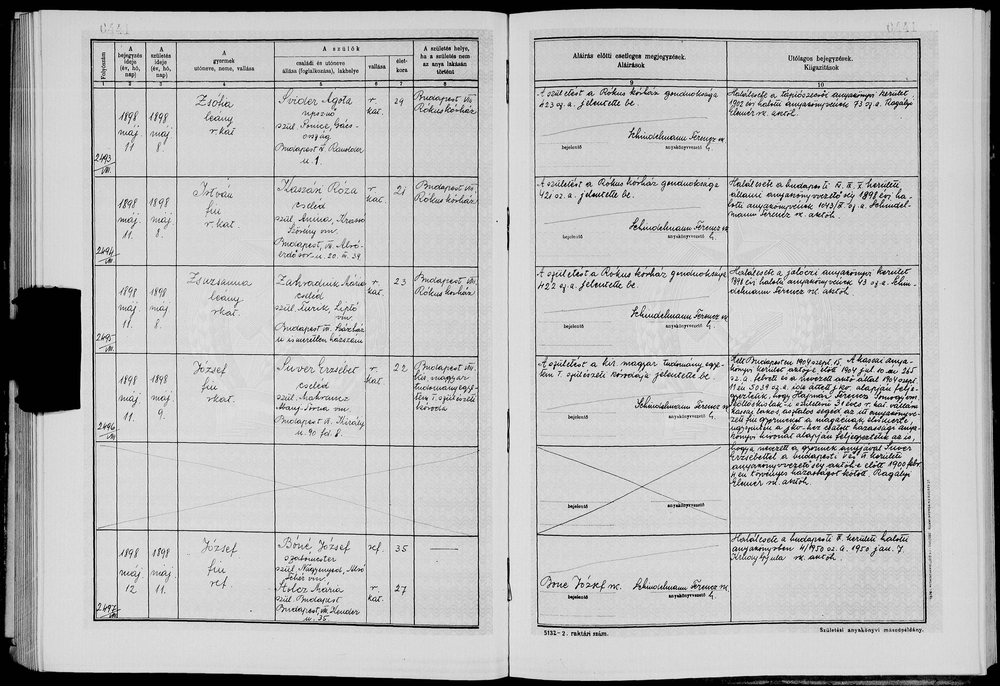
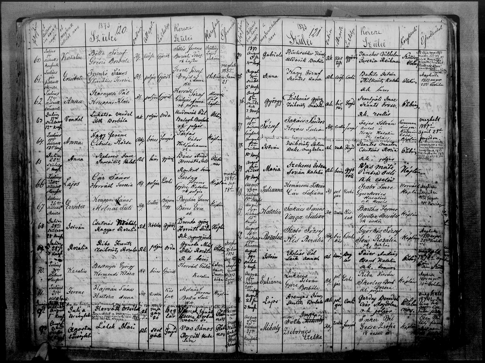
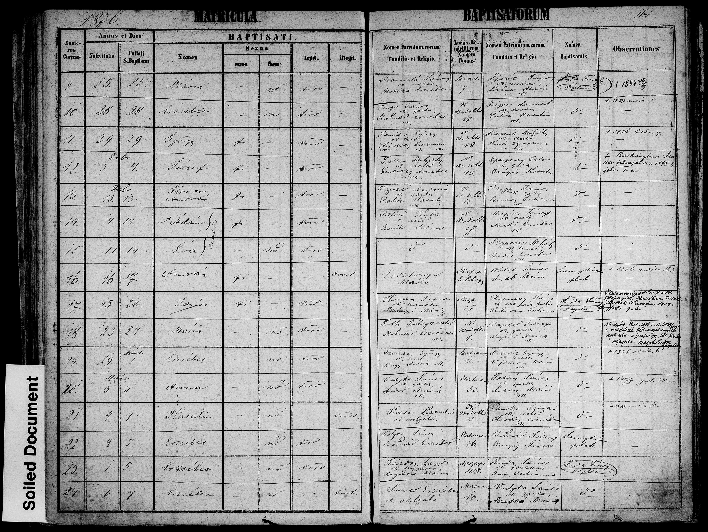
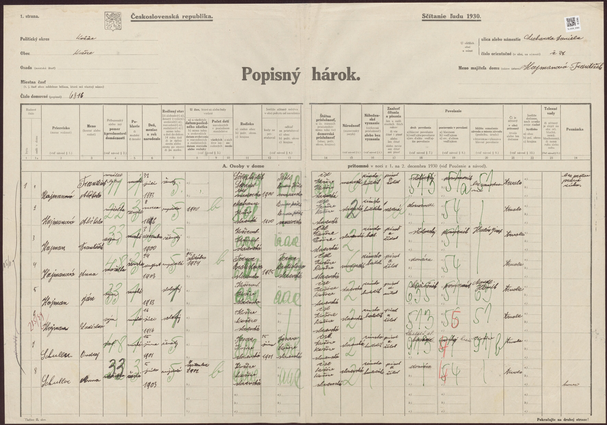
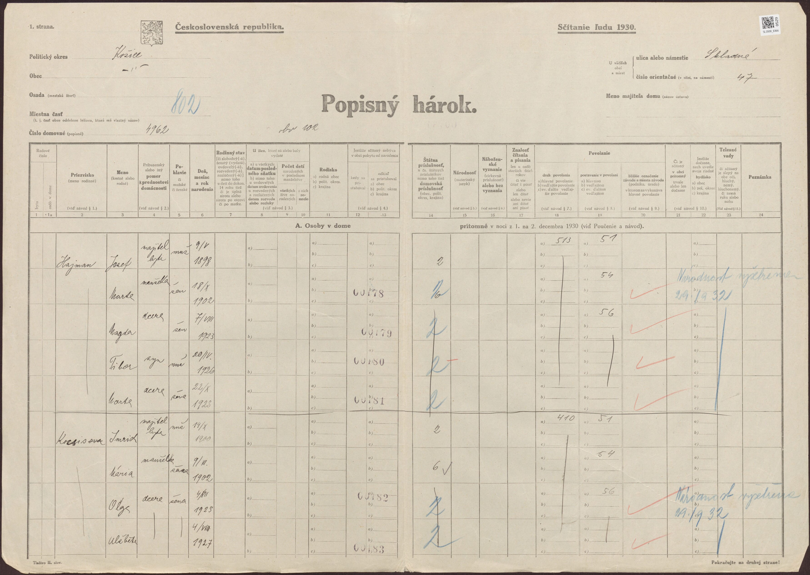
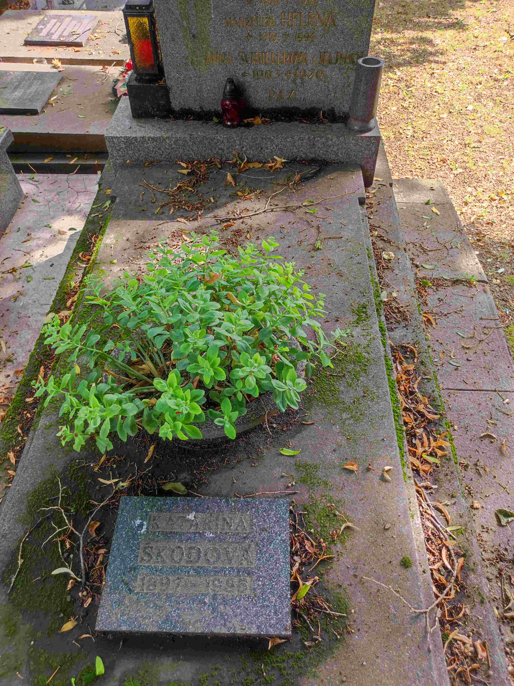
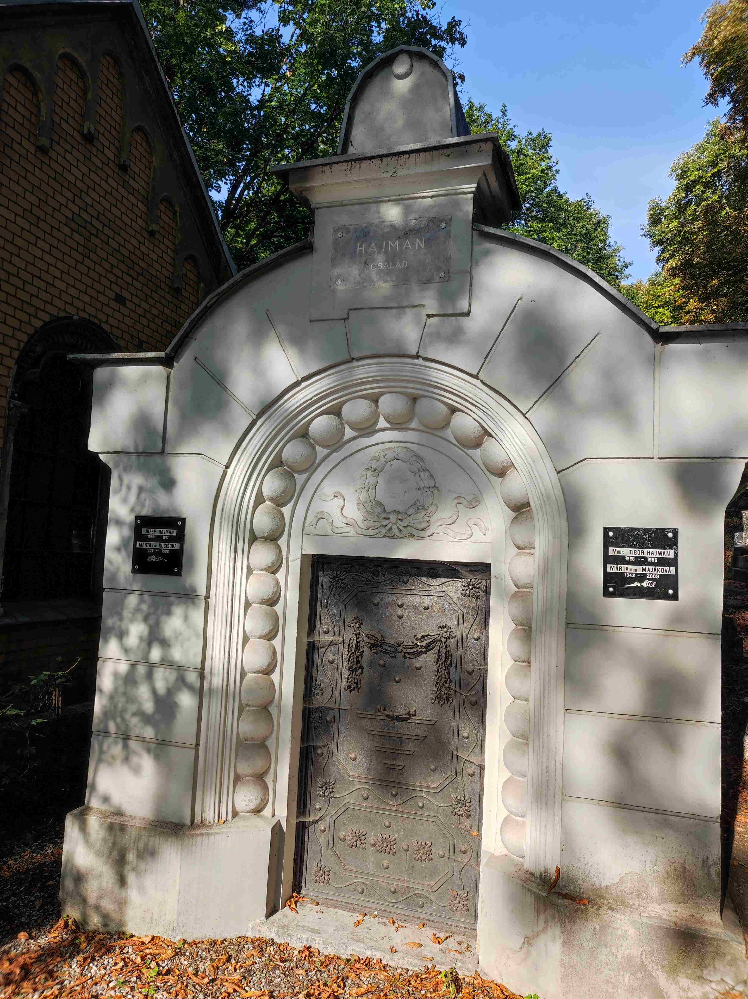
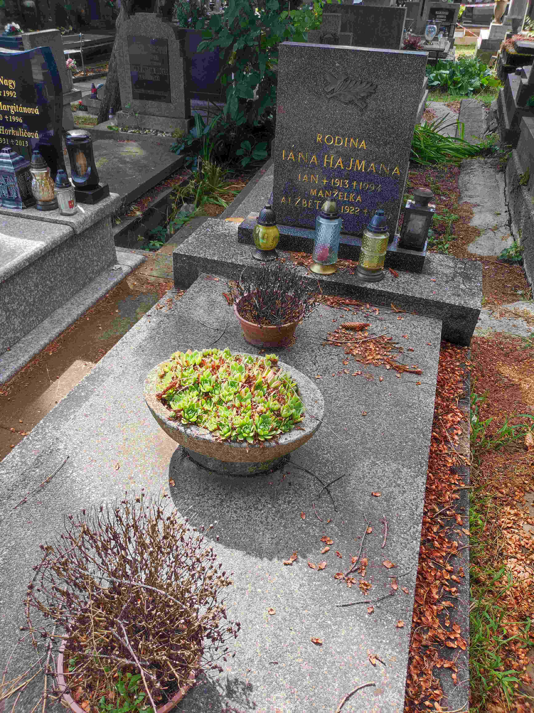
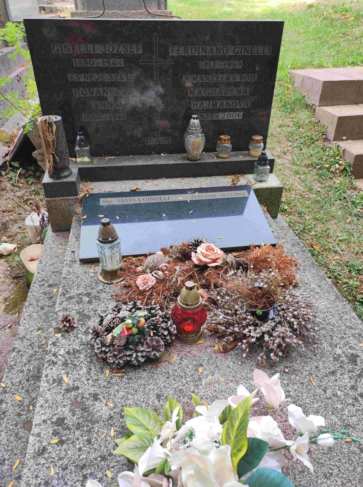

# Vetva Hajman – Škodiová (Somogy + Mokrance → Budapešť → Košice)

Súvisí: [Vetva Ličko](vetva-licko.md) · [Prehľad](prehlad.md) · Výskumný denník

Košická vetva babky Ireny. **Hajmanovci** prišli do Košíc okolo 1900: Ferenc zo somogyskej dediny Szőlőskislak (JZ Maďarsko, pri Balatonboglári) — a jeho rodičia sa do Somogy prisťahovali **z Poľska** (sobášny zápis 1861 aj úmrtný zápis 1879 uvádzajú pôvod „Raicza, Lengyelhon" = Poľsko). Ferencova žena **Alžbeta Suverová** bola z Mokraniec pri Moldave nad Bodvou (25 km od Košíc). Spoznali sa v Budapešti — ona slúžka, on stolársky pomocník — a po svadbe 1900 sa usadili v Košiciach, v kraji jej rodiny. Vyrástol z nich remeselnícky klan (kominár, kožušník, hudobník, lekár…) okolo ulíc Lichardova a Skladná. **Škodovci** sú rodina Ireninej matky Heleny; podľa rodinnej pamäti s poľským pôvodom (hypotéza, overuje sa).

## Rodová línia

- **Babka Irena Hajmanová** — *16.11.1944 Košice (vtedy Kassa, Maďarsko), †20.4.2015 Košice (~70 r.). ⚭1 Jozef Ličko ([Vetva Ličko](vetva-licko.md)), ⚭2 Peter Lorenowicz → zomrela ako **Irena Lorenowiczová** (úmrtný zápis aj parte hľadať pod týmto menom). Kremácia, popol rozptýlený — hrob nemá. FS `PMQ3-MPM`; dátumy sa overujú úmrtným listom.
- **Pradedo Rudolf Hajman** — *1916(?) †1991 (hrob sk. 1; horný riadok náhrobku je na fotke čiastočne odrezaný). **Kominár**, maďarská národnosť. V rokoch 1939–41 funkcionár kresťansko-sociálneho odborového spolku kominárov v Kassa — od radového člena (1939) cez pokladníka (1/1940) a tajomníka (11/1940) po výkonného tajomníka (1941); pramene: Jövőnk 1.4.1939, 27.1.1940, 22.2.1941; Felvidéki Ujság 8.11.1940 a 22.3.1941 (tam písaný aj „**Haiman**"); [vyhľadanie v Arcanum](https://adt.arcanum.com/en/search/results/?query=%22Hajman%20Rudolf%22). Identifikácia cez meno + mesto + remeslo + generáciu je takmer istá. Dostaval rodinný dom **Lichardova 30**. FS `PMQ3-4D3`.
- **Prababka Helena rod. Škodiová** — *1919 †1994 (~75 r., hrob sk. 1). Hovorila po slovensky, žila v Košiciach. Podľa rodinnej pamäti ona alebo jej rodina pochádzala z Poľska — hypotéza: poľská Geneteka ju nepotvrdila a Škodovci vyzerajú skôr ako miestny abovský rod, takže poľská pamäť sa možno viaže na rodné meno jej matky. Rozhodne úmrtný/rodný zápis. FS `PMQ3-HFX`.
- **Praprababka Katarína Škodová** — 1897–1985 (~88 r.), Helenina matka, pochovaná v tom istom hrobe sk. 1 (trojgeneračný hrob). „Škodová" je priezvisko po manželovi (Škoda/Škody) — **jej rodné meno nepoznáme**; je kandidátkou na nositeľku poľskej stopy. Spopolnená 8.4.1985, **urna uložená 4.6.1985 do rodinného hrobu sk. 1** (potvrdené evidenciou SMSZ 15.7.2026).
- **Irenin brat Rudolf ml.** — emigroval do Kanady (pravdepodobne 50.–60. roky, možno útek z ČSSR); podľa rodinného podania sa neskôr presťahoval do Izraela a konvertoval na judaizmus (neoverené). V košických knihách narodení 1930–44 nie je → pravdepodobne ***1945–50** (mladší než Irena), alebo sa narodil mimo Košíc. V montrealskom telefónnom zozname figuruje „Rudolph Hajman" — silný kandidát, ale zhoda mena nie je dôkaz identity; detaily v Denníku, o prípadnom oslovení rozhodne rodina.
- **2× prastarí rodičia: Ferenc Hajman a Alžbeta rod. Suverová.** Ferenc *31.7.1873 Szőlőskislak, krst 2.8.1873 Szőlősgyörök; stolársky pomocník (asztalos segéd); úmrtie neznáme (dom bol už 1915 písaný na manželku — možno vtedy vdovu; v sčítaní 1930 je vdova určite). Alžbeta *6.3.1876 Mokrance (Makranc č. 10), krst 7.3.1876 Moldava nad Bodvou; †po 12/1930. Sobáš **4.2.1900 Budapešť** (civilne, VI. obvod). Civilné matriky píšu priezvisko dôsledne **Suver** (pozemková evidencia „Schurer"; košické záznamy ho plietli aj so „Schuller"). FS: Ferenc `PX7K-3LY` ⚭ Alžbeta `PX7K-M17` (vzťah `9ZCF-R38`).
- **3× prastarí rodičia: János Hajman a Anna rod. Huterová — prisťahovalci z Poľska.** Obaja sa narodili v „**Raicza, Lengyelhon**" (Poľsko; kandidát: Rajcza pri Żywci, Halič) — János *~1836, Anna *~1838–41. V 1861 obaja slúžili ako nádenníci (mercenarius/mercenaria) v osade **Csehi**; sobáš **10.2.1861 Szőlősgyörök** (zápis č. 32, sobášil kooperátor Paulus Szmodis, svedkovia Franciscus Beke a Joannes Aranyas). Neskôr János želiar (zsellér) v Kislaku. Anna **†7.4.1879 v Kislaku pri pôrode** („szülés következtében", zaopatrená; pohreb 8.4. Kislak) — Ferenc osirel ako 5-ročný, do Košíc odišiel už bez matky. FS: János `LHW1-JPX`, Anna `LHW1-JPF`.
- **4× prastarí rodičia (zo sobášneho zápisu 1861): František (Franciscus) Heiman** — Jánosov otec — a **František (Franciscus) Hutera** — Annin otec. Obe rodiny teda podľa matriky pochádzali z Poľska; mená matiek zápis neuvádza.
- **3× prababka (Mokrance): Erzsébet Suver** — slúžka v Makranci č. 10, slobodná matka Alžbety (1876) a pravdepodobne aj Jánosa (krst 17.10.1884 Szepsi, tiež nemanželský). Kandidátka na jej identitu: Erzsébet Suver, krst 1845 Moldava, rodičia **Jozef Suver & Erzsébet Répásová** — jediná z indexu, ktorej vek sedí na oba pôrody; overuje sa. (Ak platí, jej brat István *1851 mal deti s Annou Hanzokovou — synovci.)

## Deti Jánosa a Anny (Szőlősgyörök)

- **Mária**, krst 1869 — ⚭ 17.11.1906 **András Lachmanek** (*1874; jeho rodičia Jakab Lachmanek & Zsuzsanna Bárány; sobášny záznam ark 1:1:6JBQ-2VLF, potvrdený aj civilnou matrikou s matkou Hutera Anna). Potomkovia = Lachmanekovci; rodina teda v kraji ostala aj po Ferencovom odchode. FS `LHW1-JPD`.
- **Ferenc** *1873 — náš predok (krstní rodičia Molnár Ferenc & Bolla Juli).
- **Pravdepodobní ďalší synovia: Lajos, József a Pál** — z FS indexu (rodičia „Heiman/Homon János × Hutera Anna" v tej istej malej farnosti); **overuje sa** — kým detaily krstov (dátum, bydlisko, číslo domu) nepotvrdia identifikáciu, nezapisovať do FS ani na web.
- **Rozália (Rozi)** *~1861 — doložená dcéra Jánosa (FS index): **⚭ 22.1.1882 Szőlősgyörök** (meno ženícha v indexe skomolené, overiť obraz). Zrejme tá istá Rozália, ktorú vestník Somogy 1906 uvádza ako matku branca Vámosa Mártona.
- Ďalší kandidáti z indexov (overiť obrazy): **Lajos**, krst **1864 Lengyeltóti** (otec Haiman Janus; matka v indexe skomolená); starší **Ferentz**, krst **1867 Szőlősgyörök** (rodičia Haiman Janos & Huttera Anna) — zrejme zomrel v detstve, meno v 1873 použité znova; možná dcéra **Anna**, krst 1876 (matka zapísaná „Katona Anna"?).
- **Dieťa z apríla 1879** — Anna zomrela 7.4.1879 pri pôrode → tesne predtým sa muselo narodiť dieťa; dohľadať krst (a pravdepodobne skoré úmrtie) v matrike Szőlősgyörök 4/1879.

## Rodina Ferenca a Alžbety v Košiciach

Rodina prišla do Košíc 1900, čerstvo po svadbe (údaj z hárku 1930). Piati doložení synovia a pravdepodobne dcéra; v roku 1930 žil celý klan v jednom bloku: vdova Alžbeta so slobodnými synmi na **D. Licharda 37** (dnes Lichardova; číslovanie sa zmenilo), Jozef s rodinou na **Skladnej 47** hneď vedľa — a Rudolf neskôr dostaval dom na **Lichardovej 30**.

- **Jozef** — *9.5.1898 Budapešť, †1977 Košice (~79 r., hrobka 7B). Majiteľ domu Skladná 47 (maď. Szüllő Géza u. 47). ⚭ **Marta rod. Kočišová** (1902–1982). Deti: **Magda** *7.8.1923 (vyd. Ginelliová), **Tibor** *20.4.1926, **Marta** *1928. V hárku 1930 národnosť „vyšetrená" 29.9.1932. FS `PX7K-FV1`.
- **František** — *3.12.1900, ⚭ Anna *1903. FS `PX7V-S7V`.
- **Rudolf** — náš pradedo (vyššie). 1.12.1930 nebol v Košiciach (v kompletnom indexe sčítania chýba — zrejme učňovské roky inde). FS prepojený na rodičov (`SK4K-Q53`).
- **Ján** — *1913, **kožušník** („Hajman János szűcssegéd", Kassai Ujság 23.7.1932; Felvidéki Ujság 30.12.1941), †1992(?). ⚭ Alžbeta *1922. Hrob 1MÚZEUM 1A/2; v evidencii hrobu aj Zita Kulčárová (dcéra?). FS `PX7V-5RK`.
- **Ladislav** — *1916, úradník (irodatiszt) a **hudobník košického rozhlasového orchestra**; 1940–45 zástupca dirigenta a potom dirigent baníckej kapely v Perecesi pri Miškovci; 1945 sa vrátil do Košíc (Herman Ottó Múzeum Évkönyve 12/1973, s. 256; Felsőmagyarországi Tanügy 25.8.1940; Magyar Jövő 20.7.1941). Hrob pravdepodobne sk. 15 (Ladislav + Magdaléna) — neoverené. FS `PX7K-S9Z`.
- **Anna** — *1903 †1970, vyd. **Schullerová**; pochovaná v hrobe sk. 1 s Rudolfom a Helenou → takmer isto Rudolfova sestra (doklad zatiaľ chýba). Schullerovci bývali 1930 aj v domácnosti na Licharda 37; práve so „Schuller" sa plietlo Alžbetino priezvisko.
- **MUDr. Tibor Hajman** (1926–1988) — chirurg; od 1.7.1964 prvý vedúci lekár protetického oddelenia v Košiciach (dnes odd. ortopedickej protetiky UNLP; ortopedickymagazin.sk, diel III). Žiak Premonštrátskeho gymnázia Kassa (ročenka 1938) a Hunfalvyho gymnázia (ročenky 1939–43, maturita ~1944); 1972 býval Pereš 70 (inzerát, Práca 29.7.1972). ⚭ Mária rod. Majáková (1942–2009). Meno si nikdy nemenil.
- Ďalšie výskyty mena v tlači a záznamoch (zrejme tá istá rodina, jednotlivo nepriradené): Hajman József (hasičská federácia 1940; stratené doklady, Szüllő Géza u., 1/1945 — asi náš Jozef), Hajman Béla (mestský zamestnanec 1942), Hajmán Magdolna (*~1922–25, žiačka obchodnej školy 1940 — možno Magda), Hajmán László (hudobník rádioorchestra 1941/45 — zrejme Ladislav).
- **Dom Pipa u. 16 (chudobná štvrť Tábor/Huštáky):** 6.10.1898 ho kúpila „**Parohács Jánosné szül. Schurer Erzsébet**" za 680 zlatých (od šiestich súrodencov Hankóovcov) a 15.3.1915 prešiel na „Hajman Ferencné szül. Schurer Erzsébet" (Városi Közlöny) — najskôr dedičstvo/darovanie. „Parohács" sa v celej digitalizovanej tlači vyskytuje len v týchto dvoch záznamoch — zrejme skomolenina skutočného mena. **Hypotéza:** kupujúca z 1898 = Alžbetina matka Erzsébet Suver, medzičasom vydatá za Parohácsa — dom by potom prirodzene prešiel na dcéru. Test: pozri Otvorené stopy.

## Dom Lichardova 30

V rodinnom dome dnes žije **Peter Lorenowicz** — predtým tam žil s Irenou, pred nimi Irenini rodičia Rudolf s Helenou. Rudolf dom **dostaval**; kto stavbu začal, nie je isté. Otázky na Petra: kedy sa dom staval a kto začal; spomína si na Rudolfových súrodencov (Ján kožušník, Ladislav hudobník, Jozef zo Skladnej) a ich potomkov; rodinné albumy.

## Ginelliovci (Magdina rodina)

- **Magdaléna Hajmanová** (1923–2006, ~83 r.) ⚭ **Ferdinand Ginelli** (1913–1989) — **huslista, profesor košického konzervatória**, 1942–43 hrával v košickom rozhlase (Felvidéki Ujság a i.; Nógrádi Szó 1993). Rodiny sa zrejme zoznámili cez rozhlasový orchester, kde hral Ladislav Hajman. Ferdinandovi rodičia: Ginelli József (1880–1944) a Anna rod. Hovanecz(?) (188?–1961). Ginelliovci sú stará košická rodina (talianska forma mena; JÚĽŠ 1995: 3 nositelia, všetci Košice-Juh).
- **MUDr. Tibor Ginelli** — ich syn; gynekológ a pôrodník (UNLP Košice, Rastislavova 43; odrodil Veroniku aj brata). Pomenovaný po strýkovi MUDr. Tiborovi Hajmanovi — „doktor Tibor" boli teda dvaja: strýko chirurg Hajman a synovec gynekológ Ginelli. **Pravdepodobne žije** (v cintorínskej DB nie je) — mamin bratranec 2. stupňa a ideálny živý zdroj; kontakt cez mamu. Otázky: kedy zomreli Rudolf a Helena; sestra Mária; osud Rudolfa ml.; poľský pôvod Heleny/Kataríny.
- **Mgr. Mária Ginelliová** (1950–2016, ~66 r.) — kurátorka Východoslovenského múzea (výstavy 1994–96); zrejme dcéra Ferdinanda a Magdy, Tiborova sestra.
- FS: Marta `PXWS-XHJ`, Magda `PXW3-MQY`, Tibor Hajman `PXWS-257`, Marta ml. `PXWS-FY9`, Ferdinand `PXWS-GXF`, Tibor Ginelli `PXWS-JNS` (žijúci).

## Kľúčové dokumenty

### Rodný zápis Jozefa — Budapešť 1898

Budapešť, rodná matrika, zápis č. 2496/VIII, registrované 11.5.1898 — [ark 1:1:68L7-NV46](https://www.familysearch.org/ark:/61903/1:1:68L7-NV46) (štvrtý riadok + okrajová poznámka):

- **József, *9.5.1898, rím.kat.**, narodený v pôrodnici uhorskej kráľ. univerzity (I. szülészeti kóroda), Budapešť VIII.
- Matka: „Suver Erzsébet", slúžka (cseléd), 22-ročná, rím.kat., **narodená v Mokranciach (Makranc), Abovsko-turnianska župa**; bytom Budapešť VI., Király u. 90.
- Dieťa nemanželské; otcovstvo doplnené okrajovou poznámkou (15.9.1904) na základe **zápisnice pred košickým matrikárom 10.7.1904 (č. 265)**: „Hajmán Ferencz, narodený v Szőllőskislaku, Somogyská župa, 31-ročný, rím.kat., košický obyvateľ, stolársky pomocník, uznal dieťa za svoje" + pripojený sobášny výpis: manželstvo **4.2.1900** pred matrikárom budapeštianskeho VI. obvodu.
- Vzorec sa opakoval cez generácie: matka slúžka — nemanželská dcéra (Alžbeta 1876); dcéra slúžka v Budapešti — nemanželský syn (Jozef 1898, legitimizovaný sobášom rodičov).

### Krst Ferenca 1873 — Szőlősgyörök

Farnosť pre Szőlőskislak, RK matrika krstov, s. 120, r. 71 — ark 1:1:2S19-KS3, film 004610748, obraz 66:

**Ferenc, *31.7.1873, krst 2.8.1873**, bydlisko Kis-lak — vek sedí na deň presne s košickou zápisnicou 1904. Rodičia: Hajmán János (zsellér) & Hutera Anna.

### Krst Alžbety 1876 — Moldava nad Bodvou (Szepsi)

RK matrika krstov, s. 161, r. 24 — ark 1:1:KHHP-NSS, film 4948187, obraz 229 (v FS indexe skomolená ako „Suvet"). Makranc bol filiálkou RK farnosti Szepsi (matriky od 1795):

**Erzsébet, *6.3.1876, krst 7.3.1876, nemanželská (törvénytelen)**; matka Suver Erzsébet, slúžka (szolgáló), Makranc č. 10. Krstní rodičia: Valyko János, gazda + Szafka(?) Mária.

### Sobáš Ferenc × Alžbeta — Budapešť 4.2.1900

Civilný sobáš pred matrikárom VI. obvodu (dátum z okrajovej poznámky Jozefovho zápisu; obraz zápisu zatiaľ nedohľadaný — FS kolekcia „Hungary, Civil Registration, 1895–1980", č. 1452460; duplikáty BFL, fond XXXIII.1.a, eleveltar.hu). Oznámenie páru vyšlo už **21.1.1900** v rubrike civilnej matriky troch budapeštianskych denníkov (Magyar Nemzet, Magyar Hírlap, Pesti Napló) — zrejme ohlášky: „Hajmán Ferencz **rk.** — Schurer/Suver Erzsébet **rk.**" → priamy dobový doklad, že obaja boli rímskokatolíci. Obraz zápisu uvedie stav nevesty a jej matku → rozhodne Parohács-hypotézu.

### Sobáš 10.2.1861 — Szőlősgyörök (obraz zápisu nájdený)

RK sobášna kniha Szőlősgyörök 1857–1895, zápis č. 32 — [ark 1:1:6N3H-KBMM](https://www.familysearch.org/ark:/61903/1:1:6N3H-KBMM), obraz: film 004610748 (item 4), obraz 21/134:

- **Joannes Heimann**, 25 r. (*~1836), rím.kat., slobodný, mercenarius; pôvod „**Raitz, lengyel hon**" (Raicza, Poľsko); bydlisko **Csehi**; otec **Franciscus Heiman**.
- **Anna Hutera**, 23 r. (*~1838), rím.kat., slobodná, mercenaria; pôvod „**Raitz, lengyel hon**"; bydlisko **Csehi**; otec **Franciscus Hutera**.
- Svedkovia Franciscus Beke a Joannes Aranyas; sobášil kooperátor Paulus Szmodis; promulgati (ohlásení). V ten istý deň sa sobášil aj pár Michael Szabó × Rozalia Fodor z Lengyeltóti.

### Annino úmrtie 7.4.1879 — Kislak (obraz zápisu nájdený)

RK úmrtná kniha Szőlősgyörök 1865–1895 — [ark 1:1:6N33-3JCX](https://www.familysearch.org/ark:/61903/1:1:6N33-3JCX), obraz: film 004610748 (item 5), obraz 94/204:

- „Hutera Anna, r.k. zsellérnő, **Heiman János neje** (manželka), narodená **Raiczán, Lengyelhon**, zomrela **v Kislaku**, **38 rokov** (*~1841), príčina: **szülés következtében** (v dôsledku pôrodu), zaopatrená sviatosťami; pohreb 8.4.1879 Kislak, pochoval plébános."
- Úmrtie nezávisle potvrdila aj odpoveď MNL Somogy (23.7.2026).

### Sčítacie hárky Košice 1930

- **D. Licharda 37** ([Slovakiana cair-ko14yzf](https://www.slovakiana.sk/kulturne-objekty/cair-ko14yzf); FS zdroj `W82X-K8Q`): vdova Alžbeta Hajmanová (zapísaná „*1873" — zápis komisára; správne *1876) + synovia František *1900, Ján *1913 kožušník, Ladislav *1916 + Schullerovci.
  
- **Skladná 47** (FS zdroj `W82X-KLT`): Jozef s manželkou Martou a deťmi Magdou, Tiborom a Martou; príchod rodiny do Košíc 1900.
  

## Hroby (Verejný cintorín Košice; fotky z GIS)

| Kto | Dátumy | Hrob |
|---|---|---|
| Rudolf Hajman + Helena + Anna Schullerová r. Hajman + Katarína Škodová | *1916(?) †1991; 1919–1994; 1903–1970; 1897–1985 | sk. 1 (ID 8596) |
| hrobka „HAJMAN CSALÁD": Jozef + Marta r. Kočišová + MUDr. Tibor + Mária r. Majáková | 1898–1977; 1902–1982; 1926–1988; 1942–2009 | hrobka 7B |
| „RODINA JÁNA HAJMANA": Ján + Alžbeta | *1913 †1992(?); *1922 †— | 1MÚZEUM, rad 1A, č. 2 |
| Ginelliovci: József + Anna r. Hovanecz(?) + Ferdinand + Magdaléna r. Hajmanová + Mária | 1880–1944; 188?–1961; 1913–1989; 1923–2006; 1950–2016 | sk. 91, rad 2, hrob 38 |

Irena hrob nemá (kremácia, rozptyl). Staré záznamy v cintorínskej DB sú bez dátumov — dátumy vyžiadať od správy: cintorin@smsz.sk, 0910 678 159, Rastislavova 83.

## Škodovci (Helenina rodina)

- Helena *~1919 → jej rodný zápis je v civilnej matrike (nie na FS); identitu aj pravopis rodiny (Škoda/Škody/Škodi/Skodi/Szkoda) rozhodne jej úmrtný list a rodný list Ireny.
- Kandidátske rodiny Skodi v Košiciach z FS indexu (generácia Heleniných rodičov): **Mihály Skodi & Katalin Gajdos** (deti Mihály József 1894, András 9.9.1895, István György 1898); **András Skodi & Anna Lukács** (András István 1908, István János 4.7.1909); **György Skodi & Anna Vámos** (Ilona 1890 Nižná Myšľa, 1894 Ruskov; sobáš 1908 doložený aj v tlači). Helena Skodi, krst 1893 Nižná Myšľa (Mihály Skodi & Mária Azovri), je na našu Helenu pristará.
- Hustý klaster Škody/Škodi/Škodyová v obciach JV od Košíc (hroby): Košice-Krásna (Anna Töröková rod. Škodiová †1974), Košická Polianka, **Nižná Myšľa** (o. i. Helena Mészárosová rod. Škodyová — bez dátumov; Peter †1997, Mária †2008), Vyšná Myšľa, Seňa (aj „Juhászová Mária r. Škodyová" medzi vlastníkmi lesných pozemkov), Ruskov (Juraj 1897–1985), Kechnec; v samotných Košiciach Škodi Jozef 1940–2015, Peter Škodi 1967–2018, Irena Škodyová 1940–2021, František Škody 1929–2021, rodinný hrob sk. 95/9. → Škodovci vyzerajú ako miestny abovský rod.
- **Skodi István**, ~20-ročný poslíček v Kassa 1/1944 (Magyar Országos Tudósító 20.1.1944) — generačne kandidát na Heleninho brata/bratranca.

## Lorenowiczovci (Irenina druhá rodina)

- **Peter Lorenowicz** — Irenin druhý manžel a **adoptívny otec mamy** (mama bola po adopcii písaná Lorenowiczová — pozor pri hľadaní jej dokladov). Žije v dome na Lichardovej 30; kľúčový živý zdroj (Helena bola jeho svokra; Irenine dátumy; okolnosti smrti Jozefa Lička).
- Obe podoby priezviska (Lorenowicz/Lorenovicz, v/w) sú platné — pri úradných zápisoch došlo ku komoleniu aj v rámci jednej rodiny.
- Súrodenci Petra: **Dmytro Lorenovicz** *20.7.1946 †27.3.2020 (Krematórium KE) a **Tatiana vyd. Elleder(ová)** — žije v Nemecku (manžel zrejme Čech; kandidátske domácnosti v Denníku). Podľa rodiny iní súrodenci neboli — overiť u Petra.
- Matka: **Mária Lorenoviczová** (†Košice ~2000; Verejný cintorín sk. 4, rad 8, hrob 15) — dátumy doplniť od Petra.
- Pôvod: deti narodené v **Chomutove**; do Košíc sa rodina presťahovala, keď mal Peter ~6 rokov (otec dostal prácu vo Východoslovenských železiarňach). Priezvisko je patronymum od Vavrinca; v Poľsku 273 nositeľov, ťažisko Podkarpatské vojvodstvo (okres Jarosław 69) — Geneteka ukazuje klaster **gréckokatolíckej farnosti Zamiechów (Ciemierzowice, Kaszyce) pri Przemyśli, 1844–1900** + vetvu vo východnej Haliči (Ľvov, Bilyj Kamiň). Ciemierzowice boli 1945–47 vysídlené (Akcja Wisła) → sedí presídlenie do severočeského pohraničia aj meno Dmytro (ukrajinský/rusínsky kontext; v lemkovskom slovníku meno nie je, volyňskí Česi vylúčení). Na Slovensku nositelia len v KE + Rozhanovce (2×); v ČR len 2 nositelia (Liberec) — kandidáti na príbuzných, detaily v Denníku.
- Poľská stopa Heleny s Lorenowiczovcami **nesúvisí** — rodinná pamäť sa výslovne týka Ireninej matky.

## 🧬 DNA

Veronikin test: **~3 % Ashkenazi Jewish** ≈ jeden predok 4–6 generácií dozadu. Civilný sobáš 1900 dokladá Ferenca aj Alžbetu ako rímskokatolíkov → prípadný židovský predok by bol o 1–2 generácie vyššie (rodičia Ferenca/Alžbety), alebo v líniách Škodová (rodné meno Kataríny?) či Ličko; šarišské dedinské línie (GK/RK doložené) sú nepravdepodobné. **Nový kandidát: poľská línia Heiman/Hutera z Rajcze** — nemecky znejúce meno Heimann v Haliči + migrácia sedia na aškenázsku stopu lepšie než čokoľvek doteraz (overiť v poľských matrikách). Top DNA matche na Ancestry (DNA matche (Ancestry)) Ashkenazi podiel nemajú → stopa nejde cez „americké" clustre Guľas/Rusinko, čo mestskú vetvu skôr posilňuje. V tomto svetle: podanie o Rudolfovi ml. a Izraeli mohlo odrážať reálny nárok podľa zákona o návrate. Jednorazovo skontrolovať JewishGen Hungary DB (obsahuje Kassa Chevra Kadisha 1908–24) na Hajman/Suver.

## 📷 Kde hľadať tváre

1. Albumy v dome na Lichardovej (Peter) — Rudolf, Helena, Irena, možno Alžbeta
2. Porcelánové portréty na hroboch — skontrolovať hrobku 7B a hrob Ginelliovcov sk. 91 (Dzuričkovcov zo Žipova už máme)
3. Maturitné tablo Tibora Hajmana (~1944, Hunfalvyho gymnázium) + školské ročenky
4. Repatriačné spisy 1946; prípadný vysťahovalecký/ŠtB spis Rudolfa ml. (fotky prakticky vždy)
5. Fortepan.hu — košický rozhlasový orchester ~1941 (Ladislav)

## Kde sú dokumenty

| Dokument | Kde |
|---|---|
| rodný list Ireny (*1944) | zápis odrevidovaný v CISMA → vydá ktorýkoľvek matričný úrad / slovensko.sk (druhopisy ročníkov 1938–44 aj MNL Budapešť) |
| úmrtný list Heleny (†1994) | MÚ KE-Západ (zomrela zrejme v nemocnici na Terase); draft žiadosti 22.7.2026 |
| úmrtné listy Rudolfa (†1991) a Ireny (†2015, ako Lorenowiczová!) | MÚ KE-Juh; draft 22.7.2026 |
| úmrtie Kataríny Škodovej (†1985) | KE-Staré Mesto neeviduje → skúsiť KE-Juh + kremačnú evidenciu SMSZ |
| sobáš Rudolf × Helena | v KE-SM 1938–44 nie je → skúsiť 1935–38, alebo Helenino rodisko |
| obrazy: sobáš 4.2.1900 + rodný zápis Jozefa 1898 | FS „Hungary, Civil Registration, 1895–1980" (1452460); duplikáty BFL fond XXXIII.1.a (eleveltar.hu) |
| matriky Szőlősgyörök (farnosť od 1723) | FS film 004610748 (MOL A 3940–42); krsty 1760–1864 = film 600644/DGS 4658383; do 1895 aj vefleveltar.hu (registrácia); štátne po 1895 adatbazisokonline.mnl.gov.hu; MNL Somogy Kaposvár: svl@mnl.gov.hu, +36 82 528 200 |
| krsty/sobáše Mokrance (Suverovci) | RK farnosť Szepsi (matriky od 1795), FS „Slovakia Church and Synagogue Books" (1554443) |
| pozemková kniha Kassa, vložka 4720 (Pipa 16) | ŠA Košice — kúpna zmluva 1898 + dedičské uznesenie 1915 |
| adresáre Kassa (Koczányi 1906–1913/14), živnostenské registre (kominár, kožušník) | ŠVK KE / DIKDA / Archív mesta KE — bod 12 v Korešpondencia a úlohy |
| školské výkazy „Hajman Kassa" (4 záznamy — asi synovia Ferenca) | radixindex.com (za predplatné) |

## Otvorené stopy

- **Parohács test:** obraz sobáša 4.2.1900 (stav nevesty „hajadon" vs. „özv. Parohács Jánosné" + meno matky); sobáš Parohács × Suver (Kassa X/1895–IX/1898, príp. Moldava ~1876–98); úmrtia Kassa 1914–15 („Parohács Jánosné"); marginálie na krstoch 1876/1884; vložka 4720 v ŠA KE.
- **Rudolf ml.:** rodný zápis (KE-SM, roky 1945–50; ak nie, mimo KE) → potom Library and Archives Canada (imigrácia/naturalizácia po 1951, na žiadosť) a ABS/ÚPN Praha (vysťahovalecký/ŠtB spis). Montrealský kandidát — rozhodnutie rodiny, nekontaktovať priamo. Izraelská stopa: BillionGraves IL, JewishGen (pozor na možnú zmenu mena pri konverzii).
- **Rodné meno Kataríny Škodovej:** kremačný záznam SMSZ 1985 (uvádza miesto úmrtia a matriku) + Helenin úmrtný list (rodičia).
- **Sobáš Rudolf × Helena:** nie je v KE-SM 1938–44 → skúsiť 1935–38 alebo Helenino rodisko; nepriamo posilňuje, že Helena nebola košická rodáčka.
- **Ferencovo a Alžbetino úmrtie:** úmrtné matriky KE (Ferenc †?~1915–?, Alžbeta †po 1930).
- **Poľská stopa Heiman + Hutera:** hlavný kandidát **Rajcza (okres Żywiec, Halič)** — potvrdzuje ju aj Geneteka: „Hutera" sa v Żywieckych Beskydách píše **Hutyra** a krsty 1830–45 sú práve vo farnostiach Milówka (sused Rajcze) a Cięcina. Ďalej: matriky farností **Rajcza + Milówka** (FS filmy / archív diecézy Bielsko-Żywiec) — krsty János ~1836 (otec Franciszek Heiman) a Anna ~1838–41 (otec Franciszek Hutyra), sobáše otcov ~1830te. Prečo prišli do Somogy a či prišli spolu s ďalšími rodinami (Huterovci v Látrány: Gaspar Hutera & Ana Janothka, syn Joannes krst 1857 — poľsky znejúce meno Janothka!).
- **Krst dieťaťa ~4/1879** (Annin posledný pôrod) + jeho osud.
- **Overiť obrazy krstov:** Lajos 1864 Lengyeltóti, Ferentz 1867, Anna 1876; **obraz sobáša Rozi 22.1.1882** (meno ženícha!); krsty József a Pál (indexy „Heiman/Homon János × Hutera Anna").
- **Jánosovo úmrtie** (štátne matriky Szőlősgyörök po 1895, adatbazisokonline zadarmo).
- **Erzsébet Suver st.:** potvrdiť kandidátku *1845 (Jozef Suver & Erzsébet Répásová); pravdepodobný ďalší syn János Suver *1884.
- **Šuverovci žijú v Mokranciach a Moldave dodnes** (JÚĽŠ 1995: Šuver 34× v SR, epicentrum Mokrance 7×, Moldava 7×; v tlači 20. stor. Suver János 1934, Suver István 1935, JRD 1954, Weiszer Józsefné Suver Erzsébet 2006) — vzdialení bratranci na dosah, kandidáti aj na DNA porovnanie.
- **Rozália Hajmanová a syn Vámos Márton** (vestník Somogy 1906/5) — overiť obraz strany 61 (obec narodenia syna) + krst Vámosa Mártona a sobáš/krst Rozálie (matriky Szőlősgyörök/Gamás).
- **Rozhovory so živými:** Peter Lorenowicz (Helena, dom, Rudolfovi súrodenci, Mária Lorenoviczová, súrodenci Tatiana/Vítězslav, kde sa narodil Dmytro); MUDr. Tibor Ginelli cez mamu.
- **Index sčítania 1930:** skúsiť pravopis „Haiman" (Rudolf pod „Hajman" v KE nie je).
- **Hrob sk. 15 (Ladislav + Magdaléna)** a ďalšie hroby Hajmanovcov v DB — overiť vzťahy.
- Z rodinného zošita **prepísať príčiny úmrtí** (kontext + rodinná anamnéza).
- **Spoločná žiadosť o 4 matričné výpisy** — Drafty emailov č. 0b; matriky žiadať vždy s konkrétnymi dátumami a preukázaným vzťahom (nerobia bádateľské rešerše).
