# Vetva Hajman – Škodiová (Somogy + Mokrance → Budapešť → Košice)

Súvisí: [Vetva Ličko](vetva-licko.md) · [Prehľad](prehlad.md)

Košická vetva babky Ireny. **Hajmanovci** prišli do Košíc okolo roku 1900: Ferenc zo somogyskej dediny **Szőlőskislak** pri Balatone — a jeho rodičia sa do Somogy prisťahovali **z Poľska**. Ferencova žena **Alžbeta Suverová** bola z **Mokraniec** pri Moldave nad Bodvou, dvadsaťpäť kilometrov od Košíc. Spoznali sa v Budapešti, kde ona slúžila a on tesal ako stolársky pomocník; po svadbe roku 1900 sa usadili v Košiciach, v kraji jej rodiny. Vyrástol z nich remeselnícky klan — kominár, kožušník, stolári, hudobník, neskôr lekár — usadený okolo ulíc Lichardova a Skladná. **Škodovci** sú rodina Ireninej matky Heleny.

## Rodová línia

- **Babka Irena Hajmanová** — \*16.11.1944 Košice, †20.4.2015. ⚭1 Jozef Ličko ([Vetva Ličko](vetva-licko.md)), ⚭2 Peter Lorenowicz, takže zomrela ako **Irena Lorenowiczová**. Bola spopolnená a popol rozptýlený — hrob nemá.
- **Pradedo Rudolf Hajman** — **\*22.1.1910, †22.9.1991 Košice**, **syn Ferenca a Alžbety rod. Šuverovej**, ako to potvrdila matrika. **Kominár** maďarskej národnosti. V rokoch 1939 až 1941 bol funkcionárom odborového zväzu kominárov v Košiciach — od jej založenia roku 1939 až do roku 1941 **tajomníkom** (viac nižšie). **Dostaval rodinný dom na Lichardovej 30.**
- **Prababka Helena rod. Škodiová** — \*1919, †1994. Hovorila po slovensky a žila v Košiciach.
- **Praprababka Katarína Škodová** — 1897–1985, Helenina matka, pochovaná v tom istom hrobe ako dcéra a zať. „Škodová" je priezvisko po manželovi; **jej rodné meno nepoznáme** a práve ono je kľúčom k rodinnej pamäti o poľskom pôvode.
- **Irenin brat Rudolf ml.** — emigroval do Kanady, pravdepodobne v päťdesiatych alebo šesťdesiatych rokoch. Podľa rodinného podania sa neskôr presťahoval do Izraela a konvertoval na judaizmus. V košických knihách narodení z rokov 1930 až 1944 nie je, narodil sa teda zrejme až po roku 1945.
- **2× prastarí rodičia: Ferenc Hajman a Alžbeta rod. Suverová.** Ferenc \*31.7.1873 Szőlőskislak, stolársky pomocník; dátum jeho úmrtia nepoznáme, ale roku 1915 už bol dom písaný na manželku. Alžbeta \*6.3.1876 Mokrance, †po roku 1930. Sobášili sa **4.2.1900 v Budapešti**.
- **3× prastarí rodičia: János Hajman a Anna rod. Huterová — prisťahovalci z Poľska.** Obaja sa narodili v **Rajczi** (v matrikách „Raicza, Lengyelhon"), János okolo roku 1836, Anna okolo 1838 až 1841. Roku 1861 slúžili obaja ako nádenníci v osade Csehi; neskôr bol János želiarom v Kislaku. **Anna zomrela 7.4.1879 pri pôrode** — Ferenc osirel ako päťročný a do Košíc odchádzal už bez matky.
- **4× prastarí rodičia: František Heiman** (Jánosov otec) a **František Hutera** (Annin otec) — obaja z Poľska. Mená ich manželiek matrika neuvádza.
- **3× prababka Erzsébet Suver** — slúžka v Mokranciach, slobodná matka Alžbety; neskôr **vydatá Parohácsová**, majiteľka domu na Pipa utca 16, †koncom 1914 alebo v januári 1915 v Košiciach.

## Kľúčové dokumenty

### Sobášny zápis — Budapešť, 4.2.1900

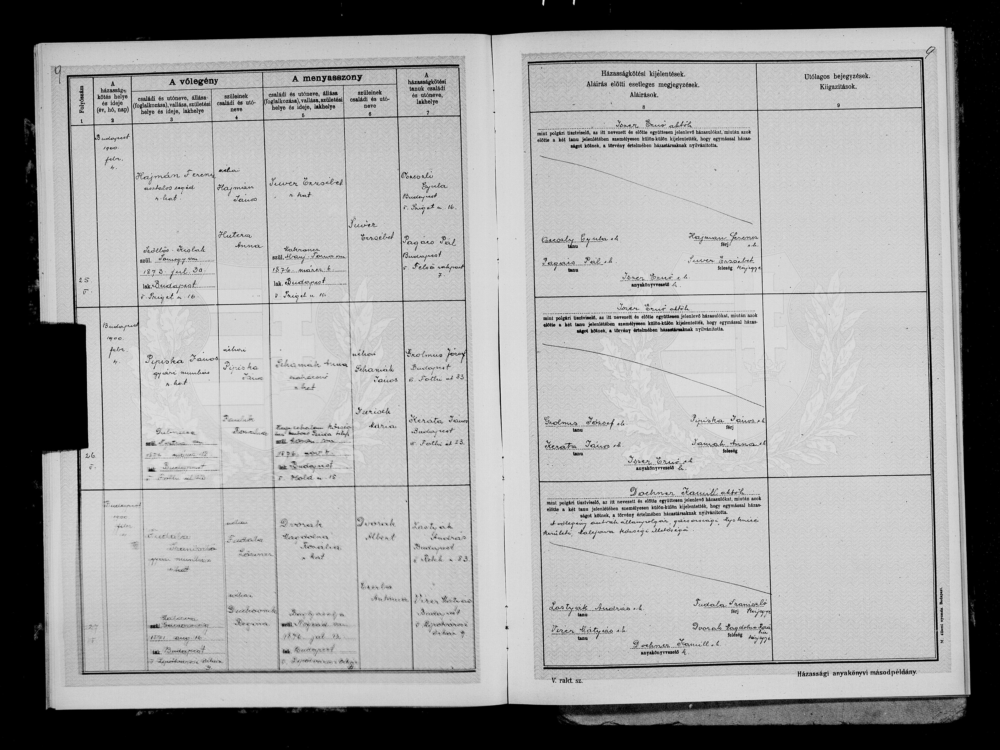

| | Ženích | Nevesta |
|---|---|---|
| Meno | Hajmán Ferencz, tovariš stolár, rím. kat. | Suver Erzsébet, rím. kat. |
| Narodenie | Szöllős-Kislak, Somogy, 30.7.1873 | Makrancz, Abaúj-Torna, 6.3.1876 |
| Bydlisko | Budapest V., Sziget u. 16 | Budapest V., Sziget u. 16 (**bývali už spolu**) |
| Rodičia | **† Hajmán János** a **Hutera Anna** | **iba „Suver Erzsébet"** — otec neuvedený |

Ferencovi rodičia sú **János Hajman a Anna Huterová**. Slovko „néhai" — nebohý — pri Jánosovi znamená, že v roku 1900 už **nežil ani otec**, takže Ferenc vstupoval do manželstva ako sirota po oboch rodičoch. Pri neveste je uvedená iba matka: **Alžbeta bola nemanželské dieťa** a jej matka Erzsébet Suver v tom čase ešte žila.

### Rodný zápis Jozefa — Budapešť 1898

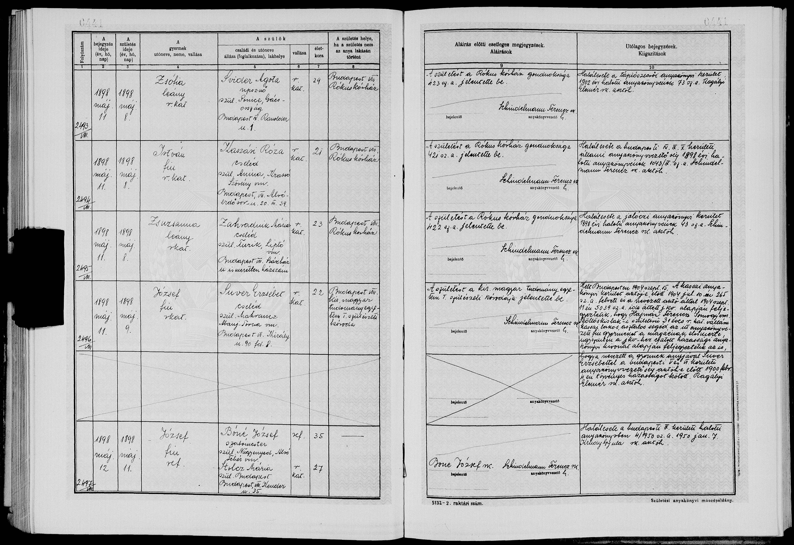

**József, \*9.5.1898**, narodený v pôrodnici uhorskej kráľovskej univerzity. Matka: „Suver Erzsébet", slúžka, dvadsaťdvaročná, rodáčka z Mokraniec. Dieťa je zapísané ako nemanželské.

O šesť rokov neskôr, **10. júla 1904**, prišiel Ferenc pred košického matrikára a syna uznal za svojho — zápisnica ho opisuje ako „stolárskeho pomocníka, košického obyvateľa, 31-ročného" a je k nej pripojený výpis o sobáši rodičov. Vďaka tomu má Jozef v rodnom zápise dodatočnú poznámku o otcovi.

Vzorec sa v tejto rodine zopakoval cez generácie: matka slúžka a nemanželská dcéra (Alžbeta 1876), potom dcéra slúžka v Budapešti a nemanželský syn (Jozef 1898), tentoraz legitimizovaný svadbou rodičov.

### Krst Ferenca 1873 — Szőlősgyörök

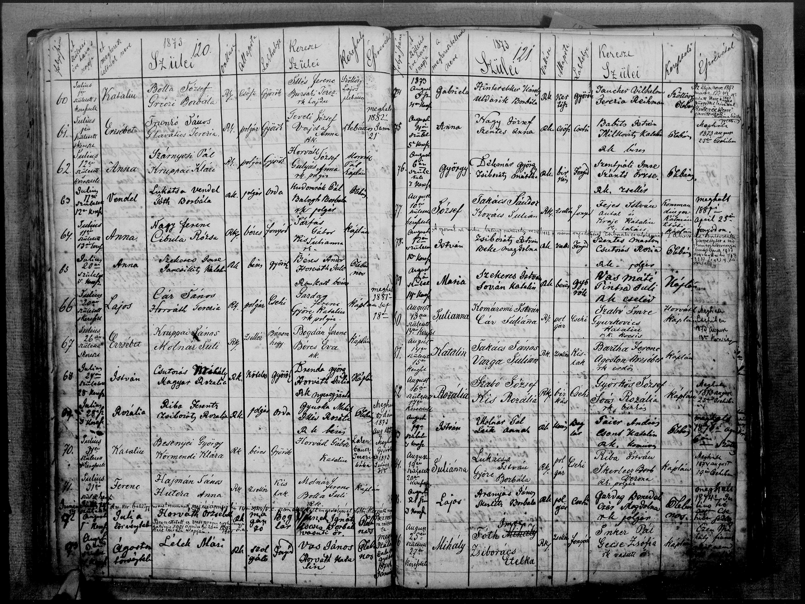

**Ferenc, \*31.7.1873, krstený 2.8.1873**, bydlisko Kis-lak; rodičia Hajmán János, želiar, a Hutera Anna. Vek sedí na deň presne s tým, čo o sebe Ferenc povedal v Košiciach roku 1904.

### Krst Alžbety 1876 — Moldava nad Bodvou

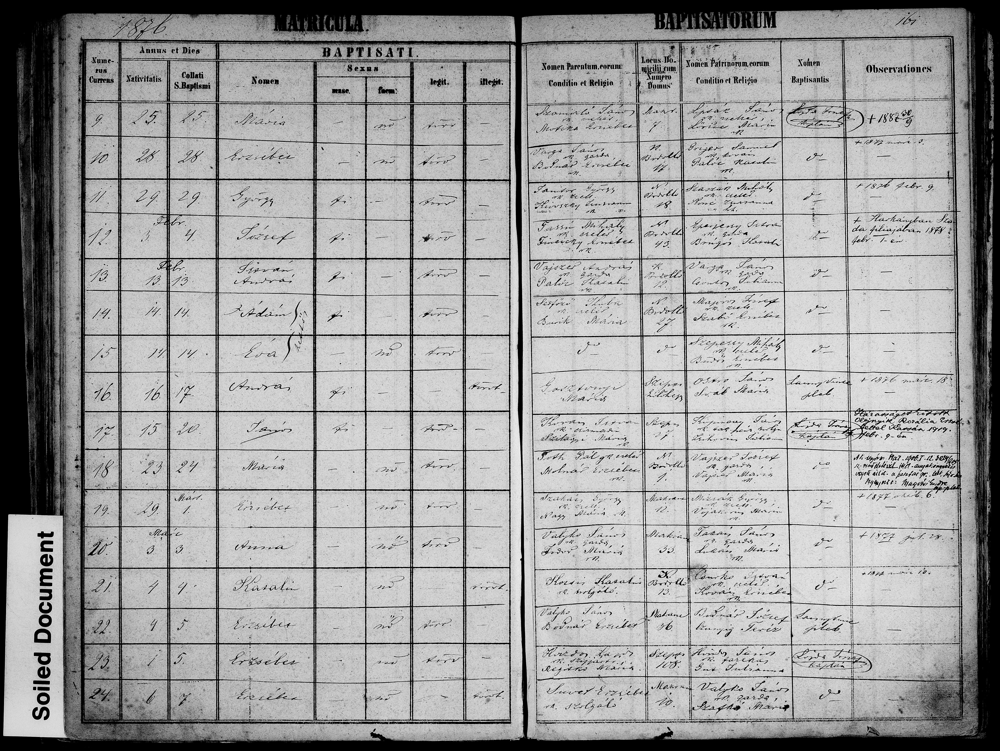

**Erzsébet, \*6.3.1876, krstená hneď na druhý deň, nemanželská**; matka Suver Erzsébet, slúžka, Makranc č. 10.

### Sobáš rodičov Ferenca — 10.2.1861, Szőlősgyörök

- **Joannes Heimann**, 25-ročný, slobodný nádenník, pôvodom z „Raitz, lengyel hon" — teda z Rajcze v Poľsku; bydlisko Csehi; otec **Franciscus Heiman**.
- **Anna Hutera**, 23-ročná, slobodná nádenníčka, rovnaký pôvod aj bydlisko; otec **Franciscus Hutera**.

Dvaja poľskí nádenníci, ktorí sa stretli v maďarskej dedine — toto je najstarší doklad o príchode rodiny do Uhorska.

### Annino úmrtie — 7.4.1879, Kislak

„Hutera Anna, želiarka, **manželka Heimana Jánosa**, narodená v Rajczi v Poľsku, zomrela v Kislaku vo veku 38 rokov, príčina: **v dôsledku pôrodu**." Pochovali ju nasledujúci deň. Úmrtie nezávisle potvrdil aj maďarský archív v Kaposvári.

## Rodina Ferenca a Alžbety v Košiciach

Prišli roku 1900, čerstvo po svadbe. Mali piatich doložených synov a v roku 1930 žil celý klan v jednom bloku: vdova Alžbeta so slobodnými synmi na **Lichardovej 37**, Jozef s rodinou na **Skladnej 47** hneď vedľa — a Rudolf neskôr dostaval dom na **Lichardovej 30**.

- **Jozef** — \*9.5.1898 Budapešť, †1977 Košice. Majiteľ domu na Skladnej 47. ⚭ **Marta rod. Kočišová** (1902–1982). Deti: **Magda** \*1923, **Tibor** \*1926 a **Marta** \*1928.
- **František** — \*3.12.1900, ⚭ Anna \*1903.
- **Rudolf** — pradedo.
- **Ján** — \*1913, **kožušník**, †1992. ⚭ Alžbeta \*1922. O jeho živote mimo dielne vieme viac než o ktoromkoľvek inom z bratov (nižšie).
- **Ladislav** — \*1916, úradník a **hudobník košického rozhlasového orchestra**; v rokoch 1940 až 1945 dirigoval banícku kapelu v Perecesi pri Miškovci a po vojne sa vrátil do Košíc.
- **Anna** — \*1903, †1970, vydatá **Schullerová**; pochovaná v hrobe s Rudolfom a Helenou, takže takmer isto Rudolfova sestra.
- **MUDr. Tibor Hajman** (1926–1988), Jozefov syn — chirurg, ktorý sa 1. júla 1964 stal **prvým vedúcim lekárom protetického oddelenia v Košiciach**.

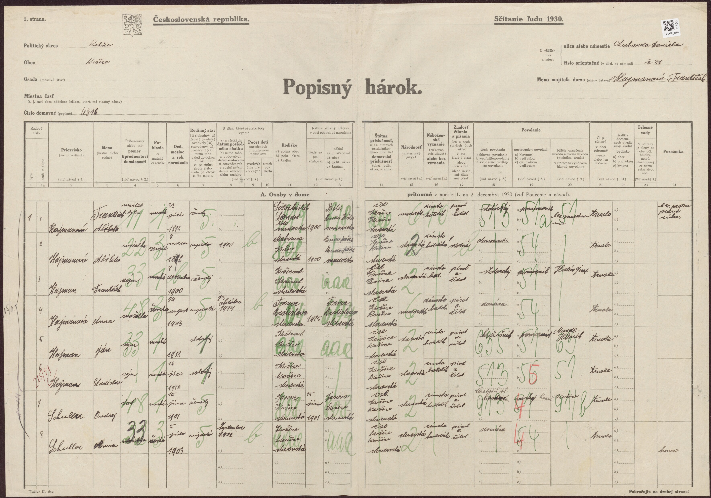

## Dom na Pipa utca 16 — dnešná Dymková

**Kúpa 1898.** V druhej polovici septembra 1898 kúpila dom **„Parohács Jánosné szül. Schurer Erzsébet"** za **680 zlatých** od šiestich súrodencov **Hankóovcov** — Jánosa, Mihálya, Alajosa, Gyulu, Julianny a Erzsébety. Oznámil to košický denník *Pannonia* 6. októbra 1898 v rubrike prevodov nehnuteľností; v tom istom zozname sa predávali aj susedné vložky 4718 a 4719, takže šlo o rozpredaj celého bloku.

**Prevod 1915 — dedičstvo.** Mestský vestník *Városi Közlöny* uverejnil 15. marca 1915 prevody za **január 1915**, roztriedené podľa právneho titulu: kúpa, darovanie, dedičstvo. Náš zápis stojí pod hlavičkou **„Hagyaték címén" — teda dedičstvom**:

> „A kassai 4720. sz. tjkvben **Parohács Jánosné** nevén írt (**Pipa u. 16. sz.**) ingatlan **Hajman Ferencné szül. Schurer Erzsébet** javára."

Obidve ženy sú v prameňoch vedené ako **rodená Schurer Erzsébet** a majetok medzi nimi prešiel **dedením**, nie predajom ani darovaním: sú to matka a dcéra. Staršia Erzsébet, slúžka z Mokraniec a matka nemanželskej Alžbety, sa vydala za muža menom **Parohács János**, kúpila v roku 1898 tento dom a po jej smrti ho **zdedila dcéra Alžbeta**.

Prevod bol zaknihovaný v **januári 1915**, takže Erzsébet zomrela **koncom roku 1914 alebo v prvých týždňoch roku 1915**. Jej úmrtný zápis hľadáme v košickej civilnej matrike.

**Kde to bolo.** **Pipa utca sa neskôr volala Dymková** — potvrdil to Archív mesta Košice. Maďarské *pipa* znamená fajku, teda dym — odtiaľ slovenský preklad. Ulica dnes už neexistuje: ležala južne pod Štúrovou, v priestore **za dnešnou Steel Arenou**, kde neskôr vyrástlo sídlisko a v posledných rokoch bytový komplex Herberia.

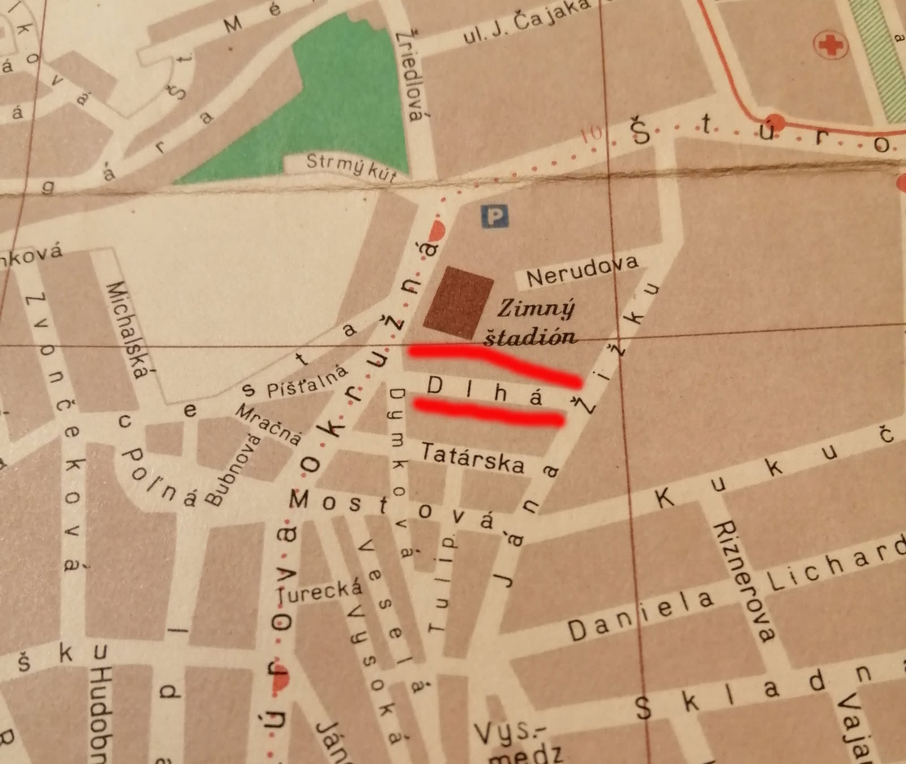
*Výrez z dobového plánu mesta: **Dymková** vedie medzi Tatárskou, Mostovou a Dlhou, hneď pod Zimným štadiónom. Vpravo dole sú **Daniela Lichardova a Skladná** — adresy, kde rodina bývala v roku 1930. Plán zverejnil Anton IV Mlynárik.*

**Aká to bola štvrť.** Tábor a susedné Huštáky boli od 19. storočia **chudobná periféria za starými hradbami** — meno Tábor pripomína staré vojenské táborisko. Bývali tam robotníci, nádenníci a remeselnícki tovariši v nízkych domčekoch bez vybavenia. Stolársky pomocník a bývalá slúžka sem zapadli presne a **cena domu tomu zodpovedá**: 680 zlatých bolo za nehnuteľnosť málo.

Štvrť pritom **nebola etnicky jednoliata**. Podľa spomienok pamätníkov tu mali malé domčeky so záhradami aj neromské rodiny a susedstvo fungovalo — a čo je pre nás podstatné, **bývalo sa vo vlastnom**, nie v nájomných barakoch. Presne to sedí na Ferenca s Alžbetou: vlastný domček v najlacnejšej štvrti mesta.

Rómske osídlenie tu bolo **už medzi vojnami** — dobová pohľadnica z dvadsiatych rokov okraj štvrte tak aj popisuje. **Veľkým getom sa však oblasť stala až po druhej svetovej vojne**, keď do Košíc prúdili robotníci za prácou v novom priemysle; koncom šesťdesiatych a v sedemdesiatych rokoch ju režim asanoval aj s Dymkovou ulicou. Pre Ferenca a Alžbetu to bola predovšetkým **najlacnejšia štvrť v meste** — bývali tu robotníci, nádenníci a tovariši bez ohľadu na pôvod.

### Ako štvrť vyzerala

Prvá fotografia je **z dvadsiatych rokov**, teda z obdobia, keď rodina ešte dom na Pipa utca vlastnila. Ostatné sú o generáciu až dve mladšie — z päťdesiatych až sedemdesiatych rokov, tesne pred asanáciou. Uličná sieť a nízka zástavba sú na nich ešte tie pôvodné, takže dávajú dobrú predstavu o mieste, kde rodina začínala.

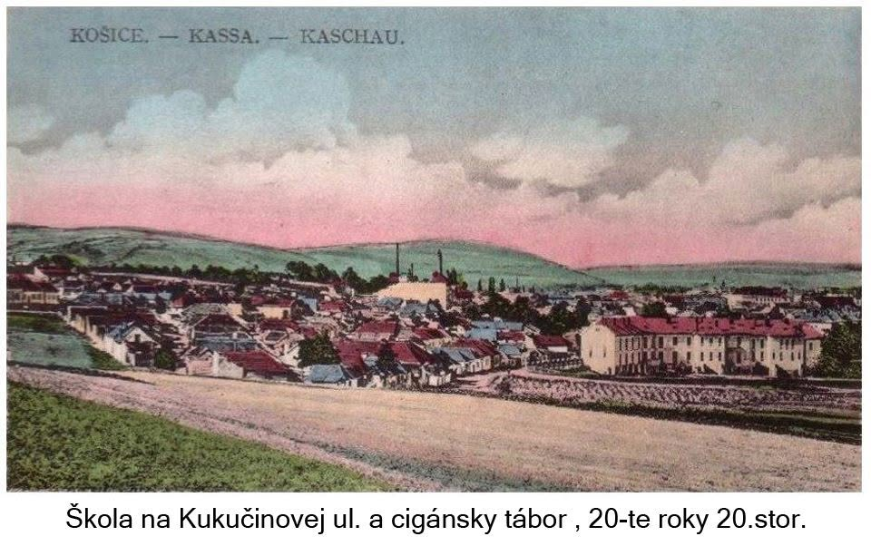
*⭐ Najbližšie k ich času: kolorovaná pohľadnica z dvadsiatych rokov — škola na Kukučínovej a za ňou štvrť. Nízke domčeky, polia až po okraj zástavby, komíny fabrík v pozadí. Alžbeta v tom čase ešte vlastnila dom na Pipa utca. Pohľadnicu zverejnil Juraj Menyhért.*

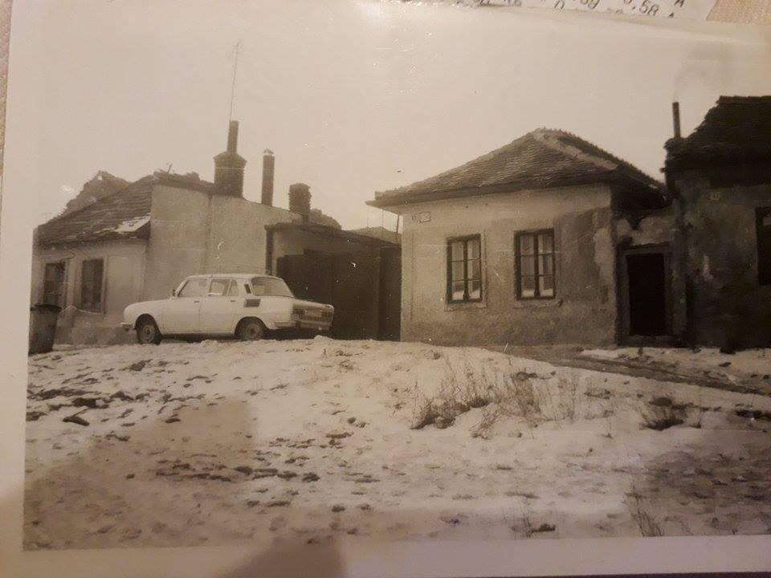
*Dymková ulica — bývalá Pipa utca, kde stál dom rodiny. Foto zverejnila Gabika Miklossi.*

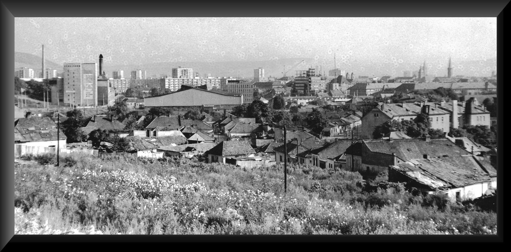
*Panoráma štvrte zo Žižkovej; vľavo Štúrova a Okružná. Foto zverejnil Tibor Tóth.*

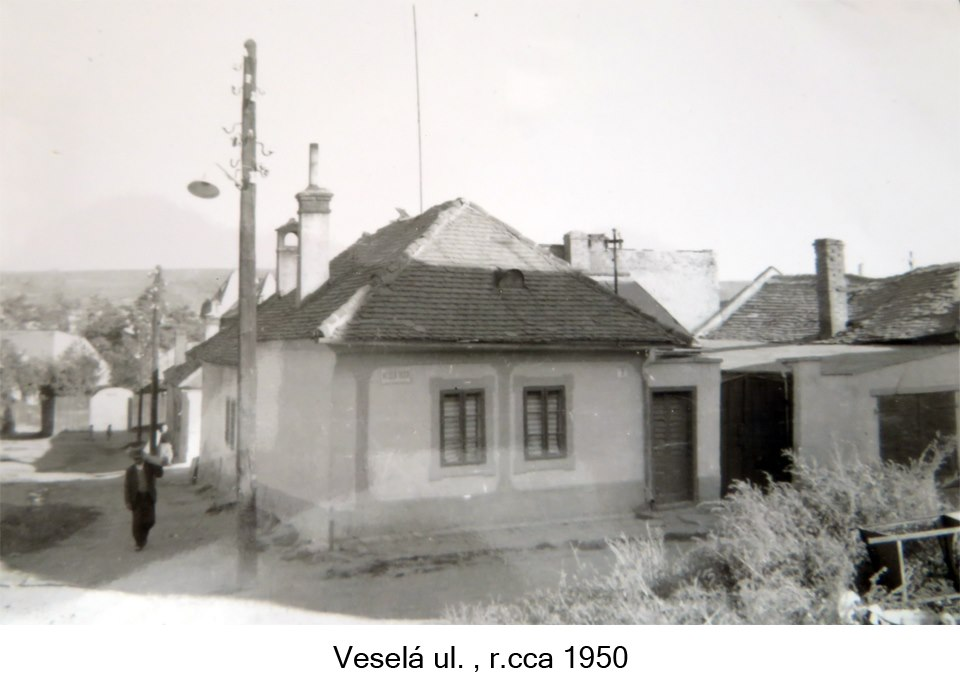
*Veselá ulica, päťdesiate roky. Foto zverejnil Juraj Menyhert.*

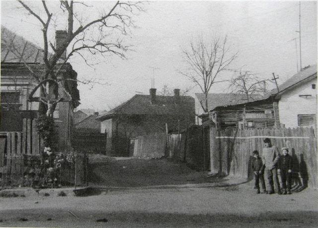
*Mostová ulica od Žižkovej, sedemdesiate roky. Foto zverejnil Juraj Menyhert.*

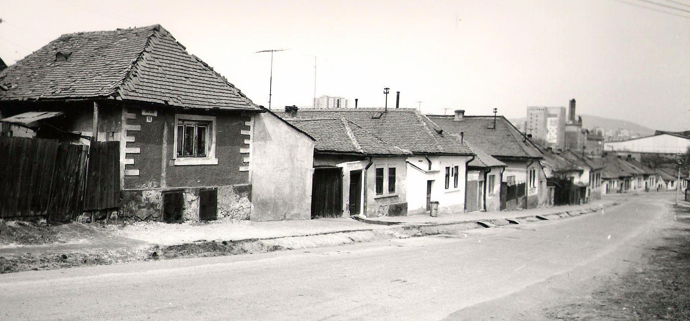
*Žižkova ulica a štvrť za ňou. Foto zverejnil Marián Sandt.*

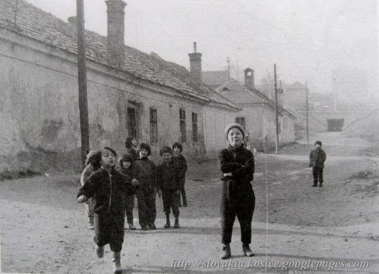
*Tulipánová ulica. Foto zverejnil Matúš Majerník.*

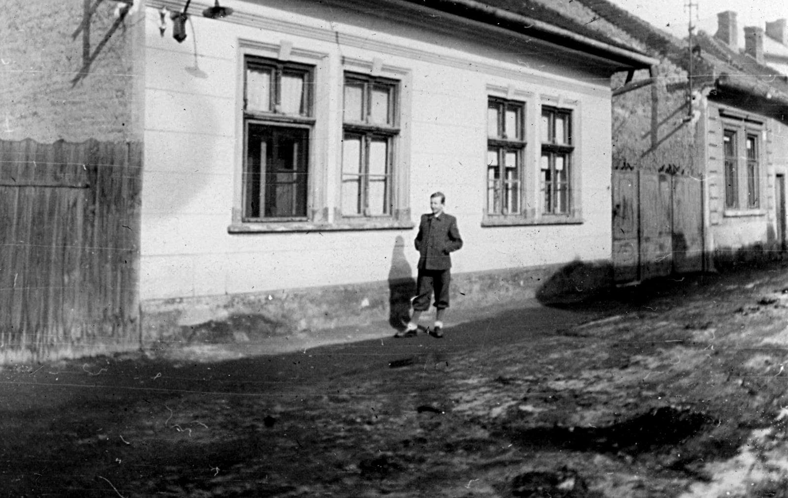
*Prízemný dom so štyrmi oknami a drevenými vrátami na nespevnenej ulici — typ bývania, aký v štvrti prevládal. Foto zverejnil Anton IV Mlynárik.*

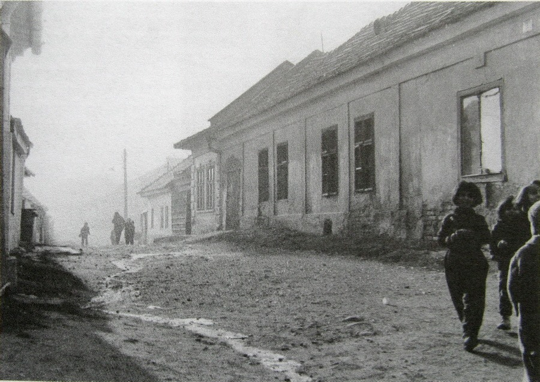
*Ulica v štvrti — omietky opadané, cesta rozmoknutá. Foto zverejnil Marián Egry.*

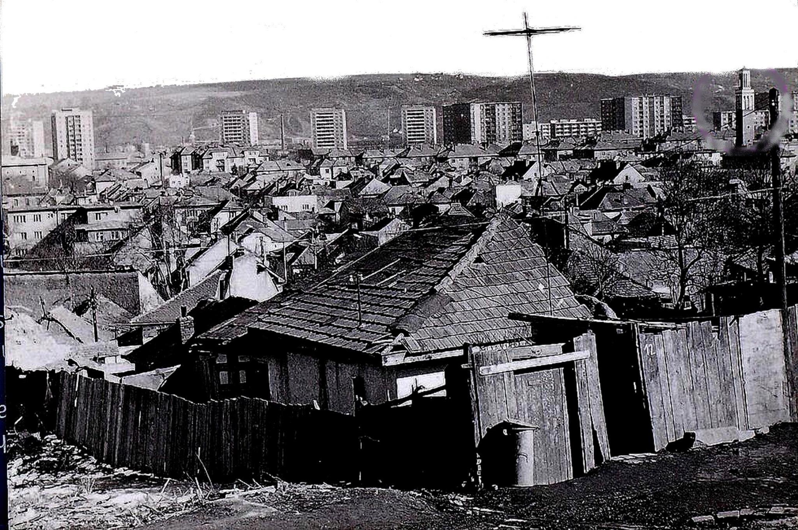
*Sedemdesiate roky tesne pred asanáciou: chatrč v popredí, za ňou pôvodná nízka zástavba a na obzore už panelové sídliská. Foto zverejnili Teo Tibor Andreas, Juraj Menyhért a Mar Cello.*

Zdroj všetkých záberov: **[Fotografie ulíc Košíc](https://foto-ulic.appspot.com/app/stranky/cigansky_tabor.html)**, album „cigánsky tábor"; autorstvo podľa údajov pri jednotlivých fotografiách. Ak si niektorý z autorov neželá zverejnenie, fotografiu na požiadanie odstránime.

### Svedectvo z novembra 1910

Ako sa na Pipa utca žilo, opísal košický denník *Felsőmagyarország* 23. novembra 1910 — v čase, keď Alžbeta s Ferencom bývali v tej istej ulici. Článok mal titulok **„Nepochovaná mŕtvola na Pipa utca — tri dni na slamenom došku"** a ulicu nazýval **„najtemnejšou Pipa utcou"**.

Stalo sa toto. V dome **č. 20** žil drevorubač **Simkó János** so svojou družkou **Magyar Annou** a jej matkou. Sedemdesiatročná starenka v sobotu v noci zomrela. V utorok ráno prišiel do domu policajt doručiť Anne predvolanie — byt našiel otvorený a prázdny, komoru zamknutú na visiaci zámok. Susedia mu povedali, že v komore leží na slame nebožka, nevystretá a nepochovaná. Simkóa priviedli od Šebastovskej cesty, kde rúbal drevo; bránil sa, že úmrtie nahlásil, ale **na pohreb nemal peniaze** a mestský obhliadač mŕtvol vraj odmietol prísť, kým nedostane dvojkorunový poplatok za obhliadku. Obhliadač to poprel.

Novinár k tomu dodal vetu, ktorá o štvrti povie viac než ktorýkoľvek úradný dokument: sú vrstvy spoločnosti, kde bieda býva medzi živými, a **tie nie sú zariadené na to, aby si mohli dovoliť smrť** — teda daň, ktorú pozostalým ukladá pochovanie mŕtveho.

Toto bolo susedstvo, v ktorom vyrastali Ferencovi synovia. O dvadsať rokov neskôr má rodina dom na Lichardovej a syn Jozef vlastný na Skladnej.

**Ako sa ulice volali.** Mená sa menili s režimami: **Pipa utca** bola po roku 1918 **Dymková**; dnešná **Skladná**, kde býval Ferencov syn Jozef, sa predtým volala **Raktár utca** a v rokoch 1938–45 Szüllő Géza utca. Pri hľadaní v starých adresároch mesta preto treba používať dobové názvy — pod dnešnými sa rodina nenájde.

**Kúsok od neskoršieho domova.** Na dobovom pláne mesta vidno, že Dymková ležala medzi Tatárskou, Mostovou a Dlhou, hneď za zimným štadiónom — a **Daniela Lichardova so Skladnou sú odtiaľ len pár blokov**. Keď sa teda rodina po roku 1915 presťahovala, nešla nikam ďaleko: zostala v tej istej časti mesta, len o ulicu či dve vyššie. Ferencovi synovia teda vyrastali stále v tom istom prostredí.

**Kto v dome býval, zatiaľ nevieme.** Vieme len, že Ferenc s Alžbetou prišli do Košíc roku 1900, teda dva roky po kúpe domu — a že v sčítaní roku 1930 už bývajú inde, na Lichardovej a Skladnej. Mená obyvateľov by prezradili mestské súpisy obyvateľov alebo dobové adresáre Košíc, usporiadané po uliciach.

### Rudolf a kominárski odborári

Košická skupina **kresťansko-sociálneho odborového zväzu kominárov** vznikla **26. februára 1939** — pár mesiacov po tom, čo Košice pripadli Maďarsku. Podľa vtedajšej tlače sa vtedy zišli „robotnícki bratia z Košíc a okolia, aby si vzali riadenie svojho osudu do vlastných rúk". **Rudolf bol pri tom od začiatku a hneď ho zvolili za tajomníka.**

Na tej istej schôdzi podal aj návrh, ktorý zhromaždenie prijalo: **požiadať majstrov, aby odteraz zamestnávali len odborovo organizovaných robotníkov**. Mal vtedy dvadsaťdeväť rokov.

Vo funkcii ho potvrdzovali znova a znova: na výročnom zhromaždení v decembri 1939, potom v roku 1940 aj 1941. Zakaždým predniesol správu o činnosti.

**Čo skupina dosiahla.** Vlastnú bilanciu uverejnilo vedenie skupiny v novembri 1940 pod titulkom „Ochrana robotníkov u košických kominárov". Keď ministerské nariadenie prerozdelilo košické kominárske obvody, skupina otvorila **otázku počtu zamestnancov** a v rokovaniach vybojovala prácu **pre troch ďalších kominárskych tovarišov**. Zároveň poslala majstrom prípis a presadila **platovú klauzulu kolektívnej zmluvy z roku 1938**; noviny menujú štyroch majstrov, ktorí odvtedy platili podľa záväzku, a dodávajú, že zvyšok košických kominárov svoju mzdu dostať musí tiež. Argument, ktorý pri tom použili, bol praktický: keď robotníci majú peniaze, rastie ich kúpna sila a majú z toho aj obchodníci.

Vlastnými slovami to vedenie skupiny zhrnulo takto — snahou je „vytvoriť rodine existenčný základ, lebo len hospodársky dobre zabezpečená rodina dá lepšiu budúcnosť".

Košický denník *Felvidéki Ujság* priniesol 22. marca 1941 správu z výročnej schôdze miestnej skupiny **kresťansko-sociálneho odborového zväzu kominárov** pod titulkom „Výmena stráží u košických kominárov". Na schôdzu prišiel aj zástupca budapeštianskeho ústredia.

**Správu o uplynulom roku predniesol Rudolf** ako tajomník skupiny — a bolo čo hlásiť. Skupina si podľa článku vybojovala zmeny v niektorých ustanoveniach **kolektívnej zmluvy**, predovšetkým v otázkach **platov a počtu zamestnancov**; noviny to opísali slovami, že sa „podarilo presadiť spravodlivosť". Delegácia okrem toho úspešne zastúpila členov ešte v pätnástich ďalších prípadoch. Skupina osobitne poďakovala primátorovi mesta a vedeniu živnostenského úradu, ktorí podľa nej „siahli chápavou rukou na starú ranu košických kominárov".

Vo voľbách bolo celé vedenie potvrdené — Rudolf zostal tajomníkom.

Podarilo sa im aj to hlavné: vo februári 1941 oznámil na dvoch poradách skupiny **uzavretie novej kolektívnej zmluvy**. Dva roky vyjednávania o mzdách a počte miest tak skončili podpisom.

Je to jediný prameň, ktorý ho ukazuje nie ako meno v matrike, ale ako človeka, ktorý niečo robil: tridsaťročný kominár, ktorý za svoj cech vyjednával o mzdách.

### Ján a ukradnuté korčule

Rudolfov mladší brat **Ján**, kožušnícky tovariš, sa v dobovej tlači objavuje trikrát a zakaždým mimo dielne.

V lete **1932**, ako devätnásťročný, drží inšpekčnú službu na turistickej chate — meno má v rozpise služieb, ktorý noviny uverejnili spolu s programom výletov.

Na konci roku **1941** ho košický denník uvádza medzi náhradníkmi výboru speváckeho zboru **„Lyra"**. V rodine teda nebol jediný muzikant: brat Ladislav hral v rozhlasovom orchestri.

A z toho istého čísla novín, tri dni pred Silvestrom 1941, je aj toto:

> Proti neznámemu páchateľovi podal oznámenie Hajman János, košický kožušnícky tovariš, ktorému z uzamknutej prenajatej skrinky v **korčuliarskom pavilóne v Széchenyiho parku** ukradli **krasokorčule namontované na topánkach**. Topánky boli hnedej farby. Škoda 100 pengő.

Sto pengő bola vtedy zhruba mesačná mzda robotníka. Z troch riadkov policajnej rubriky tak vypadol celý obrázok: mladý remeselník, ktorý chodil korčuľovať, mal na klzisku vlastnú prenajatú skrinku a na topánkach namontované krasokorčule — a niekto mu ich vzal.

## Dom Lichardova 30

V rodinnom dome dnes žije **Peter Lorenowicz** — predtým tam býval s Irenou a pred nimi Irenini rodičia Rudolf s Helenou. Rudolf dom dostaval; kto stavbu začal, zatiaľ nevieme.

## Ginelliovci

**Magdaléna Hajmanová** (1923–2006), Jozefova dcéra, sa vydala za **Ferdinanda Ginelliho** (1913–1989) — **huslistu a profesora košického konzervatória**, ktorý v rokoch 1942 a 1943 hrával v košickom rozhlase. Rodiny sa zrejme zoznámili práve cez rozhlasový orchester, kde hral aj Ladislav Hajman. Ginelliovci sú stará košická rodina s talianskou podobou mena — roku 1995 žili na Slovensku iba traja nositelia, všetci v Košiciach.

Ich deti: **MUDr. Tibor Ginelli**, gynekológ a pôrodník, ktorý priviedol na svet Veroniku aj jej brata — pomenovaný po strýkovi, chirurgovi Tiborovi Hajmanovi — a **Mgr. Mária Ginelliová** (1950–2016), kurátorka Východoslovenského múzea.

## Hroby

| Kto | Dátumy | Hrob |
|---|---|---|
| Rudolf Hajman + Helena + Anna Schullerová r. Hajman + Katarína Škodová | 1910–1991; 1919–1994; 1903–1970; 1897–1985 | sk. 1 |
| hrobka „HAJMAN CSALÁD": Jozef + Marta r. Kočišová + MUDr. Tibor + Mária r. Majáková | 1898–1977; 1902–1982; 1926–1988; 1942–2009 | hrobka 7B |
| „RODINA JÁNA HAJMANA": Ján + Alžbeta | 1913–1992; 1922–— | 1MÚZEUM, rad 1A, č. 2 |
| Ginelliovci: József + Anna + Ferdinand + Magdaléna r. Hajmanová + Mária | 1880–1944; ?–1961; 1913–1989; 1923–2006; 1950–2016 | sk. 91, rad 2, hrob 38 |

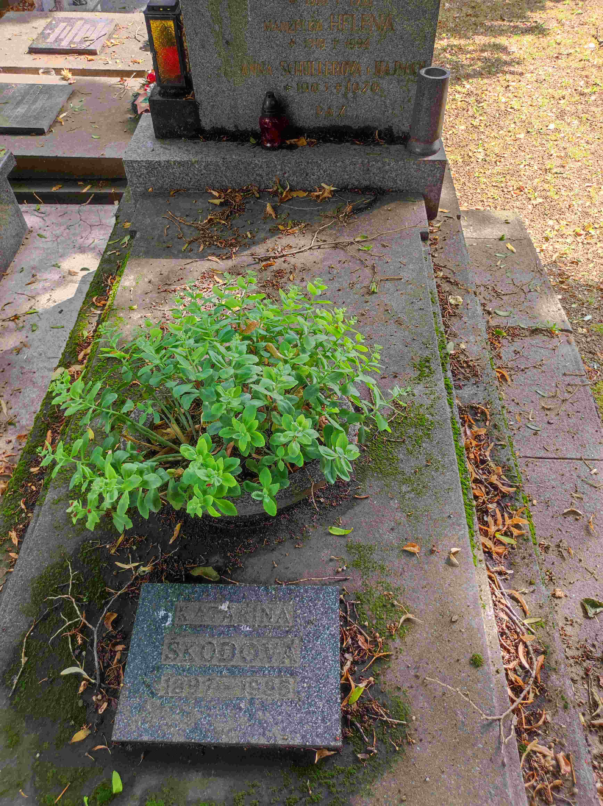
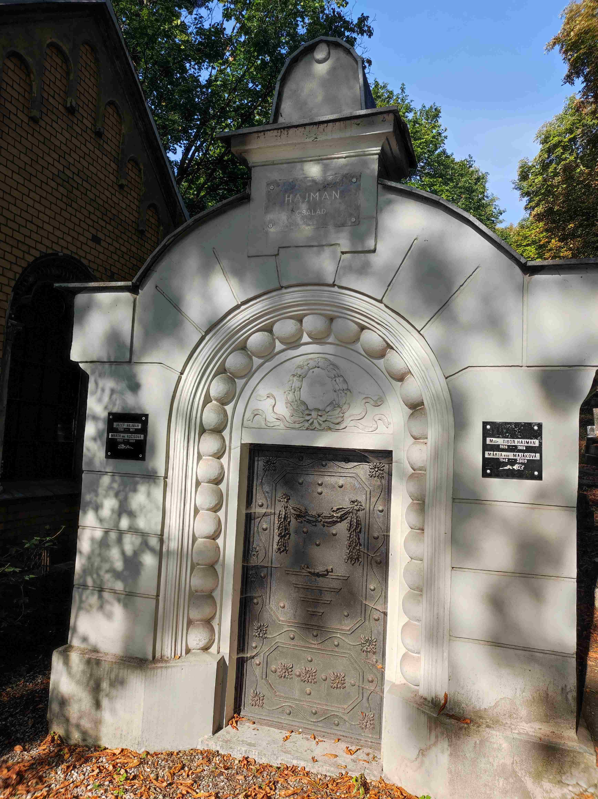

Irena hrob nemá — bola spopolnená a popol rozptýlený.

## Škodovci

Helenina rodina. Podľa rodinnej pamäti mala pochádzať z Poľska, no poľské matriky ju zatiaľ nepotvrdili a Škodovci vyzerajú skôr ako **domáci abovský rod** — priezvisko v podobách Škoda, Škody, Škodi a Skodi je husto rozsiate po obciach juhovýchodne od Košíc, v Nižnej a Vyšnej Myšli, Ruskove, Seni či Košickej Polianke.

Preto je taká dôležitá **Katarína** (1897–1985): ak sa poľská pamäť viaže na ňu, nesie ju jej **rodné meno, ktoré nepoznáme**. Prezradí ho Helenin úmrtný list alebo kremačný záznam.

## Lorenowiczovci

- **Peter Lorenowicz** — Irenin druhý manžel a **adoptívny otec mamy**. Žije v dome na Lichardovej 30 a je najvzácnejším živým svedkom rodinnej pamäti.
- Jeho súrodenci: **Dmytro** (1946–2020) a **Tatiana**, vydatá Elleder, ktorá žije v Nemecku. Matka **Mária Lorenoviczová** zomrela v Košiciach okolo roku 2000.
- Rodina prišla do Košíc z **Chomutova**, keď mal Peter asi šesť rokov — otec dostal prácu vo Východoslovenských železiarňach.
- **Pôvod priezviska** je poľský: je to patronymum od mena Vavrinec a jeho ťažisko leží v Podkarpatskom vojvodstve. Najbližší zhluk je v gréckokatolíckej farnosti **Zamiechów pri Przemyśli**, doložený medzi rokmi 1844 a 1900. Tamojšie obce boli v rokoch 1945 až 1947 vysídlené — čo dobre vysvetľuje aj presídlenie do severočeského pohraničia, aj meno Dmytro.
- Poľská stopa Heleny s Lorenowiczovcami **nesúvisí** — rodinná pamäť sa výslovne týka Ireninej matky.

## Čo hovorí DNA

Veronikin test ukazuje **približne tri percentá aškenázskeho pôvodu**, čo zodpovedá jednému predkovi štyri až šesť generácií dozadu. Civilný sobáš z roku 1900 dokladá Ferenca aj Alžbetu ako rímskokatolíkov, takže takýto predok by musel byť o generáciu či dve vyššie. Najlepšie sedí **poľská línia Heiman a Hutera z Rajcze** — nemecky znejúce meno Heimann v Haliči aj samotná migrácia. Druhým kandidátom zostáva neznáme rodné meno Kataríny Škodovej.

## Čo ešte nevieme

- **Presný dátum úmrtia Erzsébety Parohácsovej rod. Suverovej** — hľadá sa v košickej civilnej matrike medzi koncom roku 1914 a januárom 1915; mená dedičov by dala listina o prevode domu vo vložke 4720.
- **Rodné meno Kataríny Škodovej** — a s ním poľská stopa Ireninej matkinej rodiny.
- **Kedy zomrel Ferenc a kedy Alžbeta.**
- **Osud Rudolfa ml.** v Kanade a neskôr snáď v Izraeli.
- **Kde presne v Poľsku** sa narodili János a Anna — hľadá sa v matrikách farností Rajcza a Milówka. Priezvisko Hutera sa v Beskydách píše **Hutyra**, čo hľadanie sťažovalo.
- **Sobáš Rudolfa a Heleny** — v košických knihách z rokov 1938 až 1944 nie je, takže sa zrejme sobášili inde alebo skôr.
