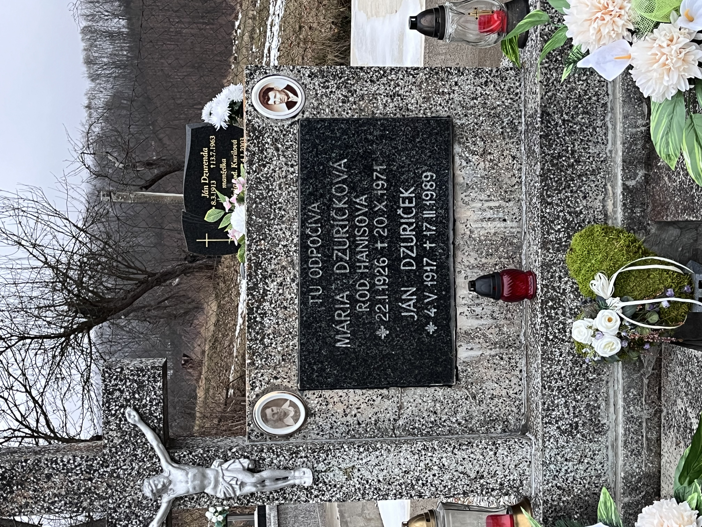
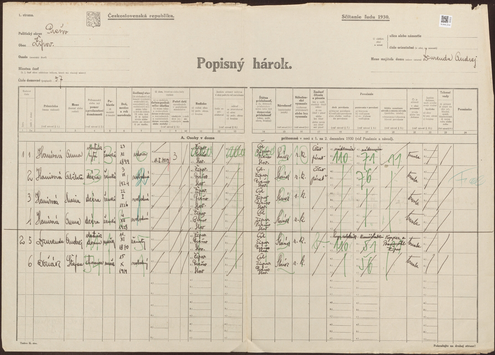

# Vetva Hanis (Žipov)

Súvisí: [Vetva Rusinko](vetva-rusinko.md) (Anna Hanisová ⚭ Ján Rusinko 1923) · [Prehľad](prehlad.md)

## ⭐⭐⭐ PRIELOM 19.7.2026 — meno otca + nová generácia (Arcibiskupský archív KE, Mgr. Róbert Eliáš)

Kľúčová oprava: **Žipov nepatril pod Radačov, ale pod farnosť BAJEROV** (radačovská hypotéza padá). Z odpisov matrík farnosti Bajerov:

- ⭐ **Otec = JOZEF HANIS, †11.1.1929, vo veku 34 rokov → narodený ~1894/95** (nie 1910 z radačovskej hypotézy — tá bola omyl!). Konečne máme jeho meno.
- ⭐ **Matka = Anna rod. DZURENDOVÁ** — jej rodné meno sme doteraz vôbec nepoznali! (FS ju mal len ako „Anna".) Sedí s Andrejom Dzurendom, majiteľom domu Žipov 57 z hárku 1930 — takmer isto **jej otec**.
- **Anna Dzurendová *24.11.1900** (oprava! FS mal 23.11.1899), rodičia **Andrej Dzurenda & Alžbeta rod. Šoltésová (Soltész)**, bývali Žipov č. 18 → **Andrej Dzurenda a Alžbeta Šoltésová = 2× prastarí rodičia, NOVÁ GENERÁCIA.**
- **Sobáš Jozefa Hanisa a Anny Dzurendovej** archív nemá (chýbajú roky 1918–1927) → **sú na farskom úrade Bajerov** (bajerov@abuke.sk).
- ⚠️ Zostáva neznáme: **rodičia samotného Jozefa Hanisa** (jeho krst ~1894/95 + odkiaľ pochádzal — sobáš 1918–27 to prezradí).

## Čo vieme

- **Anna Hanisová** ***4.12.1928** Žipov (`GYM2-LCP`) — babka. Príčina úmrtia: **mozgová porážka** (rodinný zošit).
- Jej otec **Jozef Hanis** (`GYM2-8M9`) ***~1894/95 †11.1.1929** (34 r.) — zomrel ~5 týždňov po narodení Anny! Meno doložené archívom 19.7.2026.
- Jej matka **Anna rod. Dzurendová** ***24.11.1900** Žipov (`GYM2-WVL`), rodičia Andrej Dzurenda & Alžbeta Šoltésová.
- **Sestry Anny (podľa FS, NagyLukas 8/2024):** Alžbeta Hanisová *3.6.1924 Žipov (`GYM2-D3W`), Mária Hanisová *22.1.1926 (`GYMS-9YH`) — spýtať sa rodiny na tety a ich potomkov!
- ⭐ **Mária — doložená náhrobkom (fotografia 10.7.2026):** „Mária Dzuričková rod. Hanisová *22.I.1926 †20.X.1971" + manžel **Ján Dzuriček *4.V.1917 †17.II.1989** (dožil sa ~72 r.) (do FS pridaný 10.7.2026 ako `PXS2-M43`, sobáš = vzťah `9ZHL-SLQ`, zdroj = náhrobok `W8FC-FF6`). Cintorín takmer isto **Žipov** (v pozadí hrob Jána Dzurendu *1913 — Durenda je žipovské priezvisko už v súpise 1715). Foto: 
  → **Dzuričekovci** = potomkovia tejto vetvy sú mamine sesternice/bratranci 2. stupňa — kandidáti na NagyLukasa; hľadať Dzuriček v Žipove/Prešove.
- Nič z toho nie je doložené záznamom (0 zdrojov na FS). **NagyLukas pozná aj Hanisovcov** — ďalší dôkaz, že je blízky príbuzný (potomok niektorej zo sestier?).

## Zistené stopy

- **Hroby Hanisovcov v Bajerove** (Find a Grave): Štefan Hanis †25.8.1981, Jozef Hanis †15.10.1971 — Bajerov je ~3 km od Žipova, takmer isto rodina. Spýtať sa babkinej rodiny.
- Staré indexované záznamy Hanis existujú z farnosti **Solivar** (1770-te roky) — zatiaľ nesúvisí.
- Udalosti 1928/1929 sú po konci FS kníh (~1896) → len matrika.

## Webové nálezy (9.7.2026)

- ❗**Oprava maďarského názvu: Žipov = Sárosizsép** (staršie Izsép), NIE „Zsipó" ([hu.wikipedia](https://hu.wikipedia.org/wiki/%C5%BDipov)). Nemýliť s Magyarizsép = Nižný Žipov (Zemplín). Všetky doterajšie maďarské rešerše s „Zsipó" treba považovať za neplatné.
- **Rozšírenie priezviska 1995** (databáza JÚĽŠ SAV): Hanis len **20 nositeľov v celej SR** — Prešov 6, Solivar 1, Ličartovce 1, Veľký Šariš 1, zvyšok Bardejov/Liptov/Pezinok/KE. Hanisová 27 (opäť Prešov+Solivar+V. Šariš). **Haniš** (70) je iný klaster — Šiba pri Bardejove. → rodina sa zrejme presunula do Prešova a okolia.
- **Hroby (cintoriny.sk, prezreté všetkých 80 „Hanis*")** — najlepší kandidáti na príbuzných:
  - Prešov-**Solivar**: František Haniš *7.12.1932 †19.3.2007 (dožil sa ~75 r.); Anna Hanišová *2.11.1937 †23.9.2009 (dožila sa ~72 r.); Mária Hanisová †30.3.1995; **Peter Hanis *14.6.1958 †10.12.2022** (dožil sa ~64 r.) (Solivar–Nová časť) — najsilnejší kontakt na žijúcu rodinu.
  - Prešov (mestský): **Verona Kašperová rod. Hanišová *24.1.1928 †29.11.2019** (dožila sa ~91 r.) — presne babkina generácia, možná sesternica.
  - Budimír (KE-okolie): Maciaková Anna rod. **Hanisová *6.3.1898** †2.2.1989 (dožila sa ~91 r.) — nie je babkina matka (tá bola Hanisová po sobáši), ale dokladá rod Hanis s Annou *1898 ~30 km od Žipova.
- **Cintorín Žipov nie je digitalizovaný nikde** (cintoriny.sk aj virtualnycintorin.sk — nič pre Žipov, Bajerov, Kvačany, Klenov, Brežany). Evidenciu hrobov vedie obec: **obecny@zipov.sk** ([zipov.sk](https://www.zipov.sk/)) → otcov hrob/meno len tam alebo fyzicky.
- Vojnové hroby ([VHU PDF](https://www.vhu.sk/data/files/776_vojnove-hroby-a-cintoriny-na-slovensku.pdf), s. 57): Žipov, katolícky obecný cintorín — 3 hroby z bojov 6/1919 (2 Maďari, 1 neznámy), bez mien.
- V súpise 1715 Žipova ani v telefónnom zozname 2005 **Hanis nefiguruje** (cisarik.com) → rodina prišla po 1715 a odišla pred 2005.
- Prázdne/nedostupné: Hungaricana („Hanisz" = nesúvisiaca rodina z Gyöngyösu; Sárosizsép+Hanis = 0), Find a Grave/BillionGraves SR, parte weby, Geni (217 profilov Hanis za loginom — [geni.com/surnames/hanis](https://www.geni.com/surnames/hanis)), farnostbajerov.sk (stránka Žipova = prázdny placeholder; kontakt bajerov@abuke.sk, 051/459 52 30 — farský úrad má knihy po 1896, ktoré ešte nie sú v archíve!).

## Sčítacie hárky + stopa Radačov (13.7.2026) ⭐

**1930, Žipov dom 57** (hárok 733/311, [Slovakiana](https://www.slovakiana.sk/kulturne-objekty/cair-ko1ex5n), foto ): dom vlastnil **Andrej Dzurenda** (*11.11.1870); v byte 1 vdova **Anna Hanisová *23.11.1899, RODENÁ V ŽIPOVE, ovdovela 11.I.1929** (presne = otcov dátum úmrtia — nezávislé potvrdenie!), rímskokatolíčka, nádenníčka, 3 deti (0 zomrelo): Alžbeta *3.6.1924, Mária *22.1.1926, Anna *4.12.1928 — všetky nar. Žipov. **1940, ten istý dom** (hárok 1211/275, [Slovakiana](https://www.slovakiana.sk/kulturne-objekty/cair-ko1cbxg)): Anna + Mária + Anna ml. + Dzurenda; **Alžbeta (16) už preč** → našla sa ako **„Hanisová Alžbeta" v Prešove, Floriánova 7/395** v domácnosti rodiny Šandalla (hárok 1187/125, [Slovakiana](https://www.slovakiana.sk/kulturne-objekty/cair-ko1c1l1)) — typicky služba; vydala sa asi v Prešove (matriky 1941+).

**Odkiaľ bol otec?** Žipov patril matrične pod **Bajerov**. **Jozefovi rodičia sú zatiaľ neznámi** — dá ich jeho sobáš 1918–27 (fara Bajerov má roky po 1896) a krst ~1894/95 (Bajerov / ŠA Prešov / Arcibiskupský archív KE).

**Dzuriček — o generáciu hlbšie:** 1930, Žipov dom 6 ([Slovakiana](https://www.slovakiana.sk/kulturne-objekty/cair-ko1ewzy)): **Ján Dzuriček st. *23.11.1874, RODENÝ BAJEROV** (do Žipova ako nemluvňa 1875), manželka Mária *1899/1900 Žipov, **gréckokatolíčka**; syn **Ján *14.V.1917** = manžel Márie Hanisovej (⚠️ náhrobok má 4.V.1917 — rozdiel 10 dní, overiť). Dzuričekovská otcovská línia vedie do Bajerova. Priezvisko v Žipove žije (starosta František Dzuriček 2002).

## Ďalšie kroky

- [x] ✅ úmrtný zápis otca †1929 → **Jozef Hanis, 34 r.** (archív 19.7.2026)
- [x] ✅ rodné meno matky → **Dzurendová** + jej rodičia Andrej Dzurenda & Alžbeta Šoltésová
- [ ] **fara Bajerov** (bajerov@abuke.sk) — sobáš Jozef Hanis × Anna Dzurendová (1918–27) → Jozefovi rodičia + odkiaľ bol
- [ ] potom Jozefov krst ~1894/95 (Bajerov / ŠA PO) → jeho rodičia = ďalšia generácia
- [ ] Dzurendovci: Andrej Dzurenda *~1870 (majiteľ domu 57; overiť = otec Anny) a Alžbeta Šoltésová — ich krsty/sobáš v Bajerove; Dzurenda v Žipove v súpise 1715 („Durenda")
- [ ] FS: opraviť `GYM2-8M9` (Jozef Hanis) + `GYM2-WVL` (Anna Dzurendová *1900); pridať Andreja Dzurendu a Alžbetu Šoltésovú
