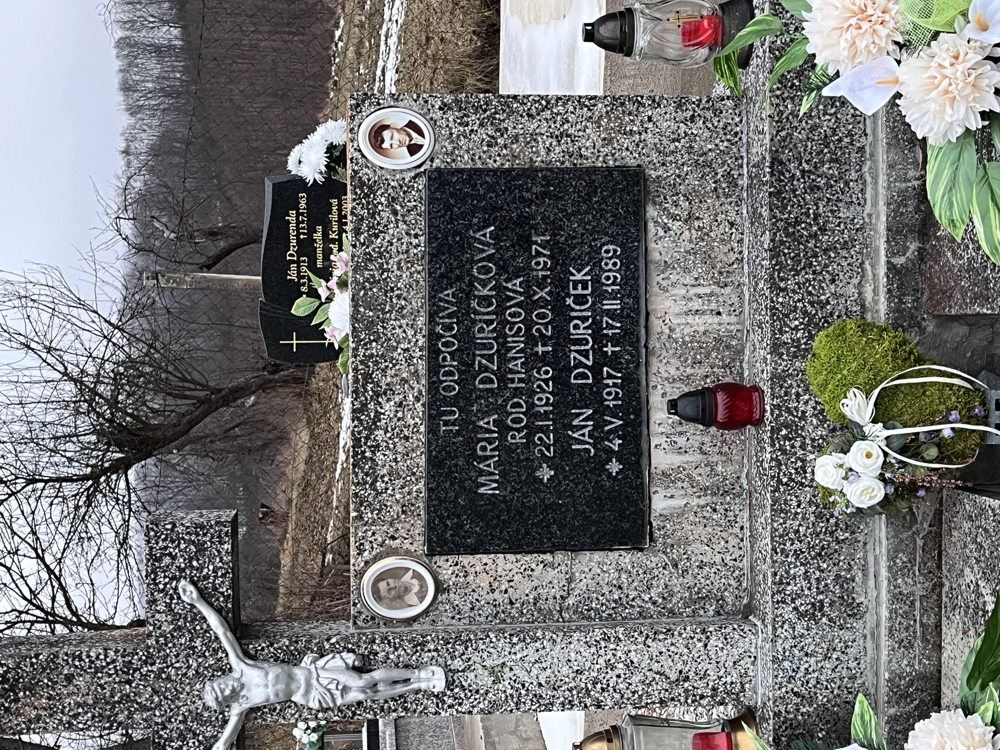

# Vetva Hanis (Žipov)

Súvisí: [Vetva Rusinko](vetva-rusinko.md) (Anna Hanisová ⚭ Ján Rusinko 1923) · [Prehľad](prehlad.md)

Babkina otcovská rodina zo **Žipova** pri Prešove. Je to vetva poznačená jednou skorou smrťou: prastarý otec Jozef zomrel päť týždňov po narodení babky Anny a jeho vdova zostala v dome svojho otca s tromi malými dcérami.

## Rodina

- **Anna Hanisová** **\*4.12.1928 Žipov** — babka. Zomrela na mozgovú porážku.
- Jej otec **Jozef Hanis** **\*~1894/95**, **†11.1.1929 vo veku 34 rokov** — zomrel päť týždňov po Anninom narodení.
- Jej matka **Anna rod. Dzurendová** **\*24.11.1900 Žipov**, dcéra **Andreja Dzurendu a Alžbety rod. Šoltésovej** — títo dvaja sú 2× prastarí rodičia.
- **Sestry babky Anny:** **Alžbeta** \*3.6.1924 a **Mária** \*22.1.1926.

**Mária a Dzuričekovci.** Mária sa vydala za **Jána Dzuričeka** (\*1917, †1989) a zomrela mladá, roku 1971. Doložil ich spoločný náhrobok:

Ich potomkovia — **Dzuričekovci zo Žipova** — sú otcovi bratranci a sesternice, teda naša najbližšia žijúca vetva na tejto strane rodiny. Dzuričekovská otcovská línia vedie do susedného **Bajerova**: Ján Dzuriček st. sa tam narodil roku 1874 a do Žipova ho priniesli ako nemluvňa.

## Čo o nich hovoria sčítacie hárky

**1930, Žipov č. 57** — dom patril **Andrejovi Dzurendovi** (\*1870), teda Anninmu otcovi. V byte býva jeho ovdovená dcéra **Anna Hanisová**, nádenníčka, ktorá podľa hárku ovdovela **11. januára 1929** — presne v deň Jozefovej smrti. S ňou tri dcéry: Alžbeta, Mária a dvojročná Anna.

**1940, ten istý dom** — zostali už len matka s Máriou a Annou. Šestnásťročná **Alžbeta bola v Prešove v službe** u rodiny na Floriánovej ulici. Tak sa z domu odchádzalo: za prácou, hneď ako to vek dovolil.

## Priezvisko Hanis

Je to vzácne meno. V celom Slovensku ho roku 1995 nosilo iba **20 mužov a 27 žien**, sústredených v Prešove, Solivare a Veľkom Šariši — teda pár kilometrov od Žipova. (Podobné **Haniš** je iná rodina, z okolia Bardejova.) V žipovskom súpise z roku 1715 Hanisovci ešte nie sú, v telefónnom zozname z roku 2005 už zase nie — rodina prišla a odišla medzi týmito dvoma dátumami.

## Čo ešte nevieme

- **Jozefovi rodičia** — kto boli a odkiaľ prišiel do Žipova. Odpoveď je v jeho sobáši s Annou (medzi rokmi 1918 a 1927) a v jeho krste okolo roku 1894; obidva doklady má farský úrad Bajerov, ktorý sme oslovili.
- **Dzurendovci** — krsty a sobáš Andreja a Alžbety. Priezvisko je v Žipove doložené už v súpise 1715 v podobe „Durenda", takže tu bola rodina dávno.
- **Hrob Jozefa Hanisa** — žipovský cintorín nie je nikde digitalizovaný, evidenciu vedie len obec.
