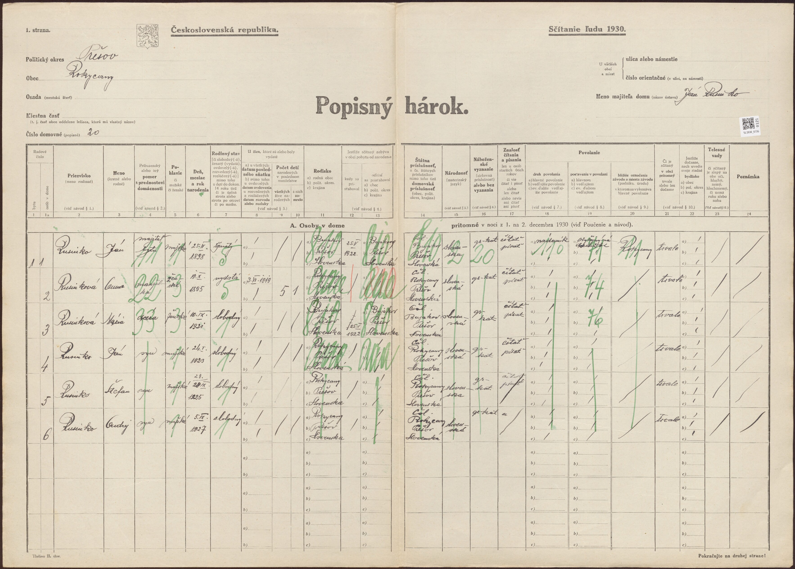
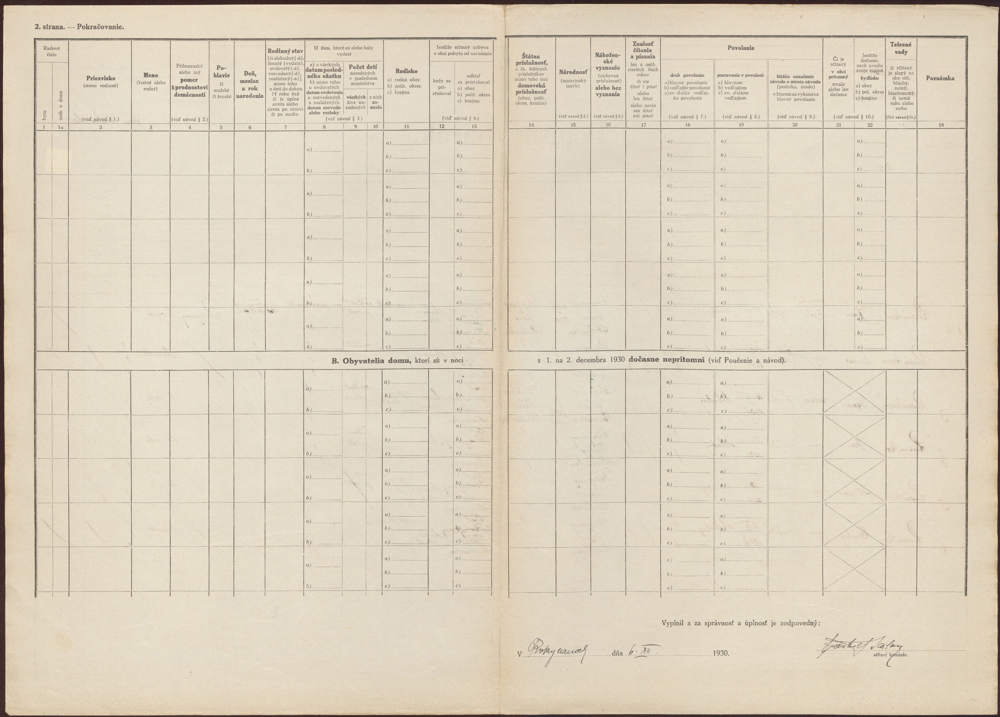
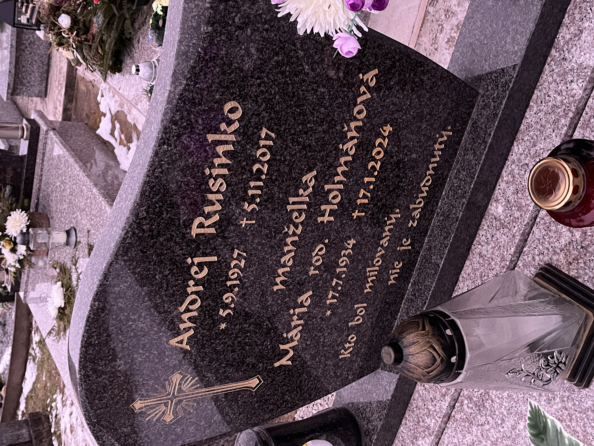
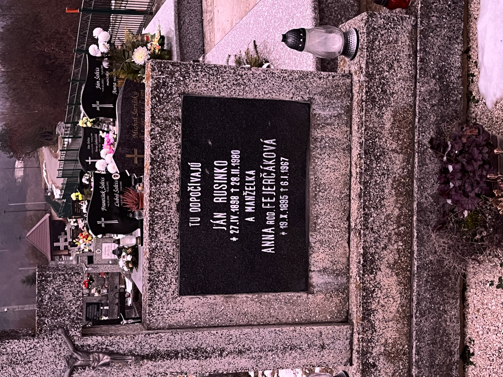
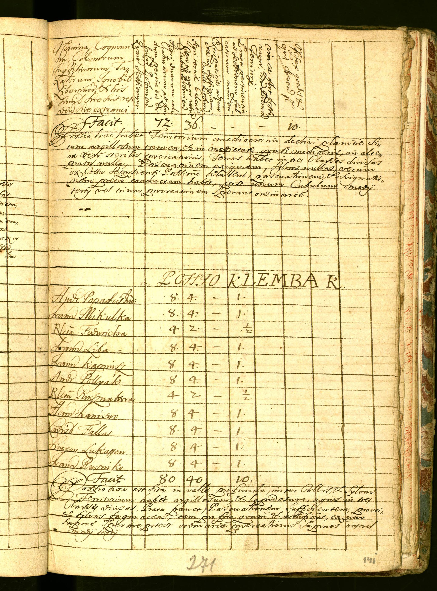
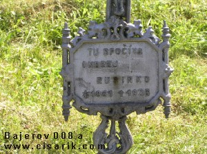

# Vetva Rusinko (Rokycany)

Súvisí: [Vetva Fejerčák-Guľas](vetva-fejercak-gulas.md) (manželka Jána 1898) · [Prehľad](index.md)

## Čo vieme

- **Ján Rusinko** *29.1.1923 Rokycany, **†4.4.2006 Košice** (dožil sa ~83 r.) — dedo. FS `PMQS-J35`. Príčina úmrtia: **rakovina pľúc a prostaty** (rodinný zošit, 7/2026). Dátum úmrtia doložený hrobom (pozri nižšie).
- Rodičia (podľa stromu, **nedoložené ako rodičia**): **Ján Rusinko *27.4.1898 †28.2.1980** (dožil sa ~82 r.) (`PQ3W-GXN`) a **Anna Fejerčáková *19.10.1895 †6.1.1967** (dožila sa ~72 r.) — presné dátumy oboch doložené spoločným hrobom v Rokycanoch (pozri nižšie); hrob zároveň dokladá, že manželia boli. Sobáš **3.6.1919** stále bez zdroja.
- Súrodenci deda (podľa stromu): Mária *1921, **Štefan *28.9.1925 †1.2.2015** (dožil sa ~90 r.) (hrob Vrakuňa, pozri nižšie), **Andrej *5.9.1927 †5.11.2017** (dožil sa ~90 r.) (⚭ Mária Holmáňová 1934–2024 (dožila sa ~90 r.)) — sedí s hrobom v Rokycanoch (Andrej + otec Ján), ktorý som videla.
- Celé prepojenie 1923→1898 vytvoril **NagyLukas** 31.7.2025 — a 13.7.2026 nám poslal aj **jeho zdroj: sčítací hárok 1930** (pozri nižšie), takže väzba dedo→pradedo je teraz **doložená**.

## ⭐⭐ Sčítací hárok 1930 — Rokycany, dom č. 20 (13.7.2026, od NagyLukasa)

Zdroj: Slovakiana / **Slovenský národný archív**, sčítací hárok **735/121, Rokycany**, sčítanie ľudu 1.–2.12.1930. [Odkaz](https://slovakiana.sk/kulturne-objekty/cair-ko1eogt) · foto: 

Celá domácnosť na jednej listine — rieši naraz viac otázok:

| # | Meno | Vzťah | Narodenie (hárok) | Rodisko | Pozn. |
|---|---|---|---|---|---|
| 1 | **Ján Rusinko** | majiteľ bytu | 25.IV.1898 | **Bujakov** | nádenník; ženatý |
| 2 | **Anna** rod. Fejerčáková | manželka | 19.X.1895 | Rokycany | sobáš **3.VI.1919**; **5 detí nar., 1 zomrelo** |
| 3 | Mária | dcéra | 10.IX.1921 | **Bujakov** | slobodná |
| 4 | **Ján (dedo)** | **syn** | 24.I.1923 | Rokycany | slobodný |
| 5 | Štefan | syn | 28.IX.1925 | Rokycany | slobodný |
| 6 | Andrej | syn | 5.IX.1927 | Rokycany | slobodný |

Čo hárok DOKLADÁ:

- 🟢 **Dedo Ján (1923) je zapísaný ako SYN Jána (1898) a Anny** — jadro celej Rusinko otázky je konečne doložené štátnym dokladom (nielen strom NagyLukasa).
- 🟢🟢 **RODINA BOLA GRÉCKOKATOLÍCKA** — všetkých 6 osôb „gr-kat". **To vysvetľuje, prečo v RK matrike Bajerova niet ani jeden krst Rusinko** → ich záznamy sú v GRÉCKOKATOLÍCKEJ farnosti, nie v RK Bajerove! Celé hľadanie treba presmerovať na GK farnosti. (Otázka RK/GK = zodpovedaná.)
- 🟢 **Sobáš 3.VI.1919** (3. jún 1919) — potvrdené, sedí s FS.
- 🟢 **„Bujakov" = pôvodná obec pred Rokycanmi.** Ján (1898) aj Mária (1921) sa narodili v Bujakove; rodina sa **prisťahovala do Rokycian 25.V.1922**. Traja mladší synovia (Ján 1923, Štefan 1925, Andrej 1927) sú už narodení v Rokycanoch. → krst Jána (1898, r. 1898) a Márie hľadať v **GK farnosti pre Bujakov**. **Nájsť, kde je/bol „Bujakov"** (obec okr. Prešov; v hárku „polit. okres Prešov").
- 🟡 **5. dieťa!** Anna porodila 5 detí, 1 zomrelo — v domácnosti sú len 4 (Mária, Ján, Štefan, Andrej). Existovalo teda **piate dieťa, ktoré zomrelo** (nar. ~1919–1930) — nevedeli sme oň.
- ⚠️ Drobné rozdiely dátumov: hárok uvádza Ján 1898 = **25.IV** (náhrobok 27.IV) a deda = **24.I.1923** (rodina/náhrobok 29.I). Identita istá (tá istá domácnosť); sčítací komisár len zapísal približný deň.
- 📄 Existuje aj **2. strana hárku** (rub) — .
- **Hárok 1940 NÁJDENÝ (13.7.2026):** škatuľa 1200, hárok 300, **dom č. 22** — domácnosť: Ján (hlava), Anna **rod. Fejerčák**, Ján (dedo, 17), Štefan, Ondrej + **Rusinková Anna** — pravdepodobne **mladšia sestra narodená po 12/1930**, o ktorej nevieme! Mária (19) už v domácnosti nie je (vydatá/v službe?). [Slovakiana cair-ko1bnqu](https://www.slovakiana.sk/kulturne-objekty/cair-ko1bnqu); osobné údaje začiernené → neredigovanú kópiu vydá SNA (škatuľa 1200, hárok 300).
- **Čísla domov:** 1930 = dom 20 (Ján majiteľ), 1940 = dom 22; **dnešné Rokycany č. 22 na mape neexistuje** → obec bola preíslovaná, staré čísla ≠ dnešné. Dnešný dom č. 20 vlastní **Emília Baranová r. Dolinská *8.6.1960 (Kendice 368), titul: DAR 1987 (RI.916/87-22/87)** — dar v 1987 bol takmer vždy v rodine → hypotéza: dcéra Márie (*1921) alebo Anny (*po 1930), ak sa niektorá vydala za Dolinského. Overenie: (1) spýtať sa otca na „Dolinský/Kendice"; (2) darovacia listina RI.916/87 v zbierke listín katastra (OÚ Prešov) / spis Štátneho notárstva Prešov v ŠA PO; (3) **pozemková kniha Rokycany (ŠA PO)** — reťaz vlastníctva od Jána Rusinka a mapovanie starých čísel na dnešné parcely.

## Hypotézy a kandidáti

- 🔴 **Ondrej Rusinko 1861–1936 (dožil sa ~75 r.), pochovaný Bajerov** (Find a Grave `QVVZ-9J43`) — vekovo kandidát na otca Jána (1898). Hárok 1930 menuje len Jánovo **rodisko (Bujakov)**, nie rodičov → Ondrej je STÁLE nedoložený. Pozor: Ondrej má hrob v RK(?) Bajerove, ale naša rodina bola GK — preveriť, či to sedí.
- Ďalší Rusinkovci pri Bajerove: Štefan *1884 (bydlisko Bajerov, Ellis Island 1920), Vojtech 1935–2006 (dožil sa ~71 r.) a Peter 1955–1994 (dožil sa ~39 r.) (cintorín Bajerov) — spýtať sa otca, či ich pozná.
- ~~V indexovaných knihách RK farnosti Bajerov nie je ani jeden krst Rusinko → rodina možno gréckokatolícka~~ ✅ **POTVRDENÉ hárkom 1930: rodina bola GRÉCKOKATOLÍCKA** (viď vyššie) — preto v RK Bajerove nič nie je.

## Hroby nájdené online (webový prieskum 9.7.2026) ⭐

| Kto | Dátumy | Hrob | Zdroj |
|---|---|---|---|
| **Ján Rusinko** + **Anna Rusinková rod. Fejerčáková** | *27.4.1898 †28.2.1980 (dožil sa ~82 r.); *19.10.1895 †6.1.1967 (dožila sa ~72 r.) | **Rokycany, sekcia A, hrobové miesto 33** (spoločný hrob) | [pohrebiskasr.sk](https://pohrebiskasr.sk/vyhladanie_zosnulych.php) — obec „Rokycany (PO)"; jediní 2 Rusinkovci v zozname (211 záznamov) |
| **Ján Rusinko (dedo)** + **Anna Rusinková** (bez dátumov v DB = babka Hanisová?) | *29.1.1923 †4.4.2006 (dožil sa ~83 r.) | **Košice, Verejný cintorín, sk. 18, hrob 20** (rad 12) | GIS mesta Košice — [mapa](https://gisplan.kosice.sk/mapa/mapa-cintorinov/), overené cez WFS službu `pahrb-kosice-pg/zemreli` |
| **Štefan Rusinko** + **Emília Rusinková** (*6.12.1925 †5.5.2015 (dožila sa ~90 r.) — takmer isto manželka, †3 mesiace po ňom) | *28.9.1925 †1.2.2015 (dožil sa ~90 r.) | **Bratislava, cintorín Vrakuňa, chodník 11, hrob 302** (predtým XI-292) | [Marianum](https://hrobovemiesta.marianum.sk/mapa/mapa-cintorinov/) |

- Košice Verejný cintorín/Krematórium má ďalších ~50 Rusinkovcov (napr. Vasil 1933–2019 (dožil sa ~86 r.), Andrej 1941–2021 (dožil sa ~80 r.), Ján 1950–2013 (dožil sa ~63 r.)…) — vzťah nepoznáme.
- ✅ **Hrob Andreja a Márie NÁJDENÝ a odfotený (10.7.2026, cintorín Rokycany):** „Andrej Rusinko *5.9.1927 †5.11.2017, manželka Mária rod. Holmáňová ***17.7.1934 †17.1.2024**. Kto bol milovaný, nie je zabudnutý." Foto: 
- ✅ **Hrob Jána a Anny (A/33) odfotený (10.7.2026)** — kameň potvrdzuje údaje z Pohrebiská SR do bodky: 
- Mária Rusinková „Bujakov" (*1921) — online stále nič.
- Find a Grave memoriál Ondreja (1861–1936) vytvoril 2006 **Ing. Juraj Čisárik** (cisarik.com) — fotodokumentácia náhrobkov Bajerova >50 r.: [cemetery-bajerov](http://www.cisarik.com/cemetery-bajerov.htm); Ondrej je jediný Rusinko na bajerovskom cintoríne (aj cintorín „Žeha" preverený — nič).
- Cisarik.com (telefónny zoznam 2005): priezvisko **Rusinko stále v Bajerove**.
- **Súrodenci — prieskum 13.7.2026:** Mária *1921 — osud stále neznámy (slabý kandidát: Mária Suvaková rod. Rusinková †1991 Vranov, LOW; ale pozri hypotézu Dolinská vyššie). Pravdepodobná príbuzná: **Veronika Mrúzová rod. Rusinková** †1.9.1978 (*≈1919) (dožila sa ~59 r.), hrob 127 **Bzenov** (susedná obec!), manžel Jozef Mrúz. Hrob Štefana a Emílie potvrdený priamo v registri Marianum (rodné meno Emílie v registri nie je → parte/matrika). **„Holmáňová" overená na fotke náhrobku — kameň to naozaj píše**, ale JÚĽŠ 1995: 0 nositeľov v SR → pravé rodné meno dá sobášny zápis (obvod Bajerov, ~50. roky). Parte Andreja (2017) ani Márie (2024) online nie sú; cintorín Rokycany je vo virtualnycintorin.sk, ale zoznam nie je verejný → obec Rokycany (obecrokycany@gmail.com, 051/778 31 36). Bonus BA: MUDr. Mikuláš Rusinko 1928–2009 (dožil sa ~81 r.) + MUDr. Eva 1931–2019 (dožila sa ~88 r.), urny Krematórium BA — vzťah nepoznáme.
- ✅ **„Bujakov" VYRIEŠENÉ (13.7.2026): Bujakov = dnešné BREŽANY, okres Prešov.** Oficiálny názov obce do **1956** (Boyak 1329 → Buják, maď. Sárosbuják → Bujakov → Brežany 1956). Leží ~4 km od Rokycian, v tom istom klastri ako Bajerov/Kvačany/Žipov. **Gréckokatolícka obec** — drevený GK chrám sv. Lukáša (1727), jediný drevený kostol okresu Prešov. Zdroje: [TASR/Korzár](https://korzar.sme.sk/presov/c/niekdajsi-bujakov-ziskal-svoj-dnesny-nazov-az-v-roku-1956), [obecbrezany.com/história](https://www.obecbrezany.com/podstranka.php?stranka=historia-obce), Gyalayov maď. lexikón („Bujakow. Sárosbuják.").
- ✅ **Zapísané do FS 9.7.2026**: Burial fakty + zdroje pre `PQ3W-GXN`, `P3GG-4Y2` (zdroj `W8XQ-BM6`), `PMQS-J35` (†4.4.2006 + hrob, zdroj `W8XQ-BMK`), `PQ34-7LM` (hrob Vrakuňa, zdroj `W8XQ-BMR`).

## Repatriačné stredisko Prešov (1946)

Register fondu *Československé repatriačné stredisko v Prešove* (ŠA Prešov), [PDF](https://www.minv.sk/swift_data/source/verejna_sprava/statny_archiv_v_presove/dokumenty/ap/Ceskoslovenske%20repatriacne%20stredisko%20v%20Presove%20%28Register%29.pdf):

- **Rusinko Ondrej, Rokycany — reg. č. 105513, škatuľa 3** (str. 24) ⭐ pravdepodobne Andrej *1927 (18–19 r. v 1946 → nútené práce / zajatie / evakuácia?)
- Rusinko Ján, Veľký Šariš — škatuľa 5 (str. 40) — neisté
- Rusinko Michal, Vyšná Olšava (str. 24) — iný okres (Stropkov), skôr nesúvisí
- **Nové (9.7.2026):** ten istý register obsahuje aj **Fejerčák Andrej, Bajerov — reg. č. 105727** a Fejerčák Jozef a Juraj (Janov) → doplniť do žiadosti archívu, nech vytiahnu spisy naraz (pozri Korešpondencia a úlohy).
- Žiadosť odoslaná 9.7.2026 na archiv.po@minv.sk — spis by mal obsahovať dátum narodenia, adresu, odkiaľ sa vracal.

## Kde sú chýbajúce dokumenty — KOMPLETNÁ MAPA (13.7.2026)

🎯 **Jedna GK farnosť drží všetko: KLENOV** (do 1948 **Klembark/Klembárk**, maď. Kelembér). Jej filiálky: **Brežany/Bujakov, Rokycany, Bajerov, Kvačany, Žipov**… ([grkatpo.sk/farnost/klenov](https://www.grkatpo.sk/farnost/klenov/), [matriky.genedict.net/klenov](https://matriky.genedict.net/klenov/)). Ondrejov krst 1861 aj Jánov krst 1898 aj krsty detí 1921–1927 patria pod Klenov.

| Dokument | Kde presne |
|---|---|
| **GK knihy Klenov 1825–1897** (krsty/sobáše/úmrtia; druhopisy 1864–1895) | ✅ **NA FAMILYSEARCH** — filmy **DGS 4406750, 4406751** → krst Ondreja *1861, rodičia Jána 1898, staršie generácie. Hneď dostupné s loginom! |
| krst Jána *27.4.1898 (Brežany) | knihy po 1897 ostali NA FARE → **GK farský úrad Klenov, Klenov 52, 082 44** (správca V. Sekera Mikluš); záloha: Archív GK arcibiskupstva Prešov. CIVILNE: Brežany patrili do **matričného obvodu SVINIA** → zväzok 1895–1906 v ŠA Prešov |
| krst Márie *1921 (Brežany), deda *1923, Štefana *1925, Andreja *1927 (Rokycany) | GK farský úrad Klenov; civilne: Rokycany = obvod **Meretice** (do 1906), dnes **Matričný úrad Bzenov** (celý klaster Bajerov/Brežany/Bzenov/Janov/Kvačany/Radatice/Rokycany/Žipov) |
| sobáš 3.6.1919 | GK Klenov (fara) alebo civilná matrika obvodu (Svinia/Meretice → dnes Bzenov); doložený už hárkom 1930 |
| úmrtia: Ján †1980, Anna †1967 | matrika (už doložené hrobom) |
| 5. dieťa (†pred 1930) | GK Klenov (fara) / matrika Bzenov |
| 1715: **Joannes Rusinko, Klenov** | ✅ **OVERENÉ NA ORIGINÁLI 14.7.2026** — Maďarský národný archív, fond N 78 (súpis 1715), Sáros, téka 6, str. 271: „**LOCO KLEMBARK**" — medzi ~11 gazdami posledný riadok „**Ioann. Rusiniko**" (8 · 4 · – · 1). Ďalší gazdovia: Mikulka, Pollyak, Fallas, Liba, Fedwicha(?), Lukessen(?)… Latinská poznámka: obec „v hlbokej doline medzi kopcami a lesmi", polia úzke, ílovitá pôda. [Databáza MNL](https://adatbazisokonline.mnl.gov.hu/adatbazis/az-1715_-evi-orszagos-osszeiras) · skeny:  |

- **Hrob Ondreja (1861–1936) (dožil sa ~75 r.) — foto zachránené z Wayback** (cisarik.com je momentálne nefunkčný): liatinový kríž „TU SPOČÍVA / ONDREJ / RUSINKO / *1861 †1936", **manželka na kríži nie je**; ~2006 boli pri hrobe čerstvé kvety → niekto miestny sa oň staral. 
- WWI zoznamy strát (RadixIndex): **Ruszinko z Kvačian** (filiálka Klenova, vedľajšia dedina) — pravdepodobne príbuzný; detaily za paywallom.
- Emigrácia: Ellis Island / FS lodné manifesty (Štefan Rusinko *1884 Bajerov, prišiel 1920) — vyžadujú FS login; manifest menuje otca/najbližšieho príbuzného a domovskú obec!

## Odkazy na FS filmy (Bajerov, do ~1896)

- [Krsty 1798–1896, sobáše 1798–1897, úmrtia 1881–1896](https://www.familysearch.org/ark:/61903/3:1:S3HT-6LL7-3TL?cc=1554443)
- [Krsty 1870–1895, sobáše 1861–1895, úmrtia 1866–1895 (druhopisy)](https://www.familysearch.org/platform/records/waypoints/9PQD-VZ7:107654301,112073701,149418302,149444001?cc=1554443)
