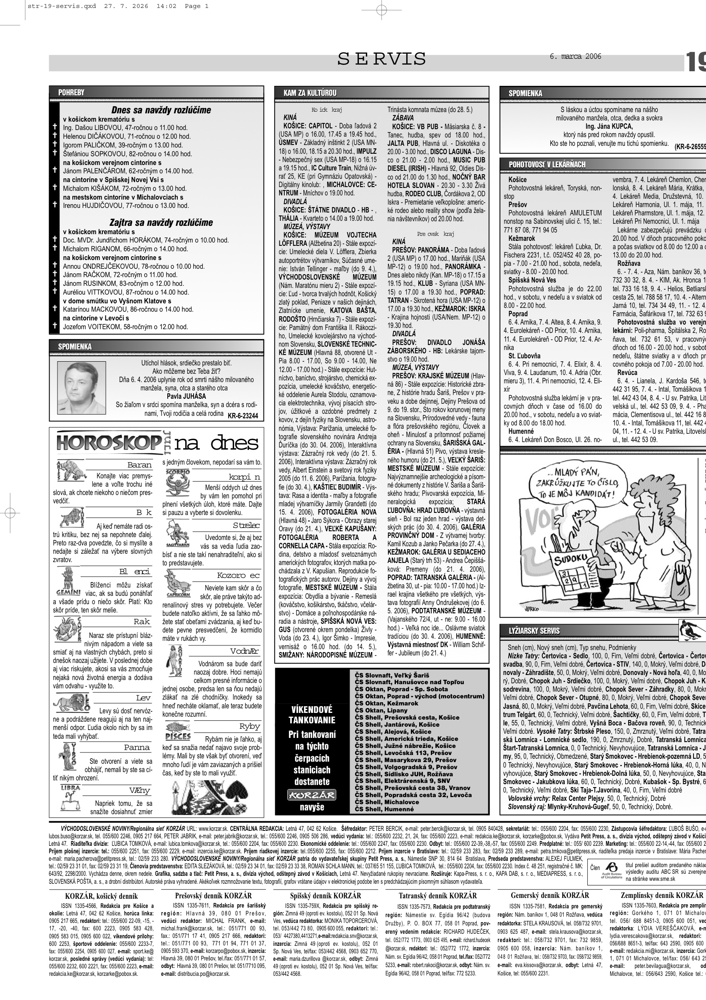
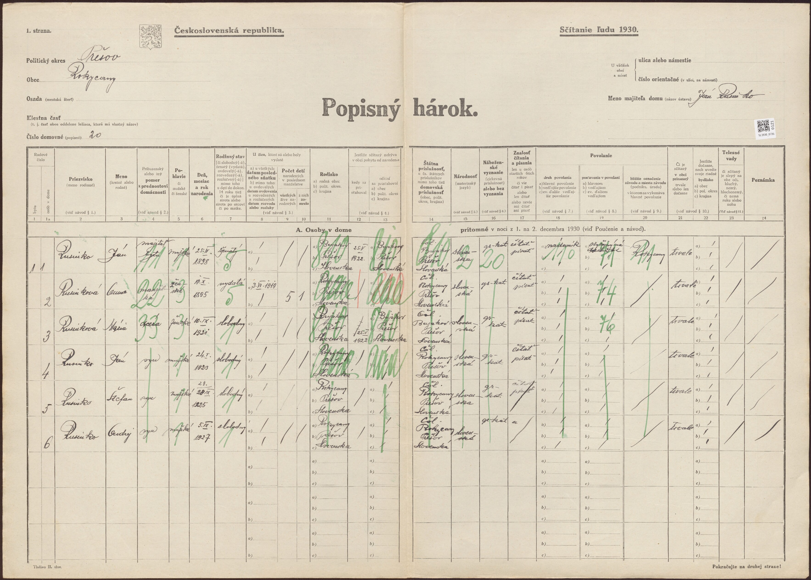
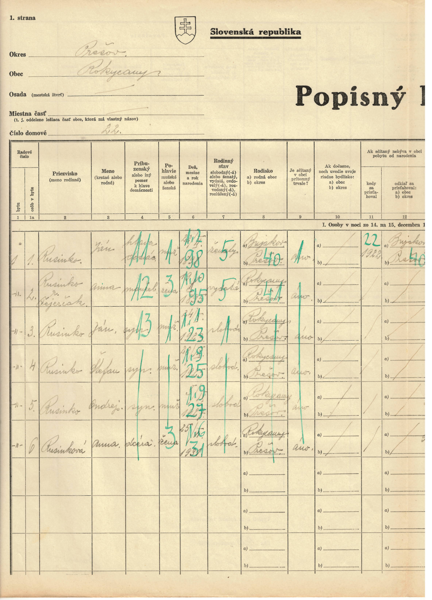

# Vetva Rusinko (Bujakov/Brežany → Rokycany → Košice)

Súvisí: [Vetva Fejerčák-Guľas](vetva-fejercak-gulas.md) (manželka Jána 1898) · [Prehľad](prehlad.md)

Gréckokatolícka rodina zo šarišskej dediny **Bujakov** (dnes Brežany; názov Bujakov platil do roku 1956) — obce s dreveným gréckokatolíckym chrámom sv. Lukáša z roku 1727. Matrične patrila pod **GK farnosť Klenov**, rovnako ako Rokycany, Bajerov, Kvačany a Žipov.

## Rodová línia

- **Dedo Ján Rusinko** — \*29.1.1923 Rokycany, †4.4.2006 Košice (~83 r.). Zomrel na rakovinu pľúc a prostaty. **Pohreb 7.4.2006 o 12.00 na verejnom cintoríne**, doložený oznámeniami v Korzári zo 6. a 7. apríla:

  

  Hrob: Verejný cintorín Košice, sekcia 18, hrob 20 — spolu s babkou Annou.
- **Pradedo Ján Rusinko** — \*27.4.1898 Bujakov, †28.2.1980 (~82 r.). Roku 1930 ešte nádenník, roku 1940 už samostatný roľník a majiteľ domu. ⚭ **3.6.1919 Anna Fejerčáková** (\*19.10.1895 Rokycany, †6.1.1967). Rodina sa **25.5.1922 presťahovala z Bujakova do Rokycian**, do domu č. 20.
- **Deti Jána a Anny:** Mária \*10.9.1921, **Ján \*1923 (dedo)**, Štefan \*28.9.1925 (†2015 Bratislava), Andrej \*5.9.1927 (†2017), **piate dieťa, ktoré zomrelo v detstve**, a **sestra Anna \*25.6.1931**.
- **Prapradedo Ondrej Rusinko** — **\*9.2.1857 Bujakov č. 15**, krstený 10.2.1857 v Klenove, †1936, pochovaný v Bajerove pod liatinovým krížom. Kríž sa zachoval a je odfotografovaný: tabuľka nesie nápis „Tu spočíva Ondrej Rusinko \*1861 †1936" — rok narodenia na kríži sa teda o štyri roky líši od klenovskej matriky; ktorý údaj je pravdivý, zatiaľ nevieme. Že bol otcom Jána \*1898, zatiaľ vieme z rodinnej postupnosti a nepriamych indícií — potvrdí to až Jánov krstný zápis, o ktorý žiadame faru Klenov.
- **Ondrejovi rodičia: Michal Rusinko a Mária rod. Gumanová** — gréckokatolíci v Bujakove. **Sobášili sa v roku 1856**; ich sobášny zápis našiel Štátny archív v Prešove a výpis z neho je objednaný — dá mená rodičov oboch, teda ďalšiu generáciu nahor. Sobášny zápis ich syna z roku 1881 vedie Michala ako **sedliaka s usadlosťou**, nie ako želiara. Detí mali najmenej osem: okrem Ondreja synov Jána \*1859, Juraja \*1862 a Michala \*1874 a dcéry Annu \*1865, Annu \*1867, Máriu \*1870 a Barboru \*1876. To, že sa meno Anna v rodine o dva roky zopakovalo, býva znamením, že prvé dievčatko zomrelo. Gumanovci sú v Bujakove a okolí domáci rod.
- **Ondrej sa 7. februára 1881 oženil s Máriou Murinovou** z Bajerova. Mal dvadsaťštyri, ona dvadsaťjeden; on bol gréckokatolík, ona rímska katolíčka, takže sa sobášili v jej farnosti a ženích musel priniesť prepúšťací list od svojho farára. Jej rodičia boli **Juraj Murin a Anna rod. Szalókiová**, želiari v Bajerove. Deti z tohto manželstva poznáme tri: Máriu \*1882, Annu \*1883 a Štefana \*1884. Či bola Mária matkou aj pradeda Jána \*1898, zostáva otvorené: medzi Štefanom a Jánom je štrnásť rokov a Ondrej sa medzitým mohol oženiť druhýkrát. Rozhodne to Jánov krstný zápis.
- **Najstarší doložení nositelia mena, daňový súpis 1715.** V Klenove („Loco Klembark“) je zapísaný **Joannes Rusinko**; obec je v súpise opísaná ako ležiaca „v hlbokej doline medzi kopcami a lesmi“. A priamo v **Bujakove** — teda tam, kde rodina žije aj o storočie neskôr — je zapísaný **Lawriś Rusinko**. Celá dedina mala vtedy šesť daňovníkov a on držal plnú usadlosť, rovnako ako štyria z ostatných piatich. Susedia sa volali Ivan, Fiod a Slois: úradník písal mená tak, ako ich počul, takže je to jeden z mála dokladov o tom, ako sa ľudia v dedine naozaj oslovovali. Či od Lawriśa vedie k Michalovi priama niť, zatiaľ nie je jasné — delí ich vyše sto rokov a tri či štyri generácie.

## Andrej na zákopoch (1944–45)

Dedov brat **Andrej** (\*5.9.1927) bol v zime 1944/45 **odvlečený kopať zákopy** — od 8. decembra do 8. februára, dva mesiace **bez akejkoľvek odmeny**, ako potvrdil národný výbor v Rokycanoch. Jeho spis z repatriačného strediska v Prešove menuje aj rodičov — Jána Rusinka a Annu rod. Fejerčákovú — a je tak nezávislým úradným dokladom, že šlo o dedovho brata.

Zaujímavosť: meno Ondrej a Andrej používal zameniteľne — dotazník podpísal ako Ondrej, potvrdenie úradu ho vedie ako Andreja.

## Sčítací hárok 1930 — Rokycany, dom č. 20

| # | Meno | Vzťah | Narodenie | Rodisko |
|---|---|---|---|---|
| 1 | Ján Rusinko | majiteľ bytu | 25.IV.1898 | Bujakov |
| 2 | Anna rod. Fejerčáková | manželka | 19.X.1895 | Rokycany |
| 3 | Mária | dcéra | 10.IX.1921 | Bujakov |
| 4 | **Ján (dedo)** | syn | 24.I.1923 | Rokycany |
| 5 | Štefan | syn | 28.IX.1925 | Rokycany |
| 6 | Andrej | syn | 5.IX.1927 | Rokycany |

Hárok dokladá dedovo synovstvo, **gréckokatolícke vierovyznanie celej domácnosti**, dátum sobáša, pôvod v Bujakove aj presťahovanie do Rokycian — a že detí bolo päť, z toho jedno zomrelo.

## Sčítací hárok 1940 — Rokycany, dom č. 22

Sčítanie sa robilo k noci zo 14. na 15. decembra 1940. Rodina medzitým prešla do domu **č. 22**, ktorý je zapísaný na Jána.

| # | Meno | Vzťah | Narodenie | Stav |
|---|---|---|---|---|
| 1 | Ján Rusinko | hlava domácnosti | 27.IV.1898 Bujakov | ženatý |
| 2 | Anna rod. Fejerčáková | manželka | 19.X.1895 Rokycany | vydatá |
| 3 | **Ján (dedo)** | syn | 24.I.1923 Rokycany | slobodný |
| 4 | Štefan | syn | 28.IX.1925 Rokycany | slobodný |
| 5 | Ondrej | syn | 1.IX.1927 Rokycany | slobodný |
| 6 | **Anna** | dcéra | 25.VI.1931 Rokycany | slobodná |

Najmladšia **Anna sa narodila 25. júna 1931** — dovtedy sme o nej vedeli len to, že existuje. Mária \*1921 už v domácnosti nie je; kam odišla, nevieme.

Ján je tu zapísaný ako **samostatný roľník a majiteľ domu**, hoci o desať rokov skôr bol nádenníkom. Anna je vedená ako domáca. Celá rodina je gréckokatolícka a slovenskej národnosti, všetci od šiestich rokov vedia čítať aj písať. Ján sa do Rokycian prisťahoval z Bujakova roku 1922, ostatní sú v obci od narodenia.

Dva dátumy sa v hárkoch rozchádzajú: Ondrej je tu narodený 1. septembra 1927, roku 1930 mal 5. septembra, a u Jána staršieho je deň prekrytý ceruzkou sčítacieho komisára.

## Hroby

| Kto | Dátumy | Hrob |
|---|---|---|
| Ján Rusinko + Anna rod. Fejerčáková | 1898–1980; 1895–1967 | Rokycany A/33 |
| dedo Ján + babka Anna | 1923–2006; 1928–2000 | Košice, Verejný cintorín 18-12-20 |
| Štefan + Emília | 1925–2015; 1925–2015 | Bratislava-Vrakuňa 11/302 |
| Andrej + Mária | 1927–2017; 1934–2024 | Rokycany |
| Ondrej Rusinko | 1857–1936 | Bajerov, liatinový kríž |

## Čo ešte nevieme

- **Osud Márie \*1921** — najstaršej dedovej sestry. Vieme o nej len zo sčítacích hárkov.
- **Osud sestry Anny \*25.6.1931** — po sčítaní 1940 o nej niet stopy.
- **Ondrejova manželka** — praprababka, ktorej meno nepoznáme. Prezradí ho jeho sobášny zápis okolo roku 1894, ktorý hľadá Štátny archív v Prešove.
- **Sobášny zápis z 3.6.1919** — samotný doklad manželstva Jána a Anny stále chýba; zatiaľ ho zastupuje náhrobok, sčítací hárok a Andrejov spis.
